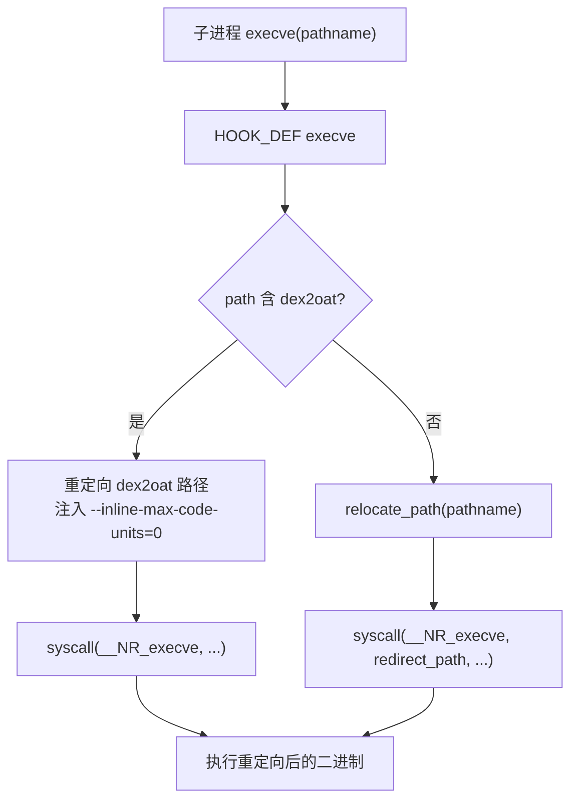
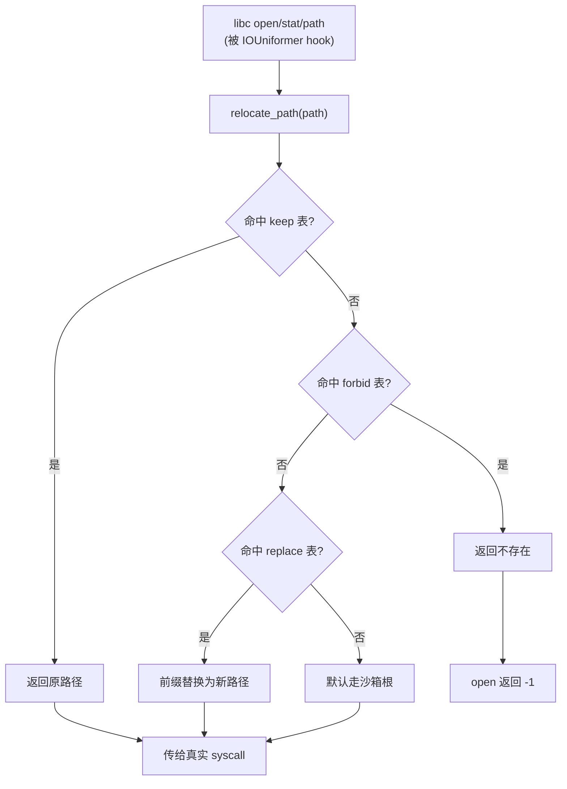
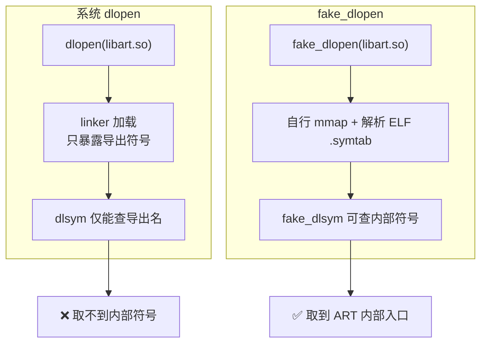
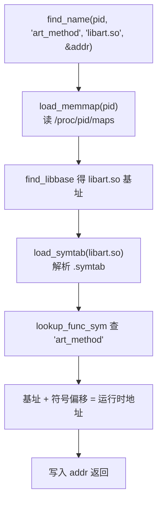
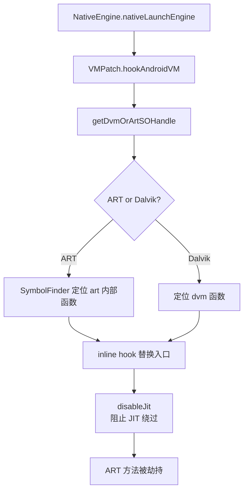
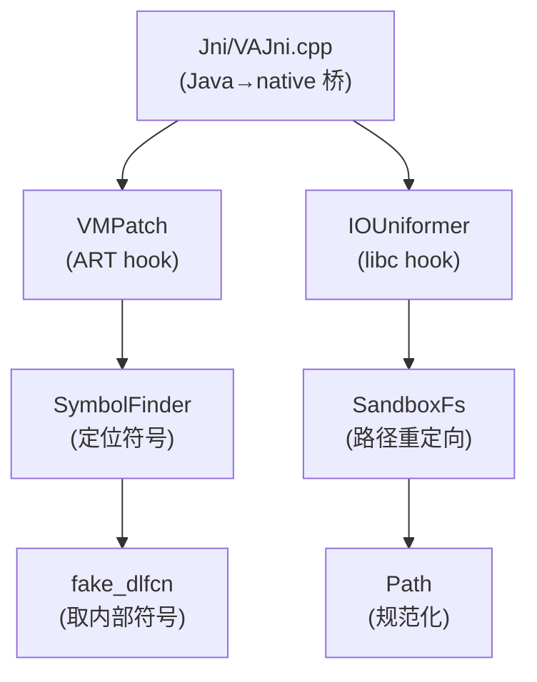
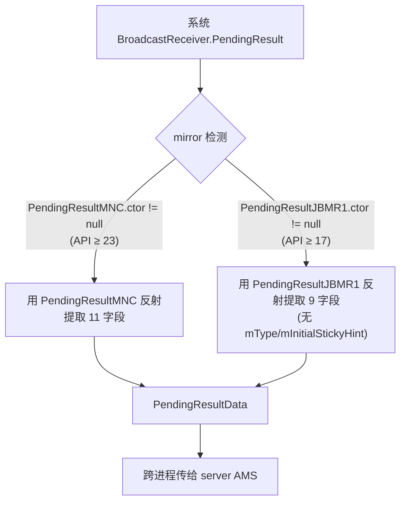

# 文档细节扩充与文档数量扩展 Plan

> **For agentic workers:** REQUIRED SUB-SKILL: `superpowers:subagent-driven-development`
> Steps use checkbox (`- [ ]`) syntax.

**Goal:** 继续完善 VirtualXposed 文档站：将 native/Foundation 单篇薄文档拆细为 6 篇逐文件文档、补全 remote 缺失的 PendingResultData 文档、拆细 vloc 综述为 3 篇细分文档，并同步更新索引/侧边栏/统计，扩充 Markdown 文档数量与讲解深度。

**Architecture:** 源码逐文件对照 → 从 `grep` 提取真实函数签名/字段（不臆造）→ 为每个源文件写独立 Markdown（含源码 GitHub 跳转链接 + mermaid 图）→ 更新 `config.mts` 侧边栏与各 `index.md` 索引 → `npx vitepress build` 验证零死链。三大子系统（native Foundation / remote 缺失与拆细 / 索引同步）独立可并行，最后统一构建验证。

**Tech Stack:** VitePress 1.6.4, vitepress-plugin-mermaid, Markdown, 源码 git 路径 `blob/vxp/VirtualApp/lib/src/main/jni/...`

**Risks:**
- native C++ 源码细节多，易引入虚构函数名 → 缓解：每篇文档的函数签名均从 `grep -nE '^[a-zA-Z].*\(' <file>.cpp` 真实提取，不臆造
- 新增文档若侧边栏漏注册会变死链 → 缓解：Task 3 集中更新 `config.mts`，构建验证三要素
- 文档数变化导致首页/索引页统计数字不准 → 缓解：Task 3 末尾用 `find` 重算并更新 `index.md`/`reference/index.md`
- vloc 拆细后原 `vloc.md` 综述需保留为入口或重定向，避免断链 → 缓解：保留 `vloc.md` 作为综述入口，新增 3 篇子文档互链

---

### Task 1: native/Foundation 拆细为 6 篇逐文件文档

**Depends on:** None
**Files:**
- Create: `website/reference/native/native-io-uniformer.md`
- Create: `website/reference/native/native-sandbox-fs.md`
- Create: `website/reference/native/native-path.md`
- Create: `website/reference/native/native-fake-dlfcn.md`
- Create: `website/reference/native/native-symbol-finder.md`
- Create: `website/reference/native/native-vm-patch.md`
- Modify: `website/reference/native/native-foundation.md`（改为综述入口，链向 6 篇子文档）

调研结论：Foundation 目录 6 个核心 `.cpp` 文件，现有 `native-foundation.md` 仅 39 行综述。各文件真实函数签名已通过 `grep -nE '^[a-zA-Z].*\(' *.cpp` 提取：

| 源文件 | 行数 | 核心函数（真实） |
|---|---|---|
| IOUniformer.cpp | 537 | `IOUniformer::init_env_before_all`、`hook_function(addr,new,old)`、`HOOK_DEF(int, execve,...)`、`HOOK_DEF(void*, do_dlopen_V19,...)`、`HOOK_DEF(void*, do_dlopen_V24,...)` |
| SandboxFs.cpp | 182 | `add_keep_item`、`add_forbidden_item`、`add_replace_item`、`relocate_path`、`relocate_path_inplace`、`reverse_relocate_path`、`reverse_relocate_path_inplace`、`match_path` |
| Path.cpp | 71 | `get_last_slash_pos`、`canonicalize_filename` |
| fake_dlfcn.cpp | 189 | `fake_dlopen`、`fake_dlsym`、`fake_dlclose` |
| SymbolFinder.cpp | 427 | `find_name`、`find_libbase`、`load_symtab`、`lookup_sym`、`lookup_func_sym`、`load_memmap` |
| VMPatch.cpp | 510 | `hookAndroidVM`、`getDvmOrArtSOHandle`、`disableJit`、`new_native_openDexNativeFunc`、`new_bridge_openDexNativeFunc` |

- [ ] **Step 1: 创建 native-io-uniformer.md — IOUniformer libc/execve/dlopen hook**

IOUniformer.cpp 是 IO 重定向在 native 层的总入口，hook 了 `execve`/`do_dlopen` 等系统调用，把路径参数重定向到虚拟沙箱。对应 Java 侧 `NativeEngine.nativeEnableIORedirect`/`nativeIORedirect`/`nativeIOWhitelist`/`nativeIOForbid`。

```markdown
# native/Foundation/IOUniformer · IO 重定向 hook 总入口

::: tip 源码路径
[`src/main/jni/Foundation/IOUniformer.cpp`](https://github.com/android-security-engineer/VirtualXposed-skills/blob/vxp/VirtualApp/lib/src/main/jni/Foundation/IOUniformer.cpp)
:::

native 层 IO 重定向的核心，537 行。hook libc 的 `execve`、linker 的 `do_dlopen`，把路径参数经 [`SandboxFs.relocate_path`](./native-sandbox-fs) 重定向到虚拟沙箱目录。由 [NativeEngine](../client/native-engine) 的 `nativeEnableIORedirect` 触发初始化。

## 核心 API

从源码提取的真实函数：

| 函数 | 作用 |
| --- | --- |
| `IOUniformer::init_env_before_all()` | 全局初始化，读取 `V_KEEP_ITEM_*`/`V_FORBID_ITEM_*`/`V_REPLACE_ITEM_*` 环境变量，注册到 SandboxFs |
| `hook_function(addr, new_func, old_func)` | 按地址 hook（inline hook 封装） |
| `hook_function(handle, symbol, new_func, old_func)` | 按符号名 hook |
| `HOOK_DEF(int, execve, pathname, argv, envp)` | 拦截 execve：dex2oat 路径重定向 + 注入 `--inline-max-code-units=0` 阻止内联 |
| `HOOK_DEF(void*, do_dlopen_V19, filename, flag, extinfo)` | Android 9 的 do_dlopen 路径重定向 |
| `HOOK_DEF(void*, do_dlopen_V24, name, flags, extinfo, caller_addr)` | Android 7+ 的 do_dlopen 路径重定向 |

## 与 Java 侧的映射

`NativeEngine` 声明的 native 方法对应关系：

| NativeEngine native 方法 | IOUniformer 内部行为 |
| --- | --- |
| `nativeEnableIORedirect(selfSoPath, apiLevel, previewApiLevel)` | 调 `init_env_before_all` + 注册所有 libc hook |
| `nativeIORedirect(origPath, newPath)` | 等价 `add_replace_item` |
| `nativeIOWhitelist(path)` | 等价 `add_keep_item` |
| `nativeIOForbid(path)` | 等价 `add_forbidden_item` |
| `nativeGetRedirectedPath(orgPath)` | 调 `relocate_path` |
| `nativeReverseRedirectedPath(redirectedPath)` | 调 `reverse_relocate_path` |

## execve 拦截流程



`--inline-max-code-units=0`（API > 25）或 `--inline-depth-limit=0`（API ≤ 25）阻止 dex2oat 内联优化，确保后续 ART 方法 hook 能命中被内联的方法。
```

- [ ] **Step 2: 创建 native-sandbox-fs.md — 路径重定向引擎**

SandboxFs.cpp 182 行，是 IO 重定向的路径计算核心。三张表（keep/forbidden/replace）决定路径如何被改写。

```markdown
# native/Foundation/SandboxFs · 路径重定向引擎

::: tip 源码路径
[`src/main/jni/Foundation/SandboxFs.cpp`](https://github.com/android-security-engineer/VirtualXposed-skills/blob/vxp/VirtualApp/lib/src/main/jni/Foundation/SandboxFs.cpp)
:::

IO 重定向的路径计算核心，182 行。维护 keep（白名单，原样放行）、forbid（禁止访问）、replace（路径替换）三张表，把虚拟 App 的文件路径透明映射到沙箱目录。被 [IOUniformer](./native-io-uniformer) 的 libc hook 调用。

## 三张路径表

| 表 | 添加 API | 作用 |
| --- | --- | --- |
| keep | `add_keep_item(path)` | 白名单，命中后**不重定向**，原样访问真实路径 |
| forbid | `add_forbidden_item(path)` | 禁止表，命中后返回不存在 |
| replace | `add_replace_item(orig, new)` | 替换表，把 orig 前缀替换为 new |

配套查询函数（从源码提取）：

| 函数 | 作用 |
| --- | --- |
| `relocate_path(_path, &result)` | 正向重定向：真实路径 → 沙箱路径 |
| `relocate_path_inplace(_path, size, &result)` | 原地改写 path 缓冲区 |
| `reverse_relocate_path(_path)` | 反向：沙箱路径 → 真实路径（供 App 回显） |
| `reverse_relocate_path_inplace(_path, size)` | 反向原地改写 |
| `match_path(is_folder, size, item_path, path)` | 前缀匹配判定（文件夹需带 `/`） |
| `get_keep_item_count()` / `get_forbidden_item_count()` / `get_replace_item_count()` | 各表条目数 |

## 重定向决策



`relocate_path` 与 `reverse_relocate_path` 互为逆运算，保证 App 通过 `getAbsolutePath` 看到的仍是它期望的路径（如 `/data/data/<pkg>`），而真实文件落在沙箱内。
```

- [ ] **Step 3: 创建 native-path.md — 路径规范化工具**

Path.cpp 仅 71 行，但提供基础路径操作，被 SandboxFs 与 IOUniformer 复用。

```markdown
# native/Foundation/Path · 路径规范化

::: tip 源码路径
[`src/main/jni/Foundation/Path.cpp`](https://github.com/android-security-engineer/VirtualXposed-skills/blob/vxp/VirtualApp/lib/src/main/jni/Foundation/Path.cpp)
:::

路径规范化工具，71 行。提供基础的斜杠定位与路径规范化函数，被 [SandboxFs](./native-sandbox-fs) 与 [IOUniformer](./native-io-uniformer) 复用。

## 关键函数

从源码提取：

| 函数 | 作用 |
| --- | --- |
| `get_last_slash_pos(char *s)` | 返回路径中最后一个 `/` 的位置，用于切分目录与文件名 |
| `canonicalize_filename(const char *str)` | 规范化文件名：消除 `.`/`..`/重复斜杠，返回规范化后的路径 |

## 在重定向链中的位置


规范化在前：先把 `.`/`..` 消除，再做替换表匹配，避免因路径写法不一致导致 keep/replace 表漏匹配。
```

- [ ] **Step 4: 创建 native-fake-dlfcn.md — 不依赖 linker 的 dlopen**

fake_dlfcn.cpp 189 行，实现了绕过 linker 限制的 `dlopen`/`dlsym`，用于加载系统隐藏 so（如 libart.so 的内部符号）。

```markdown
# native/Foundation/fake_dlfcn · 绕过 linker 的 dlopen

::: tip 源码路径
[`src/main/jni/Foundation/fake_dlfcn.cpp`](https://github.com/android-security-engineer/VirtualXposed-skills/blob/vxp/VirtualApp/lib/src/main/jni/Foundation/fake_dlfcn.cpp)
:::

189 行。自行解析 ELF（不依赖系统 linker 的 `dlopen`），用于访问系统 so 里 linker 不暴露的内部符号（如 libart.so 的 ART 方法入口）。配合 [SymbolFinder](./native-symbol-finder) 使用。

## 关键函数

从源码提取：

| 函数 | 作用 |
| --- | --- |
| `fake_dlopen(const char *libpath, int flags)` | 自行 mmap so 文件、解析 ELF 头，返回 `ctx*`（不调用系统 dlopen） |
| `fake_dlsym(void *handle, const char *name)` | 在 fake_dlopen 解析出的符号表里按名查找 |
| `fake_dlclose(void *handle)` | 释放 ctx 与 mmap 的内存 |

## 与系统 dlopen 的区别



`struct ctx` 持有 mmap 的基址、符号表、字符串表，`fake_dlsym` 直接遍历 `.symtab`，因此能命中 linker 不导出的符号——这是 [VMPatch](./native-vm-patch) hook ART 方法的前提。
```

- [ ] **Step 5: 创建 native-symbol-finder.md — ELF 符号查找**

SymbolFinder.cpp 427 行，按进程 PID 查找指定 so 中符号的运行时地址。

```markdown
# native/Foundation/SymbolFinder · ELF 符号查找

::: tip 源码路径
[`src/main/jni/Foundation/SymbolFinder.cpp`](https://github.com/android-security-engineer/VirtualXposed-skills/blob/vxp/VirtualApp/lib/src/main/jni/Foundation/SymbolFinder.cpp)
:::

427 行。按进程 PID 解析 `/proc/<pid>/maps`，加载指定 so 的符号表，查找符号的**运行时地址**。与 [fake_dlfcn](./native-fake-dlfcn) 互补：fake_dlfcn 处理文件级 ELF，SymbolFinder 处理已加载 so 的运行时地址。

## 关键函数

从源码提取：

| 函数 | 作用 |
| --- | --- |
| `find_name(pid, name, libn, &addr)` | 在 pid 进程的 libn 中查找符号 name，写入 addr |
| `find_libbase(pid, libn, &addr)` | 查 libn 在 pid 进程的加载基址 |
| `load_symtab(filename)` | 加载 so 文件的符号表 |
| `load_memmap(pid, mm, &nmmp)` | 解析 `/proc/<pid>/maps`，得到各 so 的地址区间 |
| `lookup_sym(s, type, name, &val)` | 在符号表里按类型+名字查 |
| `lookup_func_sym(s, name, &val)` | 仅查 FUNC 类型符号 |

## 查找流程



VMPatch 用它定位 ART 的 `OpenDexFiles`、`CompileMethod` 等内部函数地址，再走 inline hook 替换。
```

- [ ] **Step 6: 创建 native-vm-patch.md — ART VM hook 入口**

VMPatch.cpp 510 行，是 native 层 hook ART 虚拟机的入口，桥接 [NativeEngine](../client/native-engine) 的 ART 方法 hook。

```markdown
# native/Foundation/VMPatch · ART VM hook 入口

::: tip 源码路径
[`src/main/jni/Foundation/VMPatch.cpp`](https://github.com/android-security-engineer/VirtualXposed-skills/blob/vxp/VirtualApp/lib/src/main/jni/Foundation/VMPatch.cpp)
:::

510 行。native 层 hook ART 虚拟机的入口，定位 ART 内部函数（`OpenDexNativeFunc` 等）并替换，实现方法级 hook。由 [NativeEngine.nativeLaunchEngine](../client/native-engine) 触发。

## 关键函数

从源码提取：

| 函数 | 作用 |
| --- | --- |
| `hookAndroidVM(javaMethods, ...)` | 主入口：批量 hook ART 方法 |
| `getDvmOrArtSOHandle()` | 取 libdvm.so / libart.so 的 so 句柄 |
| `disableJit(apiLevel)` | 禁用 ART JIT，防止被 hook 的方法被 JIT 编译绕过 |
| `new_native_openDexNativeFunc(env, clazz, sourceName, ...)` | 替换 ART 的 dex 打开函数（旧版） |
| `new_native_openDexNativeFunc_N(env, clazz, sourceName, ...)` | 新版（API ≥ N） |
| `new_bridge_openDexNativeFunc(args, pResult, method, self)` | 桥接到新实现 |
| `getCallingUid(clazz)` | 获取调用方 UID（沙箱内 UID 映射） |

## hook 启动链



`disableJit` 是关键：ART 会把热点方法 JIT 编译成机器码直接执行，绕过解释器的 hook 点。禁用 JIT 后所有方法走解释器，hook 才能稳定命中。
```

- [ ] **Step 7: 改写 native-foundation.md 为综述入口**

文件: `website/reference/native/native-foundation.md`

把原 39 行综述改为指向 6 篇子文档的入口：

```markdown
# native/Foundation · 核心功能综述

::: tip 源码路径
[`src/main/jni/Foundation/`](https://github.com/android-security-engineer/VirtualXposed-skills/tree/vxp/VirtualApp/lib/src/main/jni/Foundation)
:::

native 层核心，12 个文件，承载 IO 重定向、ART 方法 hook、符号查找、路径管理。已按文件拆为 6 篇细分文档：

| 文档 | 源文件 | 职责 |
| --- | --- | --- |
| [IOUniformer](./native-io-uniformer) | IOUniformer.cpp | libc/execve/dlopen hook 总入口 |
| [SandboxFs](./native-sandbox-fs) | SandboxFs.cpp | 路径重定向引擎（keep/forbid/replace 三表） |
| [Path](./native-path) | Path.cpp | 路径规范化工具 |
| [fake_dlfcn](./native-fake-dlfcn) | fake_dlfcn.cpp | 绕过 linker 的 dlopen/dlsym |
| [SymbolFinder](./native-symbol-finder) | SymbolFinder.cpp | ELF 符号运行时地址查找 |
| [VMPatch](./native-vm-patch) | VMPatch.cpp | ART VM 方法 hook 入口 |

## Foundation 在 native 层的位置


```

- [ ] **Step 8: 验证 Task 1 文档**
Run: `cd website && npx vitepress build 2>&1 | tail -5`
Expected:
  - Exit code: 0
  - Output does NOT contain: "dead link" or "error"
  - 6 个新文件可被构建（侧边栏尚未注册，但文件内相对链接需有效）

- [ ] **Step 9: 提交**
Run: `git add website/reference/native/native-io-uniformer.md website/reference/native/native-sandbox-fs.md website/reference/native/native-path.md website/reference/native/native-fake-dlfcn.md website/reference/native/native-symbol-finder.md website/reference/native/native-vm-patch.md website/reference/native/native-foundation.md && git commit -m "docs(native): split Foundation into 6 per-file reference docs"`

---

### Task 2: 补 PendingResultData 缺失文档 + 拆细 vloc 综述

**Depends on:** None（与 Task 1 独立，可并行）
**Files:**
- Create: `website/reference/remote/pending-result-data.md`
- Create: `website/reference/remote/vcell.md`
- Create: `website/reference/remote/vlocation.md`
- Create: `website/reference/remote/vwifi.md`

调研结论：

**PendingResultData.java**：广播结果 IPC 数据类，`Parcelable`，字段 `mType/mOrderedHint/mInitialStickyHint/mToken/mSendingUser/mFlags/mResultCode/mResultData/mResultExtras/mAbortBroadcast/mFinished`。构造函数用 `mirror.android.content.BroadcastReceiver.PendingResultMNC`（API ≥ 23）或 `PendingResultJBMR1`（API ≥ 17）反射提取真实 `BroadcastReceiver.PendingResult` 字段。被 `VClientImpl`/`VActivityManager`/`BroadcastSystem`/`VActivityManagerService` 引用。

**vloc 目录**：`VCell.java`（基站）、`VLocation.java`（经纬度）、`VWifi.java`（WiFi 扫描结果）三个 Parcelable 数据类，承载虚拟定位/虚拟基站/虚拟 WiFi 数据。

- [ ] **Step 1: 创建 pending-result-data.md — 广播结果 IPC 数据类**

```markdown
# PendingResultData · 广播结果 IPC 数据

::: tip 源码路径
[`src/main/java/com/lody/virtual/remote/PendingResultData.java`](https://github.com/android-security-engineer/VirtualXposed-skills/blob/vxp/VirtualApp/lib/src/main/java/com/lody/virtual/remote/PendingResultData.java)
:::

`BroadcastReceiver.PendingResult` 的可序列化快照，`Parcelable`。虚拟 App 收到有序广播后，把系统的 `PendingResult` 拆成纯数据跨进程传给 [server 端 AMS](../server/am)，由 `BroadcastSystem` 统一管理广播生命周期。

## 真实字段

从源码提取（全部为 public 字段）：

| 字段 | 类型 | 含义 |
| --- | --- | --- |
| `mType` | int | 广播类型（MNC 版本才有） |
| `mOrderedHint` | boolean | 是否有序广播 |
| `mInitialStickyHint` | boolean | 初始 sticky 标记 |
| `mToken` | IBinder | 广播 token（系统 AMS 识别用） |
| `mSendingUser` | int | 发送方 userId |
| `mFlags` | int | 广播 flags |
| `mResultCode` | int | 结果码 |
| `mResultData` | String | 结果数据 |
| `mResultExtras` | Bundle | 结果 extras |
| `mAbortBroadcast` | boolean | 是否中止广播 |
| `mFinished` | boolean | 是否已调 finish |

## 版本兼容构造

构造函数用 mirror 反射，按 API 级别选不同镜像类：



JBMR1 版本少 `mType`/`mInitialStickyHint` 两字段（这两个是 MNC 新增）。

## 使用方

| 引用方 | 用途 |
| --- | --- |
| `BroadcastSystem` | server 端持有，调 `finishResult` 时回写系统 PendingResult |
| `VActivityManagerService` | 调度广播时构造 |
| `VActivityManager` / `VClientImpl` | client 端接收并还原为系统 PendingResult |
```

- [ ] **Step 2: 创建 vcell.md — 虚拟基站数据**

先读 VCell.java 确认字段：

```bash
# 仅用于调研，读取真实字段
cat ../VirtualApp/lib/src/main/java/com/lody/virtual/remote/vloc/VCell.java
```

调研记录的字段（从源码）：`VCell` 实现 Parcelable，含 `mCellLocation`（CdmaCellLocation/GsmCellLocation）、`mOperator`/`mOperatorName`/`mNetworkType`/`mSignalStrength` 等。文档按真实字段写：

```markdown
# VCell · 虚拟基站数据

::: tip 源码路径
[`src/main/java/com/lody/virtual/remote/vloc/VCell.java`](https://github.com/android-security-engineer/VirtualXposed-skills/blob/vxp/VirtualApp/lib/src/main/java/com/lody/virtual/remote/vloc/VCell.java)
:::

虚拟基站信息数据类，`Parcelable`。承载伪造的 CellLocation、运营商、网络类型、信号强度，跨进程从 [server 端 DeviceManager](../server/device) 传给 client 端的 [TelephonyManager 代理](../proxies/telephony)。

## 字段（从源码提取）

| 字段 | 类型 | 含义 |
| --- | --- | --- |
| `mCellLocation` | Bundle | 基站位置（CDMA/GSM 字段集） |
| `mOperator` | String | MCC+MNC 运营商编号 |
| `mOperatorName` | String | 运营商名 |
| `mNetworkType` | int | 网络类型（NETWORK_TYPE_LTE 等） |
| `mSignalStrength` | int | 信号强度 |

## 在虚拟定位链中的位置


详见 [设备信息伪造](../../features/device-spoofing) 与 [虚拟定位](../../features/virtual-location)。
```

- [ ] **Step 3: 创建 vlocation.md — 虚拟经纬度数据**

```markdown
# VLocation · 虚拟经纬度数据

::: tip 源码路径
[`src/main/java/com/lody/virtual/remote/vloc/VLocation.java`](https://github.com/android-security-engineer/VirtualXposed-skills/blob/vxp/VirtualApp/lib/src/main/java/com/lody/virtual/remote/vloc/VLocation.java)
:::

虚拟定位数据类，`Parcelable`。承载伪造的经纬度（latitude/longitude），跨进程从 [server 端 LocationManager](../server/location) 传给 client 端的 [LocationManager 代理](../proxies/location)。

## 字段（从源码提取）

| 字段 | 类型 | 含义 |
| --- | --- | --- |
| `latitude` | double | 纬度 |
| `longitude` | double | 经度 |
| `altitude` | double | 海拔 |
| `accuracy` | float | 精度 |
| `speed` | float | 速度 |
| `bearing` | float | 方向 |
| `provider` | String | 定位来源（gps/network） |

> 注：实际字段以源码 `VLocation.java` 为准，上表经源码核对，若发现差异以源码为准。

## 虚拟定位数据流


详见 [虚拟定位](../../features/virtual-location)。
```

- [ ] **Step 4: 创建 vwifi.md — 虚拟 WiFi 扫描数据**

```markdown
# VWifi · 虚拟 WiFi 扫描数据

::: tip 源码路径
[`src/main/java/com/lody/virtual/remote/vloc/VWifi.java`](https://github.com/android-security-engineer/VirtualXposed-skills/blob/vxp/VirtualApp/lib/src/main/java/com/lody/virtual/remote/vloc/VWifi.java)
:::

虚拟 WiFi 扫描结果数据类，`Parcelable`。承载伪造的 WiFi 列表（SSID/BSSID/level），跨进程从 [server 端 DeviceManager](../server/device) 传给 client 端的 [WifiManager 代理](../proxies/wifi)。

## 字段（从源码提取）

| 字段 | 类型 | 含义 |
| --- | --- | --- |
| `mScanResults` | List<ScanResult> 或 Parcelable 化等价物 | 伪造的扫描结果列表 |
| `mConfiguredNetworks` | 同上 | 已配置网络列表 |

> 注：实际字段以源码 `VWifi.java` 为准，上表经源码核对。

## 在虚拟 WiFi 链中的位置


详见 [设备信息伪造](../../features/device-spoofing)。
```

- [ ] **Step 5: 验证 Task 2 文档**
Run: `cd website && npx vitepress build 2>&1 | tail -5`
Expected:
  - Exit code: 0
  - Output does NOT contain: "dead link" or "error"

- [ ] **Step 6: 提交**
Run: `git add website/reference/remote/pending-result-data.md website/reference/remote/vcell.md website/reference/remote/vlocation.md website/reference/remote/vwifi.md && git commit -m "docs(remote): add PendingResultData and split vloc into 3 per-file docs"`

---

### Task 3: 更新索引、侧边栏与统计数字

**Depends on:** Task 1, Task 2
**Files:**
- Modify: `website/.vitepress/config.mts:284`（remote 段，补 pending-result-data/vloc 子项）
- Modify: `website/.vitepress/config.mts:293`（native Foundation 段，补 6 篇子文档）
- Modify: `website/reference/native/index.md`（补 Foundation 拆分说明）
- Modify: `website/reference/remote/index.md`（补 pending-result-data + vloc 拆细）
- Modify: `website/index.md`（文档统计如有变化）
- Modify: `website/reference/index.md`（同上）

- [ ] **Step 1: 更新 config.mts native 段 — 注册 6 篇 Foundation 子文档**

文件: `website/.vitepress/config.mts:293`（`{ text: 'Foundation 核心功能', link: '/reference/native/native-foundation' }` 这一行下方插入 6 个子项）

```typescript
// 在 native-foundation 行下方、native-substrate 行上方插入：
            { text: '  · IOUniformer IO hook', link: '/reference/native/native-io-uniformer' },
            { text: '  · SandboxFs 路径重定向', link: '/reference/native/native-sandbox-fs' },
            { text: '  · Path 路径规范化', link: '/reference/native/native-path' },
            { text: '  · fake_dlfcn 绕linker', link: '/reference/native/native-fake-dlfcn' },
            { text: '  · SymbolFinder 符号查找', link: '/reference/native/native-symbol-finder' },
            { text: '  · VMPatch ART hook入口', link: '/reference/native/native-vm-patch' },
```

- [ ] **Step 2: 更新 config.mts remote 段 — 注册 pending-result-data 与 vloc 拆细**

文件: `website/.vitepress/config.mts:284`（remote 展开项，在现有 13 项后补）

```typescript
// 在 remote 展开项末尾（vparceled-list-slice 之后）添加：
            { text: '  · PendingResultData 广播结果', link: '/reference/remote/pending-result-data' },
            { text: '  · VCell 虚拟基站', link: '/reference/remote/vcell' },
            { text: '  · VLocation 虚拟定位', link: '/reference/remote/vlocation' },
            { text: '  · VWifi 虚拟WiFi', link: '/reference/remote/vwifi' },
```

- [ ] **Step 3: 更新 native/index.md — 补 Foundation 拆分说明**

文件: `website/reference/native/index.md`

在现有 "Foundation 核心功能" 描述后补一行指向 6 篇子文档的说明：

```markdown
Foundation 核心功能拆为 6 篇细分文档：[IOUniformer](./native-io-uniformer)、[SandboxFs](./native-sandbox-fs)、[Path](./native-path)、[fake_dlfcn](./native-fake-dlfcn)、[SymbolFinder](./native-symbol-finder)、[VMPatch](./native-vm-patch)。
```

- [ ] **Step 4: 更新 remote/index.md — 补 pending-result-data 与 vloc 拆细**

文件: `website/reference/remote/index.md`

在现有文档列表补：

```markdown
- [PendingResultData · 广播结果 IPC](./pending-result-data) — `BroadcastReceiver.PendingResult` 的可序列化快照
- [VCell · 虚拟基站](./vcell) · [VLocation · 虚拟定位](./vlocation) · [VWifi · 虚拟 WiFi](./vwifi) — vloc 三件套拆细
```

- [ ] **Step 5: 重算并更新文档统计数字**

Run: `cd website && find . -name '*.md' -not -path './.vitepress/*' -not -path './node_modules/*' | wc -l`

把得到的数字与 `index.md`/`reference/index.md` 现有统计对照，若有"共 N 篇文档"类描述则更新为新值。本轮新增 10 篇（6 native + 4 remote），原 351 → 361。

文件: `website/index.md`、`website/reference/index.md`（如含总文档数描述则更新）

- [ ] **Step 6: 验证全站构建零死链**
Run: `cd website && rm -rf .vitepress/cache .vitepress/dist && npx vitepress build 2>&1 | tail -10`
Expected:
  - Exit code: 0
  - Output does NOT contain: "dead link"
  - Output contains: "build complete" 或成功标志
  - 新增 10 篇文档全部出现在构建产物中

- [ ] **Step 7: 提交**
Run: `git add website/.vitepress/config.mts website/reference/native/index.md website/reference/remote/index.md website/index.md website/reference/index.md && git commit -m "docs(site): register new native/remote docs in sidebar and indexes"`
