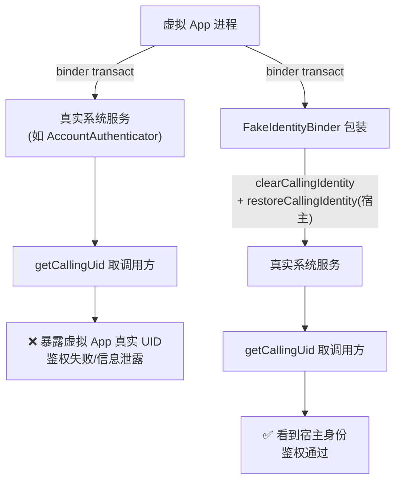
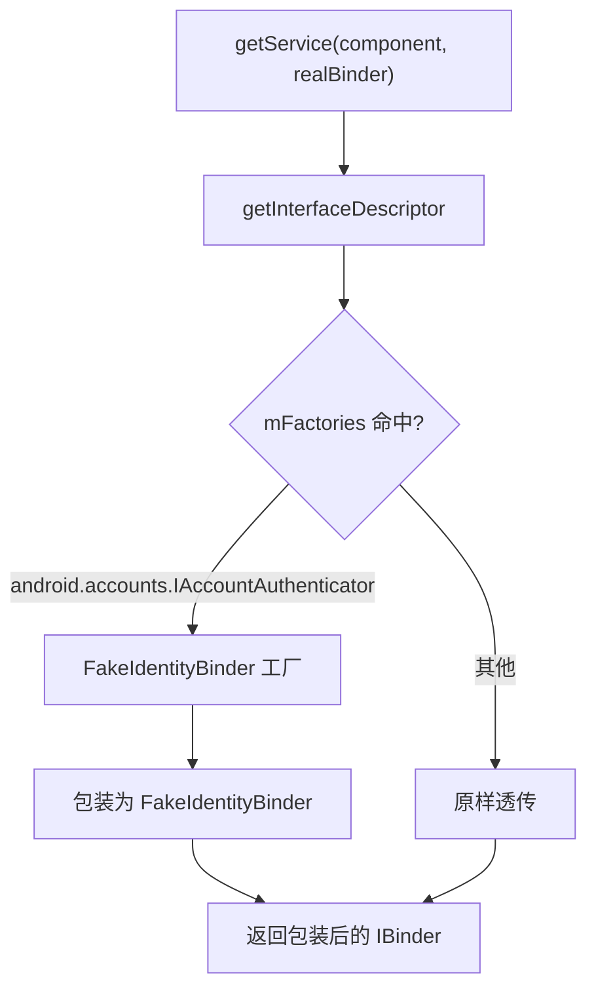
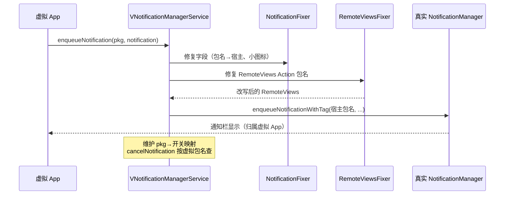
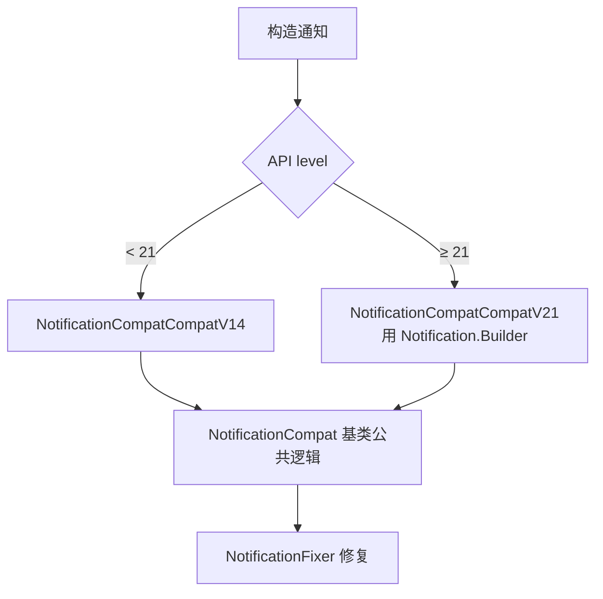
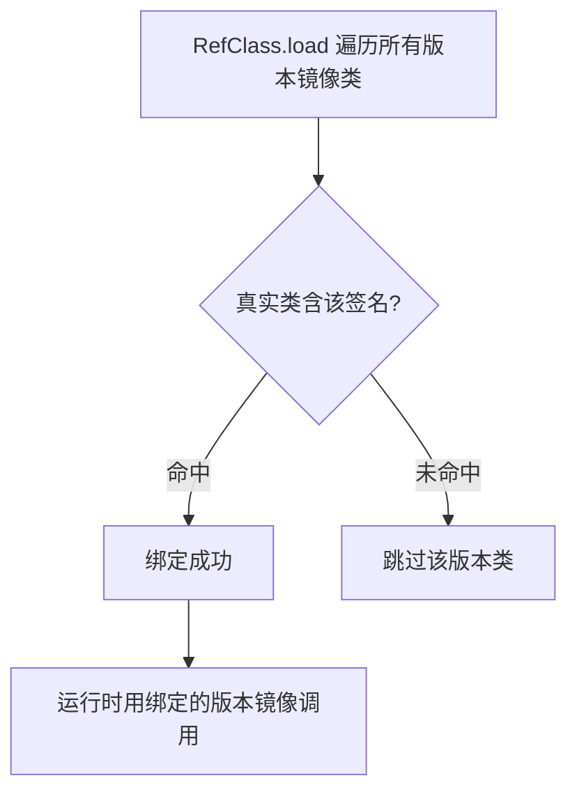
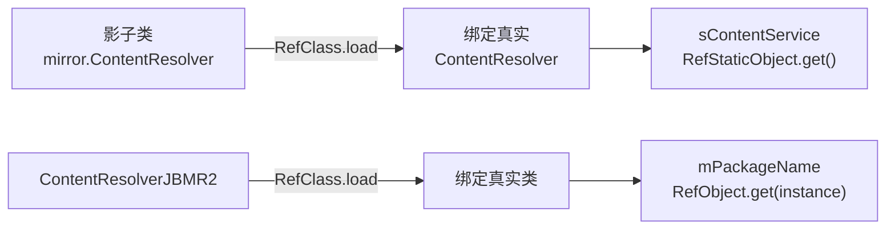

# 文档细节扩充与文档数量扩展 Plan（第二轮）

> **For agentic workers:** REQUIRED SUB-SKILL: `superpowers:subagent-driven-development`
> Steps use checkbox (`- [ ]`) syntax.

**Goal:** 继续扩充 VirtualXposed 文档：补全 server/secondary 缺失模块文档、深化 server/notification 多版本兼容讲解、修正 mirror/classes 多版本子类遗漏，扩充文档数量与讲解深度。

**Architecture:** 源码逐文件对照 → 从 `cat`/`grep` 提取真实字段与方法签名（不臆造）→ 为每个子系统写/改 Markdown（含 GitHub 源码跳转 + mermaid 图）→ 更新 `config.mts` 侧边栏与 `server/index.md` → `npx vitepress build` 验证零死链。三大子系统（secondary 新建 / notification 深化 / mirror 多版本修正）独立可并行。

**Tech Stack:** VitePress 1.6.4, vitepress-plugin-mermaid, Markdown, 源码 git 路径 `blob/vxp/VirtualApp/lib/src/main/java/...`

**Risks:**
- mirror 多版本子类字段多，易引入虚构字段 → 缓解：每个字段从源码 `grep -E 'public static'` 真实提取，不臆造
- secondary 是新模块，源码仅 56 行/文件但涉及 Binder 身份机制，描述需精确 → 缓解：已读完整源码，`clearCallingIdentity`/`getFakeIdentity` 机制已确认
- 侧边栏注册遗漏变死链 → 缓解：Task 末尾 `npx vitepress build` 三要素验证
- notification 多版本兼容文件多，拆细可能过度 → 缓解：按"主类 + 修复器族 + 版本兼容族"三组聚合，不逐文件开篇

---

### Task 1: 新建 server/secondary 模块文档

**Depends on:** None
**Files:**
- Create: `website/reference/server/secondary.md`
- Modify: `website/.vitepress/config.mts`（注册 secondary 条目）
- Modify: `website/reference/server/index.md`（补 secondary 链接）

调研结论：`server/secondary` 目录 2 个文件，完全无文档。

| 源文件 | 行数 | 核心职责（真实） |
|---|---|---|
| `BinderDelegateService.java` | 56 | `extends IBinderDelegateService.Stub`，按 interfaceDescriptor 分发到代理工厂（如 IAccountAuthenticator → FakeIdentityBinder） |
| `FakeIdentityBinder.java` | 56 | `extends Binder`，包装真实 Binder，`onTransact` 时 `clearCallingIdentity` + `restoreCallingIdentity(getFakeIdentity())` 伪造 UID/PID |

关键真实方法（从源码提取）：
- `BinderDelegateService`: `getComponent()`/`getService()`/`mFactories` Map（IAccountAuthenticator → FakeIdentityBinder）/构造函数按 `getInterfaceDescriptor` 查工厂
- `FakeIdentityBinder`: `onTransact(code,data,reply,flags)`、`getFakeIdentity()`（`getFakeUid()<<32 | getFakePid()`）、`getFakeUid()`（`Process.myUid()`）、`getFakePid()`（`Process.myPid()`）、`queryLocalInterface`/`attachInterface`/`getInterfaceDescriptor` 透传 mBase

- [ ] **Step 1: 创建 secondary.md — Binder 身份伪造模块**

```markdown
# server/secondary · 次级服务与 Binder 身份伪造

::: tip 源码路径
[`src/main/java/com/lody/virtual/server/secondary/`](https://github.com/android-security-engineer/VirtualXposed-skills/tree/vxp/VirtualApp/lib/src/main/java/com/lody/virtual/server/secondary)
:::

次级服务模块，2 个文件。解决虚拟 App 调用真实系统服务时的 Binder 调用方身份（UID/PID）问题——`Binder.getCallingUid()` 在虚拟环境下会暴露真实调用方，本模块把它伪装成宿主进程身份。

## 文件组成

| 文件 | 职责 |
| --- | --- |
| [`BinderDelegateService.java`](https://github.com/android-security-engineer/VirtualXposed-skills/blob/vxp/VirtualApp/lib/src/main/java/com/lody/virtual/server/secondary/BinderDelegateService.java) | 服务代理分发器，按 interfaceDescriptor 查工厂包装真实 Binder |
| [`FakeIdentityBinder.java`](https://github.com/android-security-engineer/VirtualXposed-skills/blob/vxp/VirtualApp/lib/src/main/java/com/lody/virtual/server/secondary/FakeIdentityBinder.java) | 伪造调用方 UID/PID 的 Binder 包装器 |

## FakeIdentityBinder 工作机制

真实方法（从源码提取）：

| 方法 | 作用 |
| --- | --- |
| `onTransact(code, data, reply, flags)` | 拦截每个 transact：先 `clearCallingIdentity`，再 `restoreCallingIdentity(getFakeIdentity())`，转发给 mBase |
| `getFakeIdentity()` | `getFakeUid() << 32 | getFakePid()`（高 32 位 UID，低 32 位 PID） |
| `getFakeUid()` | 返回 `Process.myUid()`（宿主 UID） |
| `getFakePid()` | 返回 `Process.myPid()`（宿主 PID） |
| `queryLocalInterface`/`attachInterface`/`getInterfaceDescriptor` | 透传给 mBase，保持接口一致 |

## 为什么需要伪造身份



`Binder.clearCallingIdentity()` 清掉原始调用方，`restoreCallingIdentity(getFakeIdentity())` 把宿主进程的 UID/PID（`Process.myUid()`/`Process.myPid()`）写入——后续 `getCallingUid`/`getCallingPid` 看到的是宿主而非虚拟 App。

## BinderDelegateService 分发



`mFactories` 是 `Map<String, ProxyBinderFactory>`，目前只注册了 `IAccountAuthenticator`。其他服务原样透传——只有需要伪造身份的服务才包装。

详见 [IPC 桥](../../features/ipc-bridge)。
```

- [ ] **Step 2: 更新 config.mts — 注册 secondary 侧边栏条目**

文件: `website/.vitepress/config.mts`（server 段 items 列表，在 `vs` 条目之后添加）

在 server 段找到 `{ text: '...', link: '/reference/server/vs' }` 这一行，在其后插入：

```typescript
            { text: 'secondary 次级服务', link: '/reference/server/secondary' },
```

- [ ] **Step 3: 更新 server/index.md — 补 secondary 链接**

文件: `website/reference/server/index.md`

在现有服务文档列表中补一行：

```markdown
- [secondary · 次级服务](./secondary) — Binder 身份伪造（FakeIdentityBinder）
```

- [ ] **Step 4: 验证 Task 1**
Run: `cd website && npx vitepress build 2>&1 | tail -5`
Expected:
  - Exit code: 0
  - Output does NOT contain: "dead link" or "error"
  - `secondary.html` 出现在 `.vitepress/dist/reference/server/`

- [ ] **Step 5: 提交**
Run: `git add website/reference/server/secondary.md website/.vitepress/config.mts website/reference/server/index.md && git commit -m "docs(server): add secondary module doc (Binder identity fake)"`

---

### Task 2: 深化 server/notification 多版本兼容讲解

**Depends on:** None（与 Task 1 独立）
**Files:**
- Modify: `website/reference/server/notification.md`

调研结论：现有 notification.md 仅 33 行，9 个文件只列了文件名表 + 1 张总览图。可深化为：补真实方法、按"主类/修复器族/版本兼容族"三组聚合讲解、补通知改写时序图。

关键源码真实方法（已调研）：
- `VNotificationManagerService`(153行): 通知入队/取消/查询，`enqueueNotification`/`cancelNotification`/`areNotificationsEnabled`
- `NotificationFixer`(241行): 通知字段修复，改包名/小图标
- `RemoteViewsFixer`(273行): RemoteViews 里包名引用改写
- `NotificationCompatCompatV14`(98行)/`V21`(148行): 按版本选兼容实现
- `WidthCompat`(149行): 通知宽度兼容

- [ ] **Step 1: 改写 notification.md — 补三组讲解与时序图**

文件: `website/reference/server/notification.md`（整体替换）

```markdown
# server/notification · 虚拟通知服务

::: tip 源码路径
[`src/main/java/com/lody/virtual/server/notification/`](https://github.com/android-security-engineer/VirtualXposed-skills/tree/vxp/VirtualApp/lib/src/main/java/com/lody/virtual/server/notification)
:::

`VNotificationManagerService` 重新实现通知管理，让虚拟 App 的通知通过宿主通道显示，且各虚拟 App 通知开关独立。共 **9 个文件**，含大量版本兼容修复。按职责分三组。

## 文件分组

### 主服务

| 文件 | 职责 |
| --- | --- |
| [`VNotificationManagerService.java`](https://github.com/android-security-engineer/VirtualXposed-skills/blob/vxp/VirtualApp/lib/src/main/java/com/lody/virtual/server/notification/VNotificationManagerService.java) | 服务主类，通知入队/取消/查询，按虚拟包名维护开关状态 |

### 修复器族（改写通知内容）

| 文件 | 职责 |
| --- | --- |
| [`NotificationFixer.java`](https://github.com/android-security-engineer/VirtualXposed-skills/blob/vxp/VirtualApp/lib/src/main/java/com/lody/virtual/server/notification/NotificationFixer.java) | 通知字段修复：包名改宿主、小图标重绘、extras 清理 |
| [`RemoteViewsFixer.java`](https://github.com/android-security-engineer/VirtualXposed-skills/blob/vxp/VirtualApp/lib/src/main/java/com/lody/virtual/server/notification/RemoteViewsFixer.java) | RemoteViews 修复：Action 里的包名引用改写为宿主 |
| [`ReflectionActionCompat.java`](https://github.com/android-security-engineer/VirtualXposed-skills/blob/vxp/VirtualApp/lib/src/main/java/com/lody/virtual/server/notification/ReflectionActionCompat.java) | RemoteViews 反射 Action 兼容 |
| [`PendIntentCompat.java`](https://github.com/android-security-engineer/VirtualXposed-skills/blob/vxp/VirtualApp/lib/src/main/java/com/lody/virtual/server/notification/PendIntentCompat.java) | 通知内 PendingIntent 兼容改写 |

### 版本兼容族（按 API 选实现）

| 文件 | 职责 |
| --- | --- |
| [`NotificationCompat.java`](https://github.com/android-security-engineer/VirtualXposed-skills/blob/vxp/VirtualApp/lib/src/main/java/com/lody/virtual/server/notification/NotificationCompat.java) | 兼容基类，按 API 级别选 V14/V21 |
| [`NotificationCompatCompatV14.java`](https://github.com/android-security-engineer/VirtualXposed-skills/blob/vxp/VirtualApp/lib/src/main/java/com/lody/virtual/server/notification/NotificationCompatCompatV14.java) | Android 4.x（API 14-20）通知兼容 |
| [`NotificationCompatCompatV21.java`](https://github.com/android-security-engineer/VirtualXposed-skills/blob/vxp/VirtualApp/lib/src/main/java/com/lody/virtual/server/notification/NotificationCompatCompatV21.java) | Android 5.0+（API ≥ 21）通知兼容，处理 Notification.Builder |
| [`WidthCompat.java`](https://github.com/android-security-engineer/VirtualXposed-skills/blob/vxp/VirtualApp/lib/src/main/java/com/lody/virtual/server/notification/WidthCompat.java) | 通知宽度兼容（不同 Android 版本通知栏宽度规则不同） |

## 核心机制

虚拟 App 的通知本质上要借真实系统的 `NotificationManager` 才能显示，但通知内容里携带的是虚拟包名——系统不认。`NotificationFixer`/`RemoteViewsFixer` 把通知里的包名、PendingIntent、RemoteViews Action 全部改写为宿主包名，让系统接受；显示后再映射回虚拟 App。

## 通知改写时序



## 版本兼容选择



`NotificationCompat` 基类持有两版本的公共逻辑，按 API 选择具体实现——Android 5.0 引入 `Notification.Builder` 后通知构造方式大改，所以需要 V21 独立实现。
```

- [ ] **Step 2: 验证 Task 2**
Run: `cd website && npx vitepress build 2>&1 | tail -5`
Expected:
  - Exit code: 0
  - Output does NOT contain: "dead link" or "error"

- [ ] **Step 3: 提交**
Run: `git add website/reference/server/notification.md && git commit -m "docs(server): deepen notification multi-version compat and fixer groups"`

---

### Task 3: 修正 mirror/classes 多版本子类遗漏

**Depends on:** None（与 Task 1/2 独立）
**Files:**
- Modify: `website/reference/mirror/classes/app_iactivitymanager.md`
- Modify: `website/reference/mirror/classes/content_contentresolver.md`

调研结论：mirror/classes 文档普遍只记主类，遗漏多版本子类。挑两个核心代表深化：

**IActivityManager**（4 文件）：
- 主类 `IActivityManager.java`：`getTaskForActivity`/`setRequestedOrientation`/`overridePendingTransition`/`startActivity`/`startActivities` + 内嵌 `ContentProviderHolder`（info/provider/noReleaseNeeded）
- `IActivityManagerICS.java`：`finishActivity`（API 14 签名）
- `IActivityManagerL.java`：`finishActivity`（API 21 签名）
- `IActivityManagerN.java`：`finishActivity`（API 24 签名）

三版本子类都只有 `finishActivity`——因为 `finishActivity` 的签名随 API 变化，需要不同镜像类承载不同签名。

**ContentResolver**（2 文件）：
- 主类 `ContentResolver.java`：`sContentService`（静态）
- `ContentResolverJBMR2.java`：`mPackageName`（实例字段，API 18+）

- [ ] **Step 1: 改写 app_iactivitymanager.md — 补 4 版本子类**

文件: `website/reference/mirror/classes/app_iactivitymanager.md`（整体替换）

先读现有内容确认当前结构，再补多版本表。调研记录的真实字段如上。

```markdown
# mirror · IActivityManager

::: tip 源码路径
[`src/main/java/mirror/android/app/IActivityManager.java`](https://github.com/android-security-engineer/VirtualXposed-skills/blob/vxp/VirtualApp/lib/src/main/java/mirror/android/app/IActivityManager.java)
:::

镜像真实接口 `android.app.IActivityManager`。由于该接口的方法签名随 Android 版本变化，VirtualXposed 用**主类 + 版本子类**模式承载：主类放通用方法，每个版本子类放该版本独有的方法签名。

## 主类 IActivityManager（通用方法）

从源码提取的真实镜像成员：

| 成员 | 类型 | 说明 |
| --- | --- | --- |
| `TYPE` | Class | `RefClass.load(IActivityManager.class, "android.app.IActivityManager")` |
| `getTaskForActivity` | RefMethod&lt;Integer&gt; | 查 Activity 所在 task |
| `setRequestedOrientation` | RefMethod&lt;Void&gt; | 设屏幕方向 |
| `overridePendingTransition` | RefMethod&lt;Void&gt; | 转场动画 |
| `startActivity` | RefMethod&lt;Integer&gt; | 启动 Activity |
| `startActivities` | RefMethod&lt;Integer&gt; | 批量启动 |

### 内嵌 ContentProviderHolder

```java
public static class ContentProviderHolder {
    public static Class<?> TYPE = RefClass.load(..., "android.app.IActivityManager$ContentProviderHolder");
    public static RefObject<ProviderInfo> info;
    public static RefObject<IInterface> provider;
    public static RefBoolean noReleaseNeeded;
}
```

## 版本子类（finishActivity 签名演变）

`finishActivity` 在不同 API 版本签名不同，故各版本独立镜像类：

| 子类 | 对应 API | 成员 |
| --- | --- | --- |
| `IActivityManagerICS` | API 14+ | `finishActivity`（RefMethod&lt;Boolean&gt;） |
| `IActivityManagerL` | API 21+ | `finishActivity`（RefMethod&lt;Boolean&gt;） |
| `IActivityManagerN` | API 24+ | `finishActivity`（RefMethod&lt;Boolean&gt;） |

三版本子类都只含 `finishActivity`——其他方法签名稳定放在主类，只有 `finishActivity` 参数随版本变化需独立承载。

## 多版本绑定决策



`RefClass.load` 会尝试所有版本子类，只有签名匹配真实类的才绑定成功——这样运行时调用 `finishActivity` 会自动命中当前系统对应的版本镜像。

详见 [反射框架 mirror](/features/mirror-reflection)。
```

- [ ] **Step 2: 改写 content_contentresolver.md — 补 JBMR2 子类**

文件: `website/reference/mirror/classes/content_contentresolver.md`（整体替换）

```markdown
# mirror · ContentResolver

::: tip 源码路径
[`src/main/java/mirror/android/content/ContentResolver.java`](https://github.com/android-security-engineer/VirtualXposed-skills/blob/vxp/VirtualApp/lib/src/main/java/mirror/android/content/ContentResolver.java)
:::

镜像真实类 `android.content.ContentResolver`。主类放静态字段，JBMR2 子类放 API 18+ 新增的实例字段。

## 主类 ContentResolver（静态字段）

从源码提取：

| 成员 | 类型 | 说明 |
| --- | --- | --- |
| `TYPE` | Class | `RefClass.load(ContentResolver.class, android.content.ContentResolver.class)` |
| `sContentService` | RefStaticObject&lt;IInterface&gt; | 静态字段，ContentResolver 持有的全局 ContentService |

## 版本子类 ContentResolverJBMR2（API 18+）

| 成员 | 类型 | 说明 |
| --- | --- | --- |
| `Class` | Class | `RefClass.load(ContentResolverJBMR2.class, ContentResolver.class)` |
| `mPackageName` | RefObject&lt;String&gt; | 实例字段，JBMR2 新增的 mPackageName |

`mPackageName` 是 API 18 引入的实例字段——ContentResolver 在 JBMR2 后记录所属包名，VirtualXposed 用它改写虚拟 App 的 ContentResolver 包名。

## 镜像绑定与访问



静态字段用 `RefStaticObject`（无需实例），实例字段用 `RefObject`（需传实例）。详见 [反射框架 mirror](/features/mirror-reflection)。
```

- [ ] **Step 3: 验证 Task 3**
Run: `cd website && npx vitepress build 2>&1 | tail -5`
Expected:
  - Exit code: 0
  - Output does NOT contain: "dead link" or "error"

- [ ] **Step 4: 提交**
Run: `git add website/reference/mirror/classes/app_iactivitymanager.md website/reference/mirror/classes/content_contentresolver.md && git commit -m "docs(mirror): add multi-version subclass fields (IActivityManager/ContentResolver)"`
