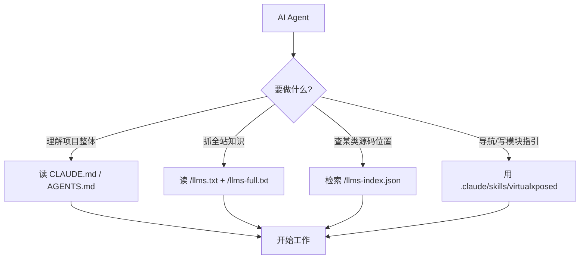

# VirtualXposed 文档站对接 AI Agent 实施计划

> **For agentic workers:** REQUIRED SUB-SKILL: `superpowers:subagent-driven-development`
> Steps use checkbox (`- [ ]`) syntax.

**Goal:** 为 VirtualXposed 文档站补齐三层 AI Agent 友好能力——(1) 知识层 `CLAUDE.md`/`AGENTS.md`/`llms.txt`，(2) 可检索结构化数据 `llms-index.json`，(3) 可操作 Agent skill —— 让 Claude Code / Cursor / 任意遵循 llms.txt 协议的 Agent 能高效理解并使用本项目的虚拟化知识与源码。

**Architecture:** 三层独立交付、按依赖串联。知识层手写（基于已调研的真实源码结构与文档结构）→ 结构化数据由 Node 脚本静态扫描 `VirtualApp/lib/src`（478 个 Java 文件，真实存在非 submodule）生成 `llms-index.json`（类→文件→模块→文档链接映射，供 Agent 精确检索与未来 RAG 消费）→ Agent skill 封装只读导航工具（按系统服务/类名查源码位置、查能力实现路径、生成 hook 编写指引），因 VirtualXposed 是 Xposed 模块运行容器而非可编程 SDK（grep 确认无 `IXposedHookLoadPackage` 入口），skill 工具全部限定只读导航，不臆造写操作 API → 站点集成把三层串成 `/dev/for-agents` 总入口 → CI 增加生成步骤保证部署产物同步。复用现有 VitePress + GitHub Pages CI，不引入新运行时。

**Tech Stack:** VitePress 1.6.4, Node.js 22 (CI 已用), ESM `.mjs` 脚本, Markdown, llms.txt 协议, Claude Code Agent skill 格式, 源码 git 路径 `blob/vxp/VirtualApp/lib/src/main/java/...`

**Risks:**
- Task 3 源码扫描脚本可能因 `launcher` submodule 未初始化而漏扫 → 缓解：脚本只扫 `VirtualApp/lib/src`（已确认 478 文件真实存在），跳过 `VirtualApp/launcher`
- Task 4 skill 若引用不存在的 SDK API 会变成幻觉工具 → 缓解：skill 工具全部限定为"只读导航/源码查询"，不暴露任何写操作或臆造 API
- `llms-index.json` 体量可能过大影响 Pages 部署 → 缓解：Task 3 末尾测量大小，若 >2MB 则按模块分片（当前预估 <500KB）
- `llms-full.txt` 手写易与正文文档脱节 → 缓解：从 `reference/index.md` 真实结构抽取文件数与模块数，不臆造
- `.gitignore` 当前是 Android 旧规则，未忽略 `website/node_modules` 与 `website/.vitepress/dist` → 缓解：Task 6 一并补齐，避免误提交产物

---

### Task 1: 创建项目级 Agent 知识层（CLAUDE.md + AGENTS.md）

**Depends on:** None
**Files:**
- Create: `CLAUDE.md`
- Create: `AGENTS.md`

- [ ] **Step 1: 创建 CLAUDE.md — 让 Claude Code 进仓库即知项目性质、构建方式、源码布局**

```markdown
# VirtualXposed-skills

## 这是什么

本仓库是 **VirtualXposed** 的教学文档站 + 源码解析项目，不是可运行 App 仓库。
VirtualXposed 是基于 VirtualApp + epic、在**免 Root** 环境下运行 Xposed 模块的 Android 虚拟化实现（支持 Android 5.0~10.0）。

仓库分两部分：
- `VirtualApp/` —— 原项目源码（只读参考，`lib` 模块含 478 个 Java + 96 个 native 源文件）
- `website/` —— VitePress 文档站，逐层拆解 VirtualXposed 的原理与源码

## 工作目录约定

- **改文档** → 改 `website/` 下的 Markdown，绝大多数工作发生在这里
- **查源码** → 读 `VirtualApp/lib/src/main/java/com/lody/virtual/`，包结构：`client/`(Hook 框架/IPC/Stub) · `server/`(虚拟系统服务) · `mirror/`(隐藏 API 镜像) · `helper/`(工具) · `remote/`(跨进程数据类) · `os/`
- **native 层** → `VirtualApp/lib/src/main/jni/`（libc hook / ART hook / inline hook）
- **不要改 `VirtualApp/` 源码**，它是只读参考本体

## 构建与验证文档站

```bash
cd website
pnpm install --frozen-lockfile
pnpm build        # 构建到 website/.vitepress/dist，零死链才算通过
pnpm dev          # 本地预览
```

任何文档改动后，用 `pnpm build` 验证无死链、无构建错误。

## 文档结构速查

| 目录 | 内容 |
|------|------|
| `website/guide/` | 入门：是什么、解决什么问题、快速使用、限制 |
| `website/architecture/` | 架构总览、进程模型、模块组成 |
| `website/features/` | 核心机制详解（虚拟化、Hook、Stub、IPC、PMS/AMS 等） |
| `website/xposed/` | 免 Root Hook 原理、模块加载、epic、资源 Hook 限制 |
| `website/reference/` | 逐模块源码参考（10 个 index.md 索引，覆盖 481 Java + 96 native） |
| `website/dev/` | 构建与文档站搭建 |

## 写文档的硬规则

1. **不臆造**：每个类/方法/字段必须从 `VirtualApp/lib/src` 源码 `grep` 真实提取
2. **源码跳转**：引用源码用 GitHub 路径 `https://github.com/android-security-engineer/VirtualXposed-skills/blob/vxp/VirtualApp/lib/src/main/java/...`
3. **新增文档页**：必须在 `website/.vitepress/config.mts` 对应 sidebar 注册，否则变死链
4. **回复语言**：始终用简体中文（用户全局偏好）

## AI Agent 对接资源

本仓库已为 Agent 提供三层对接能力，详见 `website/dev/for-agents.md`：
- `CLAUDE.md` / `AGENTS.md`（本文件）—— 项目级上下文
- `website/public/llms.txt` + `llms-full.txt` —— 站点级 llms.txt 协议入口
- `website/public/llms-index.json` —— 结构化源码索引（类→文件→模块→文档）
- `.claude/skills/virtualxposed/` —— Claude Code Agent skill（只读导航工具）
```

- [ ] **Step 2: 创建 AGENTS.md — 跨工具通用入口，复用 CLAUDE.md 内容**

```markdown
# AGENTS.md

本文件是面向所有 AI Agent 工具（Cursor、Aider、Windsurf 等）的项目入口。
Claude Code 用户请直接读 `CLAUDE.md`（内容一致，本文件为跨工具兼容而存在）。

完整项目说明、工作目录约定、构建命令、文档结构、写文档硬规则、Agent 对接资源清单，
全部见 [CLAUDE.md](./CLAUDE.md)。

## 一句话摘要

VirtualXposed 的教学文档站（VitePress）。改 `website/` 下的 Markdown，查源码读 `VirtualApp/lib/src`，改完跑 `cd website && pnpm build` 验证。所有引用的源码事实必须 `grep` 真实提取，不得臆造。
```

- [ ] **Step 3: 验证知识层文件存在且路径正确**
Run: `test -f CLAUDE.md && test -f AGENTS.md && grep -q "VirtualXposed-skills" CLAUDE.md && grep -q "CLAUDE.md" AGENTS.md && echo OK`
Expected:
  - Exit code: 0
  - Output contains: "OK"

- [ ] **Step 4: 提交**
Run: `git add CLAUDE.md AGENTS.md && git commit -m "docs(agents): add CLAUDE.md and AGENTS.md project-level agent context"`

---

### Task 2: 创建站点级 llms.txt 协议入口（llms.txt + llms-full.txt）

**Depends on:** None
**Files:**
- Create: `website/public/llms.txt`
- Create: `website/public/llms-full.txt`

- [ ] **Step 1: 创建 llms.txt — 遵循 llms.txt 协议的站点概览入口**

```text
# VirtualXposed

> 免 Root 运行 Xposed 模块的 Android 虚拟化实现 —— 原理与源码解析教学站。基于 VirtualApp + epic，用 Java 重新实现 AMS/PMS 等 48 个系统服务，在自身进程内虚拟出独立 App 运行环境。

VirtualXposed 是什么：一个不需要 Root、不需要解锁 Bootloader 的 App。它基于 VirtualApp（应用沙箱虚拟化）和 epic（ART 方法 Hook），让任意 Xposed 模块在普通 App 进程内加载并激活，Hook 目标应用的方法调用。

## 核心入口

- [入门：这是什么](https://android-security-engineer.github.io/VirtualXposed-skills/guide/what-is-virtualxposed): VirtualXposed 定位与两大限制（不改系统、不支持资源 Hook）
- [架构总览](https://android-security-engineer.github.io/VirtualXposed-skills/architecture/overview): 整体架构、进程模型、六大模块组成
- [应用虚拟化](https://android-security-engineer.github.io/VirtualXposed-skills/features/app-virtualization): 在进程内重实现系统服务的核心机制
- [系统服务 Hook](https://android-security-engineer.github.io/VirtualXposed-skills/features/service-hook): 48 个系统服务代理的统一拦截模式
- [Stub Activity 机制](https://android-security-engineer.github.io/VirtualXposed-skills/features/stub-activity): 100 个占位 Activity 欺骗真实 AMS
- [IO 重定向](https://android-security-engineer.github.io/VirtualXposed-skills/features/io-redirect): native 层 libc hook 实现数据隔离
- [免 Root Hook 原理](https://android-security-engineer.github.io/VirtualXposed-skills/xposed/how-it-works): epic + ExposedBridge 还原 Xposed API
- [源码参考总索引](https://android-security-engineer.github.io/VirtualXposed-skills/reference/): 481 Java + 96 native 源文件的逐模块解析

## 可选

- [能力边界与限制](https://android-security-engineer.github.io/VirtualXposed-skills/guide/limitations)
- [进程模型](https://android-security-engineer.github.io/VirtualXposed-skills/architecture/process-model)
- [反射框架 mirror](https://android-security-engineer.github.io/VirtualXposed-skills/features/mirror-reflection)
- [Native 层](https://android-security-engineer.github.io/VirtualXposed-skills/features/native-layer)
- [AI Agent 对接说明](https://android-security-engineer.github.io/VirtualXposed-skills/dev/for-agents): 如何用 CLAUDE.md / llms-index.json / skill 对接 Agent

## 结构化数据（供 Agent 精确检索）

- [llms-index.json](https://android-security-engineer.github.io/VirtualXposed-skills/llms-index.json): 全部 Java 类 → 源码文件 → 模块 → 文档链接的结构化映射
- [完整知识浓缩版](https://android-security-engineer.github.io/VirtualXposed-skills/llms-full.txt): 本站全部知识点的单文件版
```

- [ ] **Step 2: 创建 llms-full.txt — 全站知识单文件浓缩版，从真实文档结构抽取**

```text
# VirtualXposed 完整知识浓缩版

本文件是 VirtualXposed 教学站的全部知识点浓缩，供 AI Agent 单次读取获取全貌。
所有数字（481 Java / 96 native / 48 服务代理 / 144 镜像类）均来自源码与文档真实统计。

## 1. 项目定位

VirtualXposed = VirtualApp（应用沙箱虚拟化）+ epic（ART inline hook）。
目标：免 Root、免解锁 Bootloader 运行 Xposed 模块。支持 Android 5.0~10.0。
两大限制：(1) 不支持修改系统；(2) 不支持资源 Hook。

## 2. 架构（六大模块）

VirtualXposed 的 lib 模块（478 Java + 96 native 源文件）分为：
- 🔌 服务代理 client/hook/proxies/（~80 文件）：48 个系统服务的客户端 Hook 注入
- 🖥️ 虚拟服务 server/（~90 文件）：server 进程里重新实现的系统服务（AMS/PMS/AccountManager 等）
- ⚙️ 客户端基建 client/（~60 文件）：Hook 框架、IPC 桥、Stub、修复器
- 🪞 反射镜像 mirror/（~120 文件，144 影子类）：Android 隐藏 API 的类型安全镜像
- 🧰 工具与数据 helper/ · remote/（~50 文件）：兼容工具、集合、跨进程数据类
- 🦀 Native 层 jni/（90 文件）：libc hook / ART hook / inline hook（x86_64 + arm64）

## 3. 进程模型

- Server 进程：常驻，承载虚拟系统服务（VAMS/VPMS 等）
- Client 进程：每个虚拟 App 一个，运行目标 App + Xposed 模块
- 通过 Binder IPC 桥跨进程通信

## 4. 核心机制

### 4.1 应用虚拟化
在自身进程内用 Java 重新实现 AMS/PMS/AccountManager/LocationManager 等，让任意 App "安装"进虚拟环境独立运行。

### 4.2 系统服务 Hook（48 个代理）
统一模式：目标 App → ServiceManager.sCache（已被替换）→ 动态代理 IBinder → XxxStub(BinderInvocationProxy) → 按方法名分发到 MethodProxy 列表 → 改写参数/转发到虚拟服务或真实系统。
覆盖：account, alarm, am, appops, audio, clipboard, connectivity, devicepolicy, display, fingerprint, location, notification, pm, telephony, wifi 等 48 个服务。

### 4.3 Stub Activity 机制
预注册 100 个占位 Activity 欺骗真实 AMS，再用 H Callback 在主线程把占位 Intent 还原为虚拟 App 的真实 Intent。

### 4.4 跨进程 IPC 桥
VirtualXposed 自建 Binder 通信，把虚拟 App 的系统调用路由到 server 进程的虚拟服务。

### 4.5 IO 重定向
native 层 hook libc 文件接口（open/stat 等），把 /data/data/<pkg>、/sdcard 等路径透明重定向到虚拟数据目录，实现数据隔离。

### 4.6 反射镜像 mirror
144 个影子类把 Android 隐藏 API 包装成类型安全的静态字段访问，配合 free_reflection 解封 Android 9+ 反射限制。

### 4.7 Native 层 libva++.so
96 个 native 源文件：libc 文件 hook（IOUniformer/SandboxFs）、ART 方法 hook（VMPatch）、x86_64（Substrate）+ arm64（A64InlineHook）两套 inline hook 引擎、fake_dlfcn 绕 linker、SymbolFinder 符号查找。

## 5. Xposed 集成

- 免 Root Hook 原理：epic 在 ART 运行时做 inline hook，结合 ExposedBridge 还原 Xposed API
- 模块加载流程：虚拟 App 进程启动时加载已激活的 Xposed 模块
- 为何不支持资源 Hook：资源 Hook 需要替换系统 Resource 缓存，虚拟环境无系统权限

## 6. Hook 框架基类链

MethodProxy（方法代理基类）→ Replace*MethodProxy（改参数族）/ StaticMethodProxy / ResultStaticMethodProxy（固定返回）→ MethodInvocationStub（分发器）→ MethodInvocationProxy（注入器）→ BinderInvocationProxy（binder 注入）。
注册靠 @Inject / @SkipInject 注解，由 InvocationStubManager 统一管理。

## 7. 关键限制（写给想写 Xposed 模块的人）

VirtualXposed 是 Xposed 模块的**运行容器**，不是可编程 SDK。它自身不提供 IXposedHookLoadPackage 等入口给开发者调用——你写的仍是标准 Xposed 模块，VirtualXposed 负责在免 Root 环境让它生效。
不支持：修改系统的模块（如重力工具箱）、依赖资源 Hook 的主题模块。

## 8. Agent 对接

- 项目级上下文：仓库根 CLAUDE.md / AGENTS.md
- 站点入口：/llms.txt（本协议文件）
- 结构化检索：/llms-index.json（类→文件→模块→文档映射）
- Claude Code skill：.claude/skills/virtualxposed/（只读导航：查源码位置、查能力实现路径、生成 hook 指引）
```

- [ ] **Step 3: 验证 llms.txt 协议格式正确**
Run: `head -1 website/public/llms.txt && grep -c "^- \[" website/public/llms.txt && test -s website/public/llms-full.txt && echo OK`
Expected:
  - Exit code: 0
  - Output contains: "OK"
  - 第一行为 "# VirtualXposed"

- [ ] **Step 4: 提交**
Run: `git add website/public/llms.txt website/public/llms-full.txt && git commit -m "docs(llms): add llms.txt and llms-full.txt for agent protocol consumption"`

---

### Task 3: 创建源码扫描脚本与结构化索引 llms-index.json

**Depends on:** None
**Files:**
- Create: `website/scripts/gen-llms-index.mjs`
- Create: `website/public/llms-index.json`（脚本生成后入库）

- [ ] **Step 1: 创建 gen-llms-index.mjs — 静态扫描 VirtualApp/lib 源码生成结构化索引**

```javascript
// website/scripts/gen-llms-index.mjs
// 静态扫描 VirtualApp/lib/src 下的 Java 源码，生成供 AI Agent 检索的结构化索引。
// 输出 website/public/llms-index.json：类→源码文件→模块→文档链接的映射。
// 纯静态扫描，无需运行 Android，不依赖 launcher submodule。

import { readdir, readFile, writeFile } from 'node:fs/promises';
import { join, relative } from 'node:path';

const LIB_SRC = 'VirtualApp/lib/src/main/java/com/lody/virtual';
const OUTPUT = 'website/public/llms-index.json';
const REPO_BASE = 'https://github.com/android-security-engineer/VirtualXposed-skills/blob/vxp';

// 模块 → 文档链接映射（从 config.mts sidebar 真实抽取）
const MODULE_DOC = {
  'client/hook/proxies': '/reference/proxies/',
  'client': '/reference/client/',
  'server': '/reference/server/',
  'mirror': '/reference/mirror/',
  'helper': '/reference/helper/',
  'remote': '/reference/remote/',
  'os': '/reference/helper/',
};

function classifyModule(relPath) {
  // relPath 形如 client/hook/proxies/account/AccountStub.java
  if (relPath.startsWith('client/hook/proxies')) return 'client/hook/proxies';
  if (relPath.startsWith('client')) return 'client';
  if (relPath.startsWith('server')) return 'server';
  if (relPath.startsWith('mirror')) return 'mirror';
  if (relPath.startsWith('helper')) return 'helper';
  if (relPath.startsWith('remote')) return 'remote';
  if (relPath.startsWith('os')) return 'os';
  return 'other';
}

async function walkJava(dir) {
  const out = [];
  for (const entry of await readdir(dir, { withFileTypes: true })) {
    const full = join(dir, entry.name);
    if (entry.isDirectory()) {
      out.push(...await walkJava(full));
    } else if (entry.name.endsWith('.java')) {
      out.push(full);
    }
  }
  return out;
}

function parseClass(src) {
  // 提取 package 与首个 public class/interface 名
  const pkgMatch = src.match(/^package\s+([\w.]+);/m);
  const clsMatch = src.match(/public\s+(?:final\s+|abstract\s+)?(?:class|interface|enum)\s+(\w+)/);
  return {
    package: pkgMatch ? pkgMatch[1] : '',
    className: clsMatch ? clsMatch[1] : '',
  };
}

async function main() {
  const files = await walkJava(LIB_SRC);
  const entries = [];
  for (const abs of files) {
    const relToVirtual = relative(LIB_SRC, abs); // client/hook/proxies/account/AccountStub.java
    const relToRepo = relative('.', abs);        // VirtualApp/lib/src/main/java/com/lody/virtual/client/...
    const src = await readFile(abs, 'utf8');
    const { package: pkg, className } = parseClass(src);
    const module = classifyModule(relToVirtual);
    entries.push({
      className,
      package: pkg,
      module,
      sourcePath: relToRepo,
      sourceUrl: `${REPO_BASE}/${relToRepo}`,
      docLink: MODULE_DOC[module] || null,
    });
  }
  // 去掉解析不到类名的（极少数匿名/内部类顶级文件）
  const valid = entries.filter(e => e.className);
  const index = {
    generatedFrom: 'VirtualApp/lib/src/main/java/com/lody/virtual',
    fileCount: valid.length,
    moduleCount: [...new Set(valid.map(e => e.module))].length,
    modules: MODULE_DOC,
    classes: valid,
  };
  await writeFile(OUTPUT, JSON.stringify(index, null, 2), 'utf8');
  const sizeKB = Math.round(JSON.stringify(index).length / 1024);
  console.log(`Generated ${OUTPUT}: ${valid.length} classes, ${index.moduleCount} modules, ${sizeKB} KB`);
  if (sizeKB > 2048) {
    console.warn('WARN: index > 2MB, consider sharding by module');
  }
}

main().catch(err => { console.error(err); process.exit(1); });
```

- [ ] **Step 2: 运行脚本生成 llms-index.json**
Run: `node website/scripts/gen-llms-index.mjs`
Expected:
  - Exit code: 0
  - Output contains: "Generated website/public/llms-index.json"
  - Output contains: "classes"
  - Output does NOT contain: "WARN"（若出现 WARN 需在 Plan 中追加分片 Task）
  - 文件 `website/public/llms-index.json` 存在且为合法 JSON

- [ ] **Step 3: 验证生成的 JSON 结构合法且内容真实**
Run: `node -e "const d=require('./website/public/llms-index.json'); console.log('fileCount='+d.fileCount); console.log('first='+d.classes[0].className+' @ '+d.classes[0].module); if(d.fileCount<400){console.error('TOO FEW'); process.exit(1)}"`
Expected:
  - Exit code: 0
  - Output contains: "fileCount=" 且数值 ≥ 400（真实 478）
  - Output contains: "first=" 且为一个真实类名（非空）

- [ ] **Step 4: 提交**
Run: `git add website/scripts/gen-llms-index.mjs website/public/llms-index.json && git commit -m "feat(agents): add source-scanning script and structured llms-index.json"`

---

### Task 4: 创建 Claude Code Agent skill（只读导航工具）

**Depends on:** Task 1, Task 3
**Files:**
- Create: `.claude/skills/virtualxposed/SKILL.md`
- Create: `.claude/skills/virtualxposed/reference.md`

- [ ] **Step 1: 创建 SKILL.md — 定义 virtualxposed Agent skill，封装只读源码导航工具**

```markdown
---
name: virtualxposed
description: Navigate the VirtualXposed codebase and documentation. Use when the user asks about how a system service is virtualized/hooked, where a class lives in source, how to write an Xposed module against VirtualXposed, or how a VirtualXposed feature (app virtualization, stub activity, IO redirect, mirror reflection, native hook) is implemented. Provides read-only lookup: locate source by class/service name, trace a capability to its implementation, generate hook-writing guidance. Does NOT modify code or expose any write API — VirtualXposed is a runtime container for Xposed modules, not a programmable SDK.
---

# VirtualXposed 导航 Skill

本 skill 让 AI Agent 高效服务于"理解 VirtualXposed 如何虚拟化/Hook 某系统服务、某类源码在哪、如何写 Xposed 模块"等问题。**全部只读**。

## 知识来源（按优先级）

1. **结构化索引**：`website/public/llms-index.json` —— 全部 Java 类 → 源码文件 → 模块 → 文档链接。查"某类在哪"用这个。
2. **站点知识**：`website/public/llms-full.txt` —— 全站知识浓缩单文件。查"某机制整体怎么工作"先读这个。
3. **源码本体**：`VirtualApp/lib/src/main/java/com/lody/virtual/` —— 细节核对读源码。
4. **详细文档**：`website/reference/` 下对应模块 Markdown。

## 三类工具操作

### 工具 A：按类名/服务名定位源码

当用户问"XxxStub 在哪"、"account 服务怎么 Hook 的"：
1. 读 `website/public/llms-index.json`
2. 在 `classes` 数组中按 `className` 或 `package` 关键词过滤
3. 返回匹配项的 `sourceUrl`（GitHub 直链）+ `module` + `docLink`

### 工具 B：按能力追踪实现路径

当用户问"虚拟定位怎么实现的"、"IO 重定向在哪一层"：
1. 先读 `website/public/llms-full.txt` 第 4 节"核心机制"拿到机制概览
2. 按 module 在 `llms-index.json` 过滤相关类（如 location → `client/hook/proxies` + `server` + `remote` 三个 module 的 location 相关类）
3. 给出"客户端代理 → 虚拟服务 → 数据类"三层实现链 + 各自源码链接

### 工具 C：生成 Xposed 模块编写指引

当用户问"怎么给某 App 写个 Hook 模块在 VirtualXposed 里跑"：
1. 说明 VirtualXposed 是运行容器不是 SDK（见 `reference.md` 第 1 节）
2. 指引写标准 Xposed 模块（实现 `IXposedHookLoadPackage`）
3. 提醒两大限制：不支持改系统、不支持资源 Hook
4. 参考 `website/xposed/how-it-works` 与 `website/xposed/module-loading`

## 硬约束

- **只读**：本 skill 不修改任何文件，不暴露写操作 API
- **不臆造**：类名/方法/字段必须从 `llms-index.json` 或源码真实提取，查不到就如实说"未在索引中找到"
- **中文回复**：遵循用户全局偏好
```

- [ ] **Step 2: 创建 reference.md — skill 附带的查询手册，列出 48 服务代理与 6 模块速查表**

```markdown
# VirtualXposed Skill 查询手册

本手册是 skill 的速查附录，数据从源码与 `reference/index.md` 真实抽取。

## 1. 关键认知：VirtualXposed 不是 SDK

VirtualXposed 是 Xposed 模块的**运行容器**。它自身**不提供** `IXposedHookLoadPackage`、`XposedHelpers`、`XposedBridge` 等开发入口供你调用——这些是你在模块里 import 的 Xposed API，VirtualXposed 负责在免 Root 环境让它们生效。
查源码已确认：`VirtualApp/lib/src` 中无任何 Xposed API 定义文件。

因此本 skill 的"工具 C"只引导写标准 Xposed 模块，不生成 VirtualXposed 专属代码。

## 2. 六大源码模块速查

| 模块 | 源码路径 | 文档 | 职责 |
|------|---------|------|------|
| 服务代理 | client/hook/proxies/ | /reference/proxies/ | 48 个系统服务客户端 Hook 注入 |
| 虚拟服务 | server/ | /reference/server/ | server 进程重实现的系统服务 |
| 客户端基建 | client/ | /reference/client/ | Hook 框架/IPC/Stub/修复器 |
| 反射镜像 | mirror/ | /reference/mirror/ | 144 影子类包装隐藏 API |
| 工具数据 | helper/ · remote/ | /reference/helper/ /reference/remote/ | 兼容工具/集合/跨进程数据类 |
| Native 层 | jni/ | /reference/native/ | libc hook/ART hook/inline hook |

## 3. 48 个系统服务代理（部分，完整表见 /reference/proxies/）

| 代理 | 拦截服务 | 典型用途 |
|------|---------|---------|
| account | ACCOUNT_SERVICE | 虚拟账户 |
| am | activity | 活动管理路由 |
| appops | APP_OPS_SERVICE | 应用操作权限 |
| clipboard | CLIPBOARD_SERVICE | 剪贴板隔离 |
| connectivity | CONNECTIVITY_SERVICE | 网络状态伪造 |
| devicepolicy | DEVICE_POLICY_SERVICE | 设备策略 |
| fingerprint | FINGERPRINT_SERVICE | 指纹 |
| location | location | 虚拟定位 |
| notification | notification | 通知隔离 |
| pm | package | 虚拟包管理 |
| telephony | telephony | 电话信息伪造 |
| wifi | wifi | 虚拟 WiFi |

## 4. Hook 框架基类链

MethodProxy → (Replace*MethodProxy | StaticMethodProxy | ResultStaticMethodProxy)
→ MethodInvocationStub(分发器) → MethodInvocationProxy(注入器)
→ BinderInvocationProxy(binder 注入)。
注册：@Inject / @SkipInject 注解，InvocationStubManager 统一管理。

## 5. 查询示例

- "VLocation 在哪" → llms-index.json 过滤 className=VLocation → remote 模块
- "怎么 Hook 剪贴板" → 工具 B：proxies/clipboard + server + 全文第 4.2 节
- "写个虚拟定位模块" → 工具 C：标准 Xposed 模块 + 两大限制提醒
```

- [ ] **Step 3: 验证 skill 文件结构正确**
Run: `test -f .claude/skills/virtualxposed/SKILL.md && test -f .claude/skills/virtualxposed/reference.md && head -3 .claude/skills/virtualxposed/SKILL.md | grep -q "^name: virtualxposed" && echo OK`
Expected:
  - Exit code: 0
  - Output contains: "OK"

- [ ] **Step 4: 提交**
Run: `git add .claude/skills/virtualxposed/SKILL.md .claude/skills/virtualxposed/reference.md && git commit -m "feat(skill): add virtualxposed read-only navigation skill for AI agents"`

---

### Task 5: 站点集成 —— 创建 for-agents 总入口并注册到文档站

**Depends on:** Task 2, Task 3, Task 4
**Files:**
- Create: `website/dev/for-agents.md`
- Modify: `website/.vitepress/config.mts:115-121`（`/dev/` 侧边栏区块）
- Modify: `website/index.md`（features 区块后追加 Agent 入口）

- [ ] **Step 1: 创建 for-agents.md — 三层 Agent 对接能力的统一入口文档**

```markdown
# AI Agent 对接说明

::: tip 适用对象
想让 AI Agent（Claude Code、Cursor、Windsurf 等）高效理解并使用 VirtualXposed 知识与源码的开发者。
:::

本站已为 AI Agent 提供三层对接能力，从"项目级上下文"到"可检索数据"到"可操作工具"。

## 第一层：项目级知识（Agent 进仓库即得）

| 文件 | 作用 | 适用工具 |
|------|------|---------|
| [`CLAUDE.md`](https://github.com/android-security-engineer/VirtualXposed-skills/blob/vxp/CLAUDE.md) | 项目性质、工作目录、构建命令、写文档硬规则 | Claude Code |
| [`AGENTS.md`](https://github.com/android-security-engineer/VirtualXposed-skills/blob/vxp/AGENTS.md) | 同上，跨工具通用入口 | Cursor / Aider / Windsurf |

Agent 在本仓库工作时，会自动读取这两个文件获得项目上下文。

## 第二层：站点级 llms.txt 协议（Agent 抓取全站知识）

遵循 [llms.txt 协议](https://llmstxt.org)，本站部署后提供：

- [`/llms.txt`](../llms.txt) —— 站点概览与核心入口链接清单
- [`/llms-full.txt`](../llms-full.txt) —— 全站知识浓缩单文件版（机制、架构、限制全覆盖）

任何支持 llms.txt 的 Agent 抓取本站域名即可获得结构化知识。

## 第三层：结构化检索数据（Agent 精确定位源码）

- [`/llms-index.json`](../llms-index.json) —— 全部 Java 类的结构化索引

字段结构：

```json
{
  "fileCount": 478,
  "moduleCount": 7,
  "classes": [
    {
      "className": "AccountStub",
      "package": "com.lody.virtual.client.hook.proxies.account",
      "module": "client/hook/proxies",
      "sourcePath": "VirtualApp/lib/src/main/java/com/lody/virtual/client/hook/proxies/account/AccountStub.java",
      "sourceUrl": "https://github.com/.../AccountStub.java",
      "docLink": "/reference/proxies/"
    }
  ]
}
```

Agent 可按 `className` / `package` / `module` 精确检索"某类在哪、属于哪个模块、对应哪篇文档"。

## 第四层：Claude Code Agent Skill（可操作导航工具）

仓库内 `.claude/skills/virtualxposed/` 提供 Claude Code skill，封装三类只读工具：

- **工具 A**：按类名/服务名定位源码（查 `llms-index.json`）
- **工具 B**：按能力追踪实现路径（客户端代理 → 虚拟服务 → 数据类三层链）
- **工具 C**：生成 Xposed 模块编写指引（含两大限制提醒）

该 skill **全部只读**——VirtualXposed 是 Xposed 模块运行容器，不是可编程 SDK，skill 不暴露任何写操作或臆造 API。

## 快速对接清单


```

- [ ] **Step 2: 注册 for-agents 到 /dev/ 侧边栏 — 在 config.mts 的 /dev/ 区块追加条目**
文件: `website/.vitepress/config.mts:115-121`（`/dev/` 侧边栏区块，现有两项之后）

```typescript
// 替换 website/.vitepress/config.mts:115-121 的 /dev/ 侧边栏区块
      '/dev/': [
        {
          text: '构建与部署',
          items: [
            { text: '本地构建', link: '/dev/build' },
            { text: '本文档站搭建', link: '/dev/docs-site' }
          ]
        },
        {
          text: 'AI Agent 对接',
          items: [
            { text: 'Agent 对接说明', link: '/dev/for-agents' }
          ]
        }
      ],
```

- [ ] **Step 3: 在首页 index.md 追加 Agent 入口 — features 区块后添加指向 for-agents 的提示**

在 `website/index.md` 的 `features:` 列表最后一项（`🦀 Native 层 libva++.so`）之后、文件末尾的 `---` 之前，追加以下内容：

```markdown

## 🤖 AI Agent 对接

本站已为 AI Agent 提供完整对接能力：项目级上下文（`CLAUDE.md`/`AGENTS.md`）、站点级 [llms.txt](./llms.txt)、结构化源码索引 [llms-index.json](./llms-index.json)、以及 Claude Code 导航 skill。

→ [查看对接说明](./dev/for-agents)
```

- [ ] **Step 4: 验证文档站构建零死链**
Run: `cd website && pnpm build 2>&1 | tail -20`
Expected:
  - Exit code: 0
  - Output does NOT contain: "dead link" or "Error" or "✗"
  - Output contains: "building" 且最终无错误退出

- [ ] **Step 5: 提交**
Run: `git add website/dev/for-agents.md website/.vitepress/config.mts website/index.md && git commit -m "docs(agents): add for-agents entry page and register in sidebar/homepage"`

---

### Task 6: CI 集成生成步骤与补齐 .gitignore

**Depends on:** Task 3, Task 5
**Files:**
- Modify: `.github/workflows/docs.yml:30-34`（install 与 build 之间）
- Modify: `.gitignore`（追加 website 产物忽略）

- [ ] **Step 1: 在 CI 中增加生成 llms-index.json 步骤 — install 之后、build 之前**
文件: `.github/workflows/docs.yml:30-34`（Install dependencies 步骤与 Build 步骤之间）

```yaml
      - name: Generate llms-index.json
        working-directory: .
        run: node website/scripts/gen-llms-index.mjs

      - name: Build
        working-directory: website
        run: pnpm build
```

说明：此 Step 在现有 `- name: Install dependencies` 之后、`- name: Build` 之前插入"Generate llms-index.json"步骤。脚本工作目录为仓库根（因为脚本内路径以 `VirtualApp/lib/src` 为基准）。因 `llms-index.json` 已入库，此步骤在 CI 中会重新生成以保证与源码同步，生成的产物被 `pnpm build` 打包进 `dist`。

- [ ] **Step 2: 补齐 .gitignore — 追加 website 产物与 skill 缓存忽略规则**

在 `.gitignore` 文件末尾追加以下内容：

```text

# Website (VitePress)
website/node_modules/
website/.vitepress/dist/
website/.vitepress/cache/

# Claude Code
.claude/skills/*/cache/
```

注意：`website/public/llms-index.json` **不忽略**（它是已入库的产物，需随仓库分发，CI 仅重新生成覆盖）。

- [ ] **Step 3: 验证 .gitignore 不误伤已入库文件**
Run: `git check-ignore website/public/llms-index.json website/public/llms.txt && echo "BAD: ignored tracked file" || echo OK; git check-ignore website/node_modules && echo "node_modules ignored OK"`
Expected:
  - Exit code: 0
  - Output contains: "OK"
  - Output contains: "node_modules ignored OK"
  - 不输出 "BAD"（llms-index.json 不能被忽略）

- [ ] **Step 4: 验证 CI 工作流 YAML 语法合法**
Run: `python3 -c "import yaml; yaml.safe_load(open('.github/workflows/docs.yml')); print('YAML OK')"`
Expected:
  - Exit code: 0
  - Output contains: "YAML OK"

- [ ] **Step 5: 提交**
Run: `git add .github/workflows/docs.yml .gitignore && git commit -m "ci(agents): regenerate llms-index.json in docs workflow and fix gitignore"`
