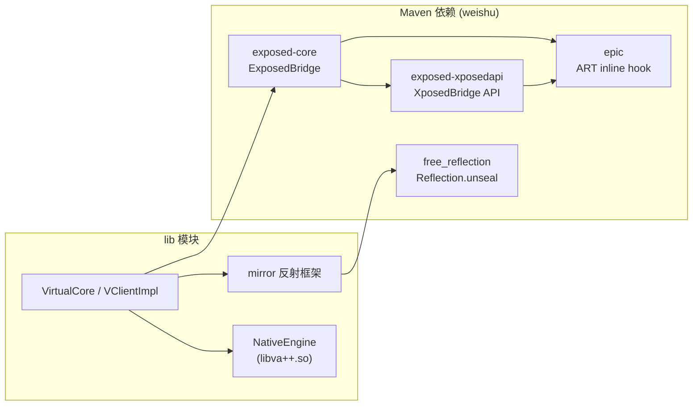
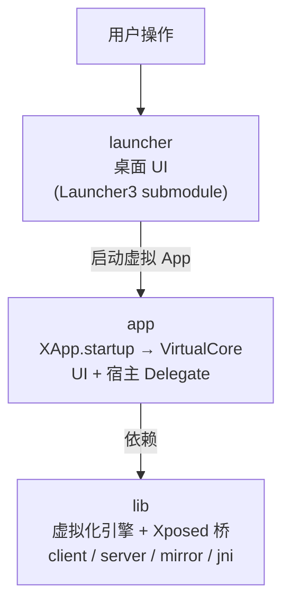

# 模块组成

VirtualXposed 工程分三个 Gradle 模块，定义在 `VirtualApp/settings.gradle`：

```groovy
include ':lib', ':app', ':launcher'
rootProject.name = "VirtualXposed"
```

这一篇梳理每个模块的代码组织，方便你按图索骥找源码。

## lib —— 虚拟化引擎 + Xposed 桥接（核心）

`lib` 是最大也最核心的模块（279 个 Java 文件 + 90 个 JNI 文件），VirtualApp 引擎和 VirtualXposed 的 Xposed 集成都在这里。包根为 `com.lody.virtual`。

### 目录结构

```
lib/src/main/
├── java/com/lody/virtual/
│   ├── client/      ← 客户端：Hook 注入、Stub、IPC、native 桥
│   ├── server/      ← 服务端：虚拟系统服务实现
│   ├── os/          ← 虚拟环境/用户/文件系统辅助
│   ├── remote/      ← 跨进程数据对象（Parcelable）
│   └── helper/      ← 工具类
├── java/mirror/     ← 反射镜像 Android 隐藏 API
├── java/android/    ← Android 框架类的补丁/镜像
├── aidl/            ← 跨进程接口定义
└── jni/             ← C/C++ native 代码（libva++.so）
```

### client/ 关键子包

| 子包 | 作用 | 代表类 |
| --- | --- | --- |
| `client.core` | 引擎入口、Hook 总管 | `VirtualCore`、`InvocationStubManager` |
| `client` | 虚拟进程绑定、native 桥 | `VClientImpl`、`NativeEngine` |
| `client.hook.base` | Hook 框架基类 | `BinderInvocationStub`、`MethodProxy`、`MethodInvocationStub` |
| `client.hook.proxies.*` | 各系统服务代理（近 60 个） | `ActivityManagerStub`、`LocationManagerStub`... |
| `client.hook.delegate` | Instrumentation 等委托 | `AppInstrumentation` |
| `client.hook.providers` | ContentProvider 代理 | `ProviderHook` |
| `client.ipc` | 跨进程调用封装 | `ServiceManagerNative`、`VActivityManager`、`VPackageManager` |
| `client.stub` | 占位组件 | `StubActivity`（C0~C99）、`StubCP`、`DaemonService` |
| `client.natives` | native 方法反射定位 | `NativeMethods` |
| `client.env` | 运行时常量、特殊组件表 | `VirtualRuntime`、`Constants`、`SpecialComponentList` |
| `client.fixer` | Context 修补 | `ContextFixer` |

### server/ 关键子包

| 子包 | 作用 | 代表类 |
| --- | --- | --- |
| `server` | 服务注册入口、缓存 | `BinderProvider`、`ServiceCache` |
| `server.am` | 虚拟 AMS（Activity/Service/进程/广播） | `VActivityManagerService`、`ActivityStack`、`ProcessRecord` |
| `server.pm` | 虚拟 PMS（安装/解析/多用户） | `VPackageManagerService`、`VAppManagerService`、`VUserManagerService` |
| `server.location` | 虚拟定位 | `VirtualLocationService` |
| `server.accounts` | 虚拟账户 | `VAccountManagerService` |
| `server.notification` | 虚拟通知 | `VNotificationManagerService` |
| `server.job` | 虚拟 JobScheduler | `VJobSchedulerService` |
| `server.device` | 虚拟设备信息 | `VDeviceManagerService` |
| `server.vs` | 虚拟存储 | `VirtualStorageService` |

### mirror/ —— 反射镜像

`mirror/` 下是一堆“影子类”，用反射字段（`RefMethod`、`RefObject` 等）映射 Android 框架的隐藏 API。`RefClass.load()` 在启动时把这些字段绑定到真实的 `android.app.ActivityThread` 等类上。详见[反射框架 mirror](../features/mirror-reflection.md)。

### jni/ —— native 层

| 目录 | 作用 |
| --- | --- |
| `jni/Jni` | JNI 桥接，`NativeEngine` 的 native 方法实现 |
| `jni/Foundation` | IO 重定向核心（hook libc 文件接口） |
| `jni/Substrate` | 方法 hook 辅助 |
| `jni/A64Inlinehook` | arm64 inline hook |
| `jni/fb` (fblyra) | Facebook 的 JNI 异常处理库 |

产出 `libva++.so`，由 `NativeEngine` 在虚拟进程里 `System.loadLibrary("va++")` 加载。

### Xposed 相关依赖

`lib/build.gradle` 引入了 weishu（Tiann）的三个 Maven 依赖：

```groovy
api("me.weishu.exposed:exposed-core:0.8.1")     // ExposedBridge
implementation "me.weishu:free_reflection:3.0.1" // 绕过反射限制
implementation "me.weishu:epic:0.11.1"           // ART 方法 hook
implementation "me.weishu.exposed:exposed-xposedapi:0.4.6" // Xposed API
```

这些是 VirtualXposed 区别于原版 VirtualApp 的关键，详见 [epic 与 ExposedBridge](../xposed/epic-exposed.md)。它们与 lib 内部代码的协作关系：



`free_reflection` 是 `mirror` 和 `epic` 的共同前置依赖——没有它，两者在 Android 9+ 都无法访问隐藏 API。

## app —— 应用外壳（64 个 Java 文件）

`app` 模块是用户实际安装的那个 App，`applicationId = "io.va.exposed64"`，包根 `io.virtualapp`。它依赖 `lib`，负责 UI 和宿主侧的回调实现。

### 目录结构

```
app/src/
├── main/java/io/virtualapp/
│   ├── XApp.java              ← Application 入口，调 VirtualCore.startup
│   ├── home/                  ← 首页、添加应用、加载页
│   ├── settings/              ← 设置、应用管理、任务管理、关于、推荐插件
│   ├── sys/                   ← 安装器、分享桥
│   ├── splash/                ← 启动闪屏
│   ├── delegate/              ← VirtualCore 各 Delegate 的实现
│   ├── gms/                   ← 伪造 GMS
│   ├── update/                ← 版本检查
│   ├── dev/                   ← 调试广播接收器
│   ├── glide/                 ← 图标加载
│   ├── widgets/               ← 自定义控件
│   └── abs/ utils/            ← MVP 基类、工具
├── aosp/java/                 ← aosp flavor：崩溃处理、初始化器
└── fdroid/java/               ← fdroid flavor：初始化器
```

### 两个 product flavor

```groovy
productFlavors {
    aosp { /* 带签名配置 */ }
    fdroid { /* 无签名 */ }
}
```

`aosp` 和 `fdroid` 各有自己的 `MyVirtualInitializer`，差异主要在签名和初始化逻辑。

### delegate/ —— 宿主侧回调

`BaseVirtualInitializer`（继承 `VirtualCore.VirtualInitializer`）按进程分发：

```java
public void onVirtualProcess() {
    virtualCore.setCrashHandler(new BaseCrashHandler());
    virtualCore.setComponentDelegate(new MyComponentDelegate());    // 组件可见性
    virtualCore.setPhoneInfoDelegate(new MyPhoneInfoDelegate());     // 设备信息伪造
    virtualCore.setTaskDescriptionDelegate(new MyTaskDescDelegate());// 任务栏图标/标题
    LogcatService.start(...);
}
public void onServerProcess() {
    virtualCore.setAppRequestListener(new MyAppRequestListener(application));
    virtualCore.addVisibleOutsidePackage("com.tencent.mm");  // 微信等对外可见
    // ...
}
```

这些 Delegate 是宿主定制虚拟行为的扩展点——`lib` 定义接口，`app` 决定具体值（比如伪造什么 IMEI、哪些包对外可见）。

### AndroidManifest 要点

- `XApp` 是 Application。
- `SplashActivity` 是 LAUNCHER 入口。
- `ShareBridgeActivity`、`InstallerActivity` 处理外部分享/安装 APK 的 Intent。
- `vxp.installer` alias 让 VirtualXposed 能响应“打开 APK”的 Intent。
- `vxp.launcher` alias（默认 disabled）可让 VirtualXposed 注册成 Home 桌面。
- 各 Stub Activity 不在这个 Manifest 里——它们在 `lib` 的 Manifest 里（被 merge 进来）。

## launcher —— 桌面 UI（git submodule）

```ini
# .gitmodules
[submodule "VirtualApp/launcher"]
    path = VirtualApp/launcher
    url = https://github.com/android-hacker/Launcher3.git
```

基于 AOSP Launcher3 改造，提供应用抽屉、桌面图标等 UI。clone 仓库后需要 `git submodule update --init` 才能拿到。

## 三模块协作



- `app` 是壳，提供 UI 和宿主定制；
- `lib` 是核，提供引擎能力；
- `launcher` 是皮，提供桌面交互。

读源码的推荐入口：`app` 的 `XApp` → `lib` 的 `VirtualCore.startup` → `InvocationStubManager` → 各 `Stub` → `server` 各 `Service`。
