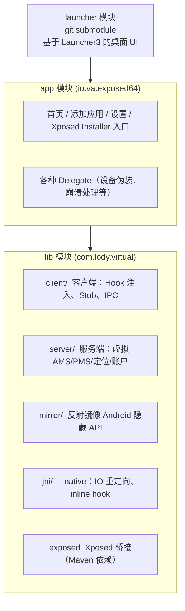
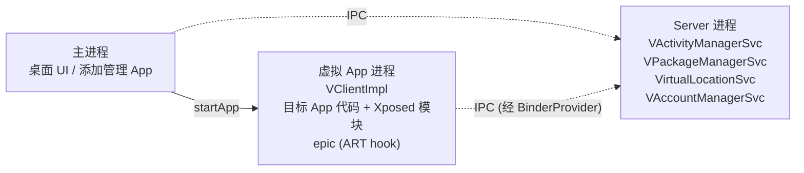
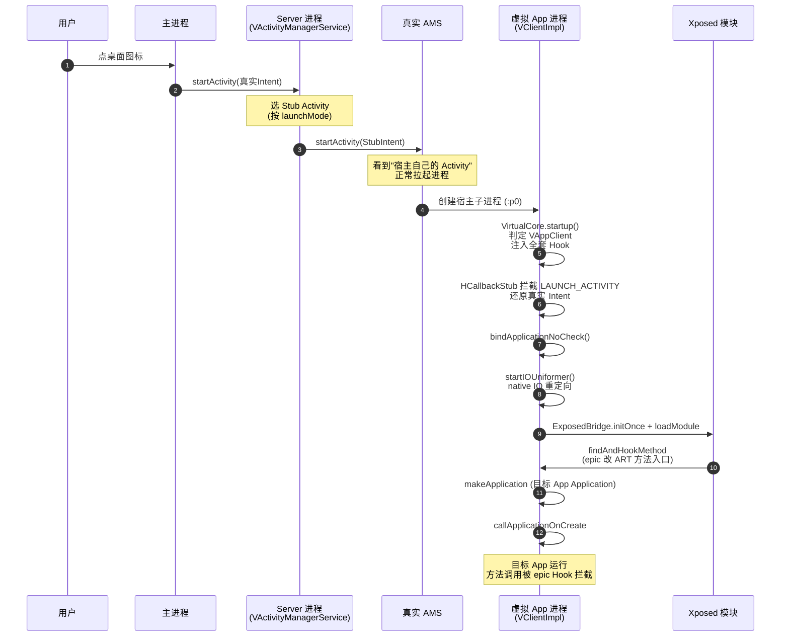

# 整体架构

这一篇从高层俯瞰 VirtualXposed 是怎么组织的，建立全局认知后再往下钻各子系统。

## 两层结构

VirtualXposed 在工程上分两层：

`settings.gradle` 里 `include ':lib', ':app', ':launcher'`，三者构成完整 APK。

## 三个进程

VirtualXposed 安装后，运行时会分化出多种进程，每种职责不同。核心是这三类（详见[进程模型](./process-model.md)）：

| 进程 | 职责 | 关键类 |
| --- | --- | --- |
| **主进程 (Main)** | 宿主 UI、桌面、设置 | `XApp`、`NewHomeActivity` |
| **Server 进程** | 虚拟系统服务端：AMS/PMS/账户/定位/通知/Job | `BinderProvider`、`VActivityManagerService`、`VPackageManagerService` |
| **虚拟 App 进程 (VAppClient)** | 跑被虚拟的 App + Xposed 模块 | `VClientImpl`、`ExposedBridge` |

一个简化的运行时视图：

## 关键设计：用 ContentProvider 当 IPC 桥

一个普通 App 怎么凭空搞出一个“系统服务端”？VirtualXposed 的巧思是：**用一个 ContentProvider 作为 server 进程的引导入口**。

- `BinderProvider`（一个 ContentProvider）注册在 Manifest 里，被系统拉起时 `onCreate` 里初始化所有虚拟服务并塞进 `ServiceCache`。
- 客户端通过 `ProviderCall` 调它的 `call("@")` 方法，拿到 `IServiceFetcher` 的 IBinder。
- 之后所有虚拟服务的获取都走这个 fetcher：`ServiceManagerNative.getService("activity")` → server 返回 `VActivityManagerService` 的 IBinder。

这样**不依赖任何系统权限，纯靠 ContentProvider + Binder** 就搭起了跨进程的服务总线。详见[跨进程 IPC 桥](../features/ipc-bridge.md)。

## 关键设计：劫持 ServiceManager 缓存

客户端怎么让目标 App 以为自己在真系统里？答案是**把系统 `ServiceManager` 缓存里的 IBinder 换成自己的代理**。

- `BinderInvocationProxy.inject()` 调 `ServiceManager.sCache.get().put(name, this)`，用假 IBinder 替换真 IBinder。
- 假 IBinder 的 `queryLocalInterface` 返回一个 Java 动态代理，代理上挂着一堆 `MethodProxy`。
- 目标 App 调 `getSystemService(LOCATION_SERVICE)` → 拿到代理 → 每个方法调用都被对应 `MethodProxy` 拦截 → 返回虚拟数据（假定位、假 IMEI 等）。

这是整个 Hook 体系的核心，详见[系统服务 Hook](../features/service-hook.md)。

## 关键设计：Stub Activity 欺骗 AMS

Android 不允许一个 App 直接启动另一个 App 的 Activity（受 manifest 限制）。VirtualXposed 怎么启动虚拟 App 的 Activity？

- 客户端 Hook `startActivity`，把真实 Intent 改写成指向**预注册的占位 Activity**（`StubActivity$C0`~`C99`，共 100 个，对应不同 launchMode/taskAffinity）。
- 真实 AMS 看到的是“宿主自己的 Activity”，正常启动。
- Activity 实例化前，Hook `ActivityThread.mH` 的 `mCallback`（`HCallbackStub`），拦截 `LAUNCH_ACTIVITY` 消息，把占位 Intent **还原**成真实 Intent，并绑定目标 App 的 ClassLoader。
- 于是真正实例化、显示的是虚拟 App 的 Activity，但 AMS 全程以为在跑宿主的 Activity。

详见 [Stub Activity 机制](../features/stub-activity.md)。

## 关键设计：native 层 IO 重定向

数据隔离（每个虚拟 App 独立数据目录）不能只靠 Java 层，因为很多 App 直接走 native 读写 `/data/data/<pkg>`。VirtualXposed 在 native 层 hook libc 的文件接口，把路径透明重定向：

- `/data/data/<目标pkg>` → VirtualXposed 私有目录下的虚拟数据目录
- `/sdcard` → 虚拟存储目录
- 配合白名单（系统公共目录不重定向）

这部分由 `libva++.so` 完成，入口是 `NativeEngine`，详见[虚拟存储与 IO 重定向](../features/io-redirect.md)和[Native 层](../features/native-layer.md)。

## 关键设计：在虚拟进程里加载 Xposed

这是 VirtualXposed 相对原版 VirtualApp 的核心增量。`VClientImpl.bindApplicationNoCheck()` 在绑定目标 App 的 Application 时：

1. `ExposedBridge.initOnce(context, appInfo, classLoader)` —— 初始化 epic 的 ART Hook 引擎。
2. 遍历所有已安装的 App，把其中是 Xposed 模块的 `ExposedBridge.loadModule(...)` 加载进来。
3. 模块用标准 Xposed API（`XposedBridge.findAndHookMethod` 等）注册钩子，epic 在 ART 层把方法入口改写。

于是模块的 Hook 就挂在了同进程的目标 App 方法上。详见 [Xposed 集成](../xposed/how-it-works.md)。

## 一张图串联：启动虚拟 App 的完整时序

下面这张时序图把上述所有关键设计串起来——从用户点图标到目标 App 跑起来、Xposed 模块生效的全过程：

## 阅读路线

建议按这个顺序读，每一篇都建立在前一篇之上：

1. [进程模型](./process-model.md) —— 四种进程怎么区分、怎么启动
2. [模块组成](./modules.md) —— lib/app/launcher 各自代码组织
3. 然后进入[功能详解](../features/app-virtualization)，逐个机制钻进去
