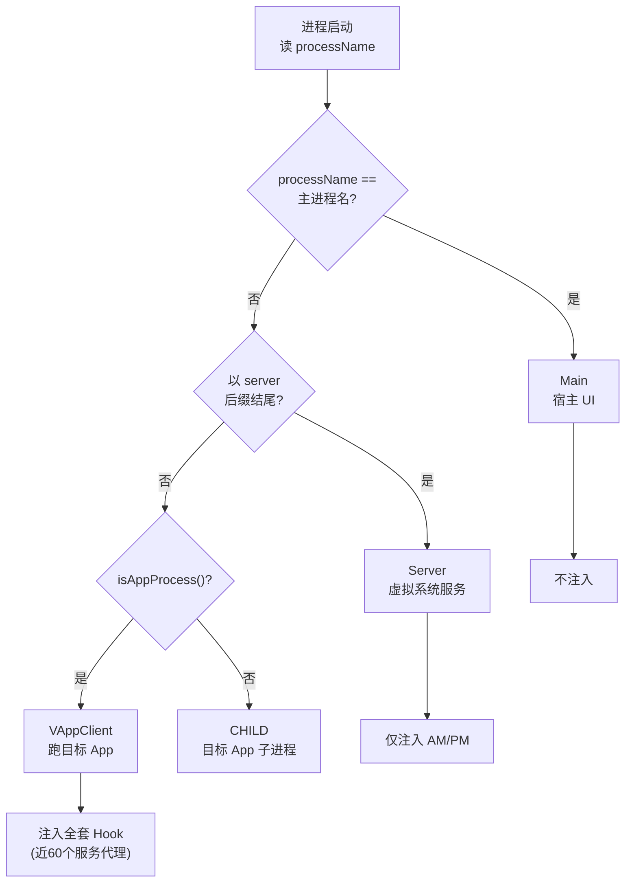
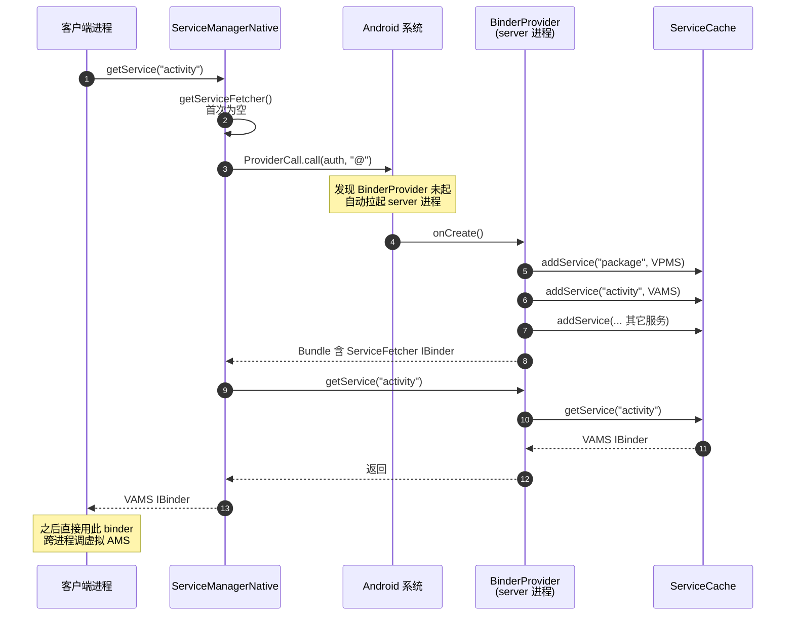

# 进程模型

VirtualXposed 安装后是**一个 APK、一个 applicationId**，但运行时会分化出多种进程。理解进程模型是理解一切后续机制的前提——因为“在哪个进程里 Hook”“server 在哪”“App 跑在哪”全都由进程类型决定。

## 四种进程类型

核心逻辑在 `VirtualCore.detectProcessType()`（`lib/.../client/core/VirtualCore.java`）：

```java
private void detectProcessType() {
    hostPkgName = context.getApplicationInfo().packageName;
    mainProcessName = context.getApplicationInfo().processName;
    processName = ActivityThread.getProcessName.call(mainThread);
    if (processName.equals(mainProcessName)) {
        processType = ProcessType.Main;          // 1. 主进程
    } else if (processName.endsWith(Constants.SERVER_PROCESS_NAME)) {
        processType = ProcessType.Server;        // 2. server 进程
    } else if (VActivityManager.get().isAppProcess(processName)) {
        processType = ProcessType.VAppClient;    // 3. 虚拟 App 进程
    } else {
        processType = ProcessType.CHILD;         // 4. 子进程
    }
    if (isVAppProcess()) {
        systemPid = VActivityManager.get().getSystemPid();
    }
}
```

判断依据纯粹是**当前进程名**：

| 类型 | 判断条件 | 职责 |
| --- | --- | --- |
| **Main** | 进程名 == 主进程名 | 宿主 UI、桌面、设置 |
| **Server** | 进程名以 server 后缀结尾 | 虚拟系统服务端 |
| **VAppClient** | `VActivityManager.isAppProcess()` 认定 | 跑被虚拟的 App |
| **CHILD** | 其它 | 目标 App 自己 fork 的子进程 |

判定流程：



## 进程是怎么被拉起的

### Server 进程：靠 ContentProvider 拉起

Android 系统保证：**一个 ContentProvider 在被首次访问时，系统会自动拉起它所在的进程**。VirtualXposed 利用这点引导 server：

- `BinderProvider`（一个 ContentProvider）声明在 Manifest 里，归属 server 进程。
- 客户端首次调用 `ServiceManagerNative.ensureServerStarted()` 时，发起一次 `ProviderCall`（`methodName = "ensure_created"`）。
- 系统发现 `BinderProvider` 还没起来，就**拉起 server 进程**，触发 `BinderProvider.onCreate()`。
- `onCreate` 里依次 `systemReady` 各个虚拟服务并注册到 `ServiceCache`。

```java
// ServiceManagerNative
public static void ensureServerStarted() {
    new ProviderCall.Builder(context, SERVICE_CP_AUTH).methodName("ensure_created").call();
}
```

```java
// BinderProvider.onCreate()
VPackageManagerService.systemReady();
addService(PACKAGE, VPackageManagerService.get());
VActivityManagerService.systemReady(context);
addService(ACTIVITY, VActivityManagerService.get());
// ... 账户、定位、通知、Job、设备 ...
```

不依赖任何系统权限，纯靠 ContentProvider 的生命周期钩子，就把 server 进程“骗”起来了。



### 虚拟 App 进程：靠 Stub Activity 拉起

启动一个虚拟 App 时，真正拉起新进程的是**真实 AMS**，但它拉起的是宿主进程的一个新实例（用 `:p<N>` 之类的子进程名）：

1. 用户点桌面图标 → 主进程发 `startActivity`（指向 Stub Activity）。
2. `VActivityManagerService`（server）记录这个虚拟 App 的进程信息，并通过真实 AMS 启动一个宿主子进程（用 Stub Activity 作为入口）。
3. 新进程起来后，`VirtualCore.startup()` 跑起来，`detectProcessType()` 判定自己是 `VAppClient`。
4. `VClientImpl.bindApplication()` 把目标 App 的 Application 绑上来——这个进程从此“变成”目标 App。

进程名是 VirtualXposed 自己管理的（`isAppProcess` 判定），对系统而言它们都是宿主 `io.va.exposed64` 的子进程。

## startup() 的初始化流程

每个进程起来后都要调 `VirtualCore.startup(context)`，它根据进程类型做不同的事：

```java
public void startup(Context context) throws Throwable {
    if (!isStartUp) {
        Reflection.unseal(context);              // 绕过 Android 9+ 反射限制
        VASettings.STUB_CP_AUTHORITY = ...;     // 拼接 ContentProvider authority
        ServiceManagerNative.SERVICE_CP_AUTH = ...;
        mainThread = ActivityThread.currentActivityThread.call();
        unHookPackageManager = context.getPackageManager();
        detectProcessType();                     // 判定进程类型
        InvocationStubManager.getInstance().init();   // 按类型注入 Hook
        invocationStubManager.injectAll();
        ContextFixer.fixContext(context);
        isStartUp = true;
    }
}
```

关键在 `InvocationStubManager.injectInternal()`——**不同进程类型注入不同的 Hook 集合**：

```java
if (isMainProcess()) return;              // 主进程：啥也不注入
if (isServerProcess()) {                  // server：只注入 AM/PM
    addInjector(new ActivityManagerStub());
    addInjector(new PackageManagerStub());
    return;
}
if (isVAppProcess()) {                    // 虚拟 App 进程：注入全套
    addInjector(new LibCoreStub());
    addInjector(new ActivityManagerStub());
    addInjector(new PackageManagerStub());
    addInjector(new LocationManagerStub());
    addInjector(new TelephonyStub());
    // ... 近 60 个服务代理 ...
}
```

这设计很合理：

- **主进程**是宿主 UI，不需要骗自己，不注入。
- **server 进程**自己就是虚拟系统服务的实现方，只需少量 Hook（让它能收到系统的回调）。
- **虚拟 App 进程**是“演戏”的主场，要把全套系统服务都换成代理，让目标 App 信以为真。

## initialize() 的回调分发

`VirtualCore` 暴露了 `VirtualInitializer` 抽象类，让宿主 App（`app` 模块）按进程类型注册各自逻辑：

```java
public void initialize(VirtualInitializer initializer) {
    switch (processType) {
        case Main:        initializer.onMainProcess(); break;
        case VAppClient:  initializer.onVirtualProcess(); break;
        case Server:      initializer.onServerProcess(); break;
        case CHILD:       initializer.onChildProcess(); break;
    }
}
```

`app` 模块的 `BaseVirtualInitializer` 实现了这些回调（见[模块组成](./modules.md)）：

- `onVirtualProcess()`：设崩溃处理、组件委托、设备信息伪装、任务描述伪装，启动 `LogcatService`。
- `onServerProcess()`：设 App 安装请求监听、声明对外可见的包（QQ、微信等，用于跨进程通信白名单）。

## 为什么要分这么多进程

分进程不是洁癖，是必需：

1. **隔离崩溃**：一个虚拟 App 崩了不能拖垮 server 和其它虚拟 App。
2. **模拟真实多 App**：真实 Android 里每个 App 独立进程、独立 UID。VirtualApp 要让目标 App“以为”自己独占进程，就得给每个虚拟 App 一个独立进程（虽然对系统而言都是宿主子进程）。
3. **server 独立**：虚拟系统服务要常驻、要被所有虚拟 App 进程共享，必须独立进程承载。
4. **安全边界**：目标 App 的代码跑在 VAppClient 进程，它只能通过 server 暴露的 Binder 接口访问虚拟服务，不能直接摸到 server 的内存。

## 小结

- 一个 APK，按进程名区分 4 种进程。
- server 靠 ContentProvider 拉起，虚拟 App 靠 Stub Activity + 真实 AMS 拉起。
- 每个进程 `startup()` 时按类型注入不同 Hook 集合。
- 主进程不注入、server 注入少量、虚拟 App 进程注入全套。

下一步看[模块组成](./modules.md)，了解代码是怎么按 lib/app/launcher 组织的。
