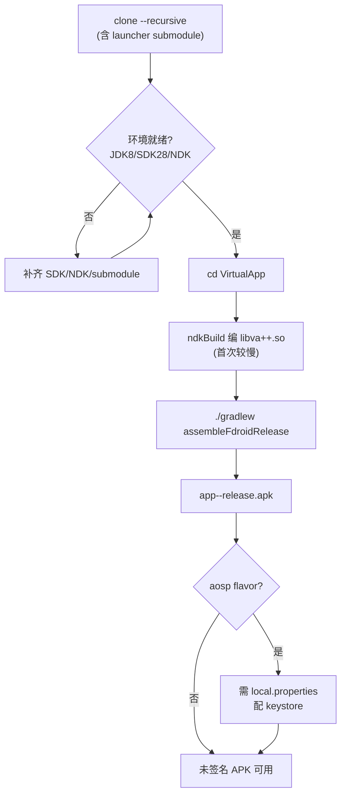
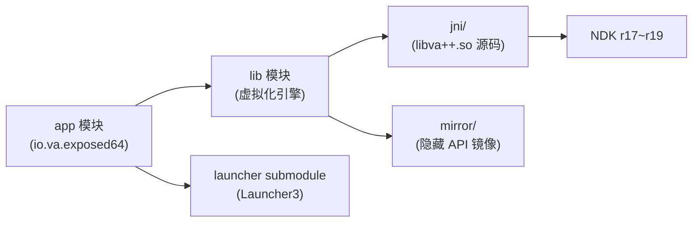

# 本地构建

这一篇讲怎么在本地从源码构建 VirtualXposed APK。文档站的构建见[本文档站搭建](./docs-site.md)。

## 构建流程总览



## 工程模块依赖




## 前置要求

| 项 | 要求 |
| --- | --- |
| JDK | JDK 8（项目用 `compileSdkVersion 28` + AGP 3.2.1，需要 JDK 8） |
| Android SDK | API 28（compileSdkVersion）+ Build Tools 28.0.3 |
| NDK | 项目含 native 代码（`libva++.so`），需 NDK |
| Git submodule | `launcher` 是 submodule，必须 init |

## 关键配置

来自 `VirtualApp/build.gradle`：

```groovy
buildscript {
    dependencies {
        classpath 'com.android.tools.build:gradle:3.2.1'           // AGP 3.2.1
        classpath 'com.android.tools.build:gradle-experimental:0.11.1'
    }
}
```

来自 `VirtualApp/app/build.gradle`：

```groovy
android {
    compileSdkVersion 28
    buildToolsVersion '28.0.3'
    defaultConfig {
        applicationId "io.va.exposed64"
        minSdkVersion 21          // Android 5.0
        targetSdkVersion 23
        versionCode 220
        versionName "0.22.0"
        ndk { abiFilters "arm64-v8a", "x86_64" }   // 只产 64 位
    }
    productFlavors {
        aosp { /* 带签名 */ }
        fdroid { /* 无签名 */ }
    }
}
```

## 构建步骤

```bash
# 1. clone（带 submodule）
git clone --recursive https://github.com/android-security-engineer/VirtualXposed-skills.git
cd VirtualXposed-skills

# 已 clone 的话补 submodule
git submodule update --init --recursive

# 2. 进入工程目录
cd VirtualApp

# 3. 构建 release（fdroid flavor，无需签名配置）
./gradlew assembleFdroidRelease

# 或 aosp flavor（需要 local.properties 配 keystore，见下）
./gradlew assembleAospRelease
```

## 产物位置

```
VirtualApp/app/build/outputs/apk/<flavor>/release/
└── app-<flavor>-release.apk
```

## 签名配置（aosp flavor）

`app/build.gradle` 从 `local.properties` 读 keystore：

```groovy
Properties properties = new Properties()
def localProp = file(project.rootProject.file('local.properties'))
if (localProp.exists()) {
    properties.load(localProp.newDataInputStream())
}
def keyFile = file(properties.getProperty("keystore.path") ?: "/tmp/does_not_exist")
```

要构建 aosp release，在 `VirtualApp/local.properties` 加：

```properties
keystore.path=/path/to/your.jks
keystore.alias=your_alias
keystore.pwd=your_store_password
keystore.alias_pwd=your_key_password
```

没有 keystore 时，aosp flavor 的 `signingConfig` 不生效（`if (keyFile.exists())` 判断），构建出的 APK 未签名。fdroid flavor 不涉及签名。

## native 构建

`lib/build.gradle` 配了 `externalNativeBuild`（ndkBuild）：

```groovy
android {
    defaultConfig {
        externalNativeBuild {
            ndkBuild { abiFilters "arm64-v8a", "x86_64" }
        }
    }
    externalNativeBuild {
        ndkBuild { path file("src/main/jni/Android.mk") }
    }
}
```

`jni/Android.mk` 编译 `va++` 共享库（见 [Native 层](../features/native-layer.md)）。首次构建会编译 native，较慢。`android.useDeprecatedNdk=true`（`gradle.properties`）是为了兼容旧版 NDK 配置。

如果 NDK 版本不匹配，native 构建可能失败。项目使用的是较旧 AGP 3.2.1，对应 NDK r17~r19 左右的版本兼容性最好。

## CI 构建

仓库提供两条 GitHub Actions 流水线：

| Workflow | 文件 | 触发 | 产物 |
| --- | --- | --- | --- |
| Android CI | `.github/workflows/android.yml` | push 到 vxp/main、PR | APK artifact（30 天） |
| Release APK | `.github/workflows/release.yml` | 推 `v*` tag | GitHub Release 资产（永久） |

### Android CI（构建验证）

每次推送 VirtualApp 改动或 PR，CI 会：

1. checkout 含 launcher submodule
2. JDK 8 + Android SDK 28 + NDK r19c（19.2.5345600）
3. 从 GitHub Secrets 解码 release keystore 写入 `local.properties`
4. `./gradlew assembleAospRelease`（签名）+ `assembleFdroidRelease`（未签名）
5. 上传 APK 为 artifact（`virtualxposed-apk`，保留 30 天）

### Release APK（发布分发）

推送 `v*` tag（如 `git tag v0.22.1 && git push origin v0.22.1`）触发发布：

1. 同样构建签名 aosp APK
2. 重命名为 `VirtualXposed-<tag>.apk`
3. 用 `softprops/action-gh-release` 创建 GitHub Release 并上传 APK

> ⚠️ 首次发布前需配置签名密钥，见下文[签名密钥配置](#签名密钥配置)。

### 签名密钥配置

CI 的 Release 流程需要 4 个 GitHub Secret（仓库 Settings → Secrets and variables → Actions）：

| Secret | 值 | 来源 |
| --- | --- | --- |
| `VXP_KEYSTORE_BASE64` | keystore 的 base64 | `base64 -w 0 release.jks` |
| `VXP_KEY_ALIAS` | `vxp` | generate-keystore.sh 默认 |
| `VXP_STORE_PWD` | keystore 密码 | `virtualxposed`（可改） |
| `VXP_KEY_PWD` | key 密码 | `virtualxposed`（可改） |

生成 keystore（运行 `./scripts/generate-keystore.sh release.jks`，脚本会输出 base64 与各 Secret 值，填入 GitHub Secrets 即可）。

> ⚠️ keystore 一旦用于发布 Release 不可更换（否则后续版本签名不一致，无法覆盖安装）。妥善备份 `release.jks`。

## 常见问题

- **依赖拉不到**：项目原用 jcenter（2021 年停服），已在 `VirtualApp/build.gradle` 的 buildscript 与 allprojects 两处追加阿里云镜像 `https://maven.aliyun.com/repository/jcenter`。若仍缺包，检查具体包名是否仅存在于 jcenter，可补 `maven { url 'https://maven.aliyun.com/repository/public' }`。
- **NDK 版本不匹配**：`gradle-experimental:0.11.1` 是废弃的 native 插件，需 NDK r19c（19.2.5345600）。CI 已固定此版本；本地建议用同版本，新版 NDK 可能报错。
- **launcher submodule 缺失**：`git submodule update --init --recursive`，CI 已自动处理。
- **CI 签名失败**：检查 4 个 `VXP_*` Secret 是否都已配置；`VXP_KEYSTORE_BASE64` 必须是 `base64 -w 0`（单行无换行）输出。
- **Java 版本**：必须 JDK 8，更高版本可能因 AGP 3.2.1 不兼容报错。

## 下载预编译 APK

无需从源码编译，直接下载已构建的签名 APK：

- **GitHub Releases**：[releases 页面](https://github.com/android-security-engineer/VirtualXposed-skills/releases)，下载最新 `VirtualXposed-v*.apk`
- **命令行**：`gh release download --repo android-security-engineer/VirtualXposed-skills --pattern '*.apk'`（下载最新版），或 `gh release download v0.22.1 --repo android-security-engineer/VirtualXposed-skills`（指定版本）
- **AI Agent**：在脚本中用 `gh release download` 或直接请求 `https://github.com/android-security-engineer/VirtualXposed-skills/releases/latest/download/` 获取最新 APK。

下载后在 Android 5.0~10.0 设备上直接安装（已签名，arm64-v8a / x86_64）。

## 小结

- JDK 8 + SDK 28 + NDK r19c，clone 带 submodule。
- `./gradlew assembleFdroidRelease` 出未签名 APK，`assembleAospRelease` 需配 keystore。
- native `libva++.so` 自动随 lib 模块构建。
- CI `android.yml` 自动构建验证，`release.yml` 在推 `v*` tag 时发布签名 APK 到 GitHub Release。
- jcenter 已用阿里云镜像续命老栈（AGP 3.2.1 / Gradle 4.6）；升级 AGP 不在本阶段范围。

本文档站（VitePress）的构建部署是另一套，见[本文档站搭建](./docs-site.md)。
