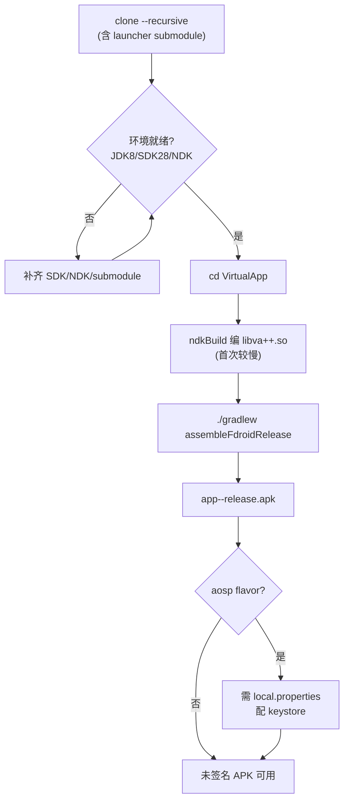
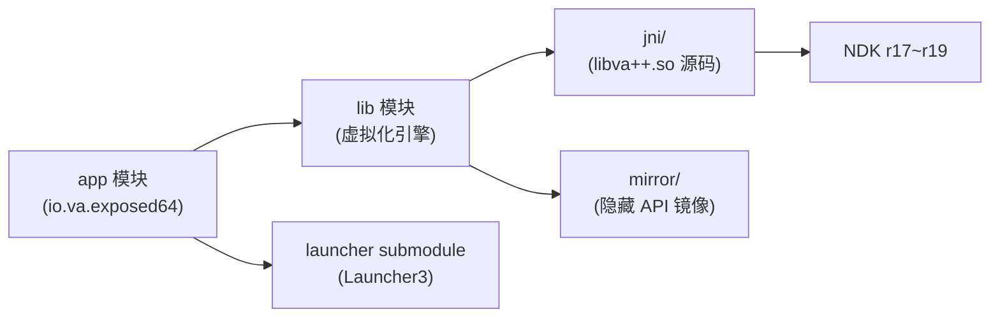

# 本地构建

这一篇讲怎么在本地从源码构建 VirtualXposed APK。文档站的构建见[本文档站搭建](./docs-site.md)。

## 构建流程总览



## 工程模块依赖




## 前置要求

| 项 | 要求 |
| --- | --- |
| JDK | JDK 8（项目用 `compileSdkVersion 28` + AGP 3.2.1，需要 JDK 8） |
| Android SDK | API 28（compileSdkVersion）+ Build Tools 28.0.3 |
| NDK | 项目含 native 代码（`libva++.so`），需 NDK |
| Git submodule | `launcher` 是 submodule，必须 init |

## 关键配置

来自 `VirtualApp/build.gradle`：

```groovy
buildscript {
    dependencies {
        classpath 'com.android.tools.build:gradle:3.2.1'           // AGP 3.2.1
        classpath 'com.android.tools.build:gradle-experimental:0.11.1'
    }
}
```

来自 `VirtualApp/app/build.gradle`：

```groovy
android {
    compileSdkVersion 28
    buildToolsVersion '28.0.3'
    defaultConfig {
        applicationId "io.va.exposed64"
        minSdkVersion 21          // Android 5.0
        targetSdkVersion 23
        versionCode 220
        versionName "0.22.0"
        ndk { abiFilters "arm64-v8a", "x86_64" }   // 只产 64 位
    }
    productFlavors {
        aosp { /* 带签名 */ }
        fdroid { /* 无签名 */ }
    }
}
```

## 构建步骤

```bash
# 1. clone（带 submodule）
git clone --recursive https://github.com/android-security-engineer/VirtualXposed-skills.git
cd VirtualXposed-skills

# 已 clone 的话补 submodule
git submodule update --init --recursive

# 2. 进入工程目录
cd VirtualApp

# 3. 构建 release（fdroid flavor，无需签名配置）
./gradlew assembleFdroidRelease

# 或 aosp flavor（需要 local.properties 配 keystore，见下）
./gradlew assembleAospRelease
```

## 产物位置

```
VirtualApp/app/build/outputs/apk/<flavor>/release/
└── app-<flavor>-release.apk
```

## 签名配置（aosp flavor）

`app/build.gradle` 从 `local.properties` 读 keystore：

```groovy
Properties properties = new Properties()
def localProp = file(project.rootProject.file('local.properties'))
if (localProp.exists()) {
    properties.load(localProp.newDataInputStream())
}
def keyFile = file(properties.getProperty("keystore.path") ?: "/tmp/does_not_exist")
```

要构建 aosp release，在 `VirtualApp/local.properties` 加：

```properties
keystore.path=/path/to/your.jks
keystore.alias=your_alias
keystore.pwd=your_store_password
keystore.alias_pwd=your_key_password
```

没有 keystore 时，aosp flavor 的 `signingConfig` 不生效（`if (keyFile.exists())` 判断），构建出的 APK 未签名。fdroid flavor 不涉及签名。

## native 构建

`lib/build.gradle` 配了 `externalNativeBuild`（ndkBuild）：

```groovy
android {
    defaultConfig {
        externalNativeBuild {
            ndkBuild { abiFilters "arm64-v8a", "x86_64" }
        }
    }
    externalNativeBuild {
        ndkBuild { path file("src/main/jni/Android.mk") }
    }
}
```

`jni/Android.mk` 编译 `va++` 共享库（见 [Native 层](../features/native-layer.md)）。首次构建会编译 native，较慢。`android.useDeprecatedNdk=true`（`gradle.properties`）是为了兼容旧版 NDK 配置。

如果 NDK 版本不匹配，native 构建可能失败。项目使用的是较旧 AGP 3.2.1，对应 NDK r17~r19 左右的版本兼容性最好。

## CI 构建（参考）

仓库已有的 `.github/workflows/android.yml` 在 push/PR 时自动构建：

```yaml
jobs:
  build:
    runs-on: ubuntu-latest
    steps:
    - uses: actions/checkout@v1
    - name: Checkout submodules
      uses: srt32/git-actions@v0.0.3
      with:
        args: git submodule update --init --recursive
    - name: set up JDK 1.8
      uses: actions/setup-java@v1
      with:
        java-version: 1.8
    - name: Build with Gradle
      run: cd VirtualApp && ./gradlew assembleRelease
    - name: Archive production artifacts
      uses: actions/upload-artifact@v1
      with:
        name: compiled
        path: VirtualApp/app/build/
```

注意它用 JDK 8、checkout v1（较旧）、`assembleRelease`（会同时构建 aosp 和 fdroid）。

## 常见问题

- **`git submodule` 拉不到 launcher**：网络问题或 submodule URL 变了，检查 `.gitmodules` 里的 `github.com/android-hacker/Launcher3.git` 是否可访问。
- **native 编译失败**：NDK 版本问题，`android.useDeprecatedNdk=true` 和旧 AGP 对新 NDK 支持差，建议用 NDK r17c/r18b。
- **依赖拉不到**：项目用 jcenter（已停止服务）和 maven.google.com，jcenter 依赖可能失败。可尝试加阿里云镜像或换仓库。
- **Java 版本**：必须 JDK 8，更高版本可能因 AGP 3.2.1 不兼容报错。

## 小结

- JDK 8 + SDK 28 + NDK，clone 带 submodule。
- `./gradlew assembleFdroidRelease` 出未签名 APK，aosp 需配 keystore。
- native `libva++.so` 自动随 lib 模块构建。
- CI 已有 `android.yml` 自动构建。

本文档站（VitePress）的构建部署是另一套，见[本文档站搭建](./docs-site.md)。
