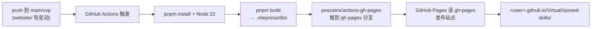
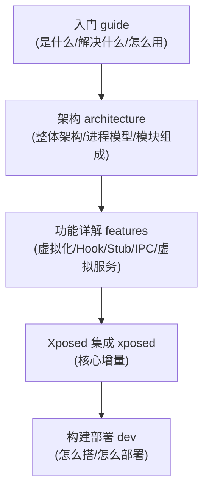

# 本文档站搭建

这一篇讲你正在看的这个文档站是怎么搭的——VitePress + GitHub Pages + GitHub Actions，作为本站自身的技术说明，也可作为类似项目的参考。

## 部署流水线




## 技术选型

| 组件 | 选择 | 理由 |
| --- | --- | --- |
| 静态站点生成器 | VitePress | Vue 生态、Markdown 优先、内置搜索/侧边栏、构建快 |
| 内容格式 | Markdown | 写作友好，适合教学文档 |
| 部署 | GitHub Pages | 免费、与仓库同源、自动 HTTPS |
| CI/CD | GitHub Actions | push 自动构建部署，无需本地操作 |

## 目录结构

```
website/
├── package.json              ← VitePress 依赖与脚本
├── .gitignore                ← 忽略 node_modules / dist / cache
├── .vitepress/
│   └── config.mts            ← 站点配置（nav/sidebar/主题/搜索）
├── public/
│   └── logo.svg              ← 站点 logo
├── index.md                  ← 首页（hero + features）
├── guide/                    ← 入门篇
├── architecture/             ← 架构篇
├── features/                 ← 功能详解篇
├── xposed/                   ← Xposed 集成篇
└── dev/                      ← 构建部署篇
```

## config.mts 关键配置

```ts
export default defineConfig({
  lang: 'zh-CN',
  title: 'VirtualXposed',
  base: '/VirtualXposed-skills/',   // ← 关键：GitHub Pages 项目站点路径
  cleanUrls: true,
  lastUpdated: true,
  themeConfig: {
    nav: [...],         // 顶部导航
    sidebar: {          // 按路径分组的侧边栏
      '/guide/': [...],
      '/architecture/': [...],
      '/features/': [...],
      '/xposed/': [...],
      '/dev/': [...]
    },
    search: { provider: 'local', ... },  // 本地搜索
    footer: { ... }
  }
})
```

### base 路径

这是部署到 GitHub Pages **项目站点**（非用户站点）的关键。仓库名 `VirtualXposed-skills`，Pages URL 是 `https://<user>.github.io/VirtualXposed-skills/`，所以 `base` 必须是 `/VirtualXposed-skills/`，否则所有静态资源 404。

如果是 `<user>.github.io` 仓库（用户站点），`base` 用 `/`。

### 侧边栏按路径分组

VitePress 支持不同路径下显示不同侧边栏。本站按 `guide`/`architecture`/`features`/`xposed`/`dev` 分组，每组对应一个章节的目录树，`activeMatch` 控制导航高亮。

## 本地开发

```bash
cd website
pnpm install      # 或 npm install
pnpm dev          # 启动开发服务器，http://localhost:5173
pnpm build        # 构建到 .vitepress/dist
pnpm preview      # 本地预览构建产物
```

构建产物在 `website/.vitepress/dist/`，是一组纯静态 HTML/JS/CSS。

## CI/CD：GitHub Actions

部署 workflow 在 `.github/workflows/docs.yml`（见[配置 GitHub Actions](#) 篇实际文件）。它的逻辑：

1. `push` 到 `main`/`vxp` 分支且 `website/` 有变动时触发。
2. checkout 仓库。
3. 装 pnpm + Node 22。
4. `pnpm install` 装依赖。
5. `pnpm build` 构建。
6. 用 `peaceiris/actions-gh-pages` 把 `website/.vitepress/dist` 推到 `gh-pages` 分支。
7. GitHub Pages 读 `gh-pages` 分支发布。

workflow 关键片段：

```yaml
- name: Build
  run: cd website && pnpm install && pnpm build
- name: Deploy
  uses: peaceiris/actions-gh-pages@v4
  with:
    github_token: ${{ secrets.GITHUB_TOKEN }}
    publish_dir: website/.vitepress/dist
```

`GITHUB_TOKEN` 是 Actions 自动注入的，无需额外配置 secret。

## 启用 GitHub Pages

workflow 部署到 `gh-pages` 分支后，还要在仓库设置里开 Pages：

1. 仓库 Settings → Pages。
2. Source 选 **Deploy from a branch**。
3. Branch 选 `gh-pages` / `(root)`。
4. Save。

首次部署后几分钟，站点在 `https://<user>.github.io/VirtualXposed-skills/` 上线。

（如果用 Actions 部署，也可选 Source 为 GitHub Actions，workflow 用 `actions/deploy-pages` 直接部署，不经过 gh-pages 分支。本站用 gh-pages 分支方式。）

## 内容组织原则

教学站点的核心是**让读者按顺序读能建立完整认知**。本站的结构：



1. **入门**（guide）：是什么、解决什么问题、怎么用、不能做什么 —— 建立宏观认知。
2. **架构**（architecture）：整体架构、进程模型、模块组成 —— 建立全局视图。
3. **功能详解**（features）：逐个机制钻进去 —— 应用虚拟化、Hook、Stub、IPC、各虚拟服务、底层支撑。
4. **Xposed 集成**（xposed）：VirtualXposed 的核心增量。
5. **构建部署**（dev）：怎么搭、怎么部署（含本站自身）。

每篇都在开头点明“这一篇讲什么、和前后篇的关系”，结尾小结并指向下一篇。这是为了让读者不迷路。

## 小结

- VitePress + Markdown，`base` 设 `/VirtualXposed-skills/` 适配项目站点。
- 侧边栏按路径分组，对应章节结构。
- GitHub Actions `docs.yml` 在 push 时构建并部署到 `gh-pages` 分支。
- 仓库 Settings → Pages 开启 `gh-pages` 分支发布。

本文档站的所有源文件都在 `website/` 下，可作参考或二次开发基础。
