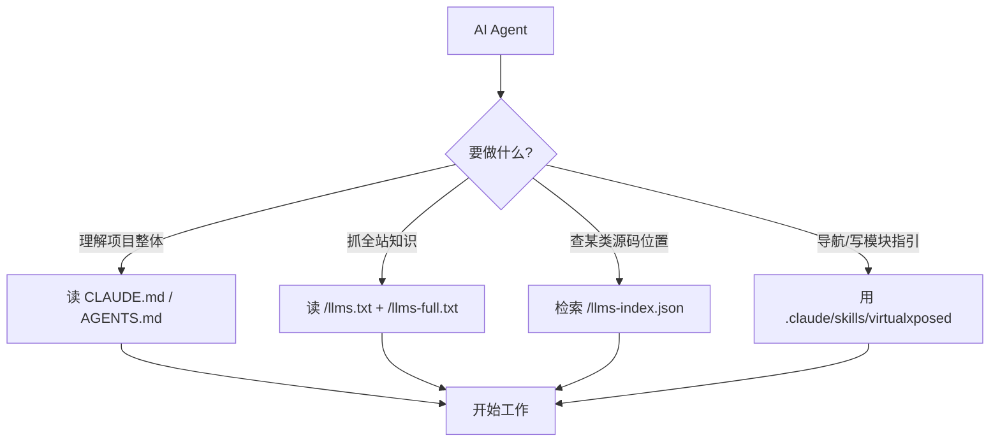

# AI Agent 对接说明

::: tip 适用对象
想让 AI Agent（Claude Code、Cursor、Windsurf 等）高效理解并使用 VirtualXposed 知识与源码的开发者。
:::

本站已为 AI Agent 提供三层对接能力，从"项目级上下文"到"可检索数据"到"可操作工具"。

## 第一层：项目级知识（Agent 进仓库即得）

| 文件 | 作用 | 适用工具 |
|------|------|---------|
| [`CLAUDE.md`](https://github.com/android-security-engineer/VirtualXposed-skills/blob/vxp/CLAUDE.md) | 项目性质、工作目录、构建命令、写文档硬规则 | Claude Code |
| [`AGENTS.md`](https://github.com/android-security-engineer/VirtualXposed-skills/blob/vxp/AGENTS.md) | 同上，跨工具通用入口 | Cursor / Aider / Windsurf |

Agent 在本仓库工作时，会自动读取这两个文件获得项目上下文。

## 第二层：站点级 llms.txt 协议（Agent 抓取全站知识）

遵循 [llms.txt 协议](https://llmstxt.org)，本站部署后提供：

- [`/llms.txt`](../llms.txt) —— 站点概览与核心入口链接清单
- [`/llms-full.txt`](../llms-full.txt) —— 全站知识浓缩单文件版（机制、架构、限制全覆盖）

任何支持 llms.txt 的 Agent 抓取本站域名即可获得结构化知识。

## 第三层：结构化检索数据（Agent 精确定位源码）

- [`/llms-index.json`](../llms-index.json) —— 全部 Java 类的结构化索引

字段结构：

```json
{
  "fileCount": 239,
  "moduleCount": 7,
  "classes": [
    {
      "className": "AccountStub",
      "package": "com.lody.virtual.client.hook.proxies.account",
      "module": "client/hook/proxies",
      "sourcePath": "VirtualApp/lib/src/main/java/com/lody/virtual/client/hook/proxies/account/AccountStub.java",
      "sourceUrl": "https://github.com/.../AccountStub.java",
      "docLink": "/reference/proxies/"
    }
  ]
}
```

Agent 可按 `className` / `package` / `module` 精确检索"某类在哪、属于哪个模块、对应哪篇文档"。

## 第四层：Claude Code Agent Skill（可操作导航工具）

仓库内 `.claude/skills/virtualxposed/` 提供 Claude Code skill，封装三类只读工具：

- **工具 A**：按类名/服务名定位源码（查 `llms-index.json`）
- **工具 B**：按能力追踪实现路径（客户端代理 → 虚拟服务 → 数据类三层链）
- **工具 C**：生成 Xposed 模块编写指引（含两大限制提醒）

该 skill **全部只读**——VirtualXposed 是 Xposed 模块运行容器，不是可编程 SDK，skill 不暴露任何写操作或臆造 API。

## 第五层：预编译 APK 下载（Agent 获取可安装产物）

VirtualXposed 以 **APK** 形式分发。Agent 无需从源码编译，可直接下载 Release：

下载命令：`gh release download --repo android-security-engineer/VirtualXposed-skills --pattern '*.apk' --dir .`

或直接请求 latest release URL：`https://github.com/android-security-engineer/VirtualXposed-skills/releases/latest`

> ⚠️ **签名状态**：当仓库未配置 `VXP_*` 签名 Secret 时，`release.yml` 走**降级模式**产出**未签名** APK。Android 7+ 会拒绝安装未签名 APK（`INSTALL_PARSE_FAILED_NO_CERTIFICATES`），需用 apksigner 自行签名后安装（见下方快速开始路径 A）。配置签名 Secret 后推 `v*` tag 即产已签名 APK。

- APK 支持 arm64-v8a / x86_64，安装于 Android 5.0~10.0（Android 13 经兼容性修复亦可启动，见 commit `f3007dc5`）
- 需从源码编译时见 [/dev/build](./build)（含 jcenter 镜像、NDK r19c、keystore 配置）
- CI 流水线：`android.yml`（构建验证）+ `release.yml`（tag 触发发布，支持未签名降级）

## 快速对接清单



## 快速开始：Agent 端到端示例

下面给一个 Agent 从零接入的完整可复制流程，覆盖"下载 → 签名 → 安装 → 启动验证"、"定位某服务的 Hook 实现"、"改一个文档页"三条最常见路径。

### 路径 A：下载并安装 VirtualXposed APK

```bash
# 1. 下载最新 Release APK（未配签名 Secret 时为未签名降级版）
gh release download --repo android-security-engineer/VirtualXposed-skills --pattern '*.apk' --dir .

# 2. 若是未签名 APK，本地用 apksigner 签名（需自备 keystore）
BT=$ANDROID_SDK_HOME/build-tools/34.0.0
$BT/zipalign -p -f 4 VirtualXposed-*.apk aligned.apk
$BT/apksigner sign --ks your.jks --ks-pass pass:<pwd> --ks-key-alias <alias> \
  --key-pass pass:<pwd> --v1-signing-enabled true --v2-signing-enabled true \
  --v3-signing-enabled true aligned.apk
$BT/apksigner verify aligned.apk   # exit 0 = 签名有效

# 3. 安装到已连接的设备（adb）
adb install -r aligned.apk

# 4. 启动并验证（启动 Activity 为 SplashActivity，会跳转 NewHomeActivity）
adb shell am start -n io.va.exposed64/io.virtualapp.splash.SplashActivity
adb shell ps -A | grep exposed64            # 应见主进程 + io.va.exposed64:x 服务器进程
adb shell dumpsys activity activities | grep topResumedActivity  # 应为 NewHomeActivity
```

### 路径 B：定位某系统服务的 Hook 实现

```bash
# 1. 问"location 服务怎么 Hook 的" → 检索结构化索引
curl -s https://android-security-engineer.github.io/VirtualXposed-skills/llms-index.json \
  | jq '.classes[] | select(.module=="client/hook/proxies") | select(.className|test("Location";"i"))'

# 2. 得到 LocationStub 的 sourceUrl（GitHub 直链）+ docLink（/reference/proxies/）
# 3. 读 llms-full.txt 第 4.2 节拿"系统服务 Hook 统一模式"概览
# 4. 按 module 在 index 过滤 server/remote 的 location 相关类，得"客户端代理 → 虚拟服务 → 数据类"三层链
#    涉及 native（如 IO 重定向）时额外查 nativeClasses：jq '.nativeClasses[] | select(.fileName|test("IOUniformer"))'
```

### 路径 C：改一个文档页并验证

```bash
cd website
pnpm install --frozen-lockfile
# 编辑 website/<某页>.md ...
pnpm build          # 零死链、无构建错误才算通过

# 改源码相关文档后，重新生成索引并校验数字
node scripts/gen-llms-index.mjs   # 重生成 llms-index.json
node scripts/gen-llms-full.mjs    # 校验手写文件数字无漂移
```
