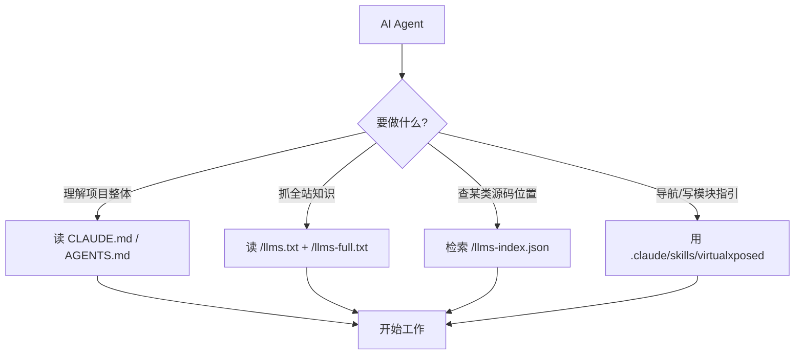

# AI Agent 对接说明

::: tip 适用对象
想让 AI Agent（Claude Code、Cursor、Windsurf 等）高效理解并使用 VirtualXposed 知识与源码的开发者。
:::

本站已为 AI Agent 提供三层对接能力，从"项目级上下文"到"可检索数据"到"可操作工具"。

## 第一层：项目级知识（Agent 进仓库即得）

| 文件 | 作用 | 适用工具 |
|------|------|---------|
| [`CLAUDE.md`](https://github.com/android-security-engineer/VirtualXposed-skills/blob/vxp/CLAUDE.md) | 项目性质、工作目录、构建命令、写文档硬规则 | Claude Code |
| [`AGENTS.md`](https://github.com/android-security-engineer/VirtualXposed-skills/blob/vxp/AGENTS.md) | 同上，跨工具通用入口 | Cursor / Aider / Windsurf |

Agent 在本仓库工作时，会自动读取这两个文件获得项目上下文。

## 第二层：站点级 llms.txt 协议（Agent 抓取全站知识）

遵循 [llms.txt 协议](https://llmstxt.org)，本站部署后提供：

- [`/llms.txt`](../llms.txt) —— 站点概览与核心入口链接清单
- [`/llms-full.txt`](../llms-full.txt) —— 全站知识浓缩单文件版（机制、架构、限制全覆盖）

任何支持 llms.txt 的 Agent 抓取本站域名即可获得结构化知识。

## 第三层：结构化检索数据（Agent 精确定位源码）

- [`/llms-index.json`](../llms-index.json) —— 全部 Java 类的结构化索引

字段结构：

```json
{
  "fileCount": 239,
  "moduleCount": 7,
  "classes": [
    {
      "className": "AccountStub",
      "package": "com.lody.virtual.client.hook.proxies.account",
      "module": "client/hook/proxies",
      "sourcePath": "VirtualApp/lib/src/main/java/com/lody/virtual/client/hook/proxies/account/AccountStub.java",
      "sourceUrl": "https://github.com/.../AccountStub.java",
      "docLink": "/reference/proxies/"
    }
  ]
}
```

Agent 可按 `className` / `package` / `module` 精确检索"某类在哪、属于哪个模块、对应哪篇文档"。

## 第四层：Claude Code Agent Skill（可操作导航工具）

仓库内 `.claude/skills/virtualxposed/` 提供 Claude Code skill，封装三类只读工具：

- **工具 A**：按类名/服务名定位源码（查 `llms-index.json`）
- **工具 B**：按能力追踪实现路径（客户端代理 → 虚拟服务 → 数据类三层链）
- **工具 C**：生成 Xposed 模块编写指引（含两大限制提醒）

该 skill **全部只读**——VirtualXposed 是 Xposed 模块运行容器，不是可编程 SDK，skill 不暴露任何写操作或臆造 API。

## 第五层：预编译 APK 下载（Agent 获取可安装产物）

VirtualXposed 以 **APK** 形式分发。Agent 无需从源码编译，可直接下载已签名的 Release：

下载命令：`gh release download --repo android-security-engineer/VirtualXposed-skills --pattern '*.apk' --dir .`

或直接请求 latest release URL：`https://github.com/android-security-engineer/VirtualXposed-skills/releases/latest`

- APK 已签名，支持 arm64-v8a / x86_64，安装于 Android 5.0~10.0
- 需从源码编译时见 [/dev/build](./build)（含 jcenter 镜像、NDK r19c、keystore 配置）
- CI 流水线：`android.yml`（构建验证）+ `release.yml`（tag 触发发布）

## 快速对接清单


