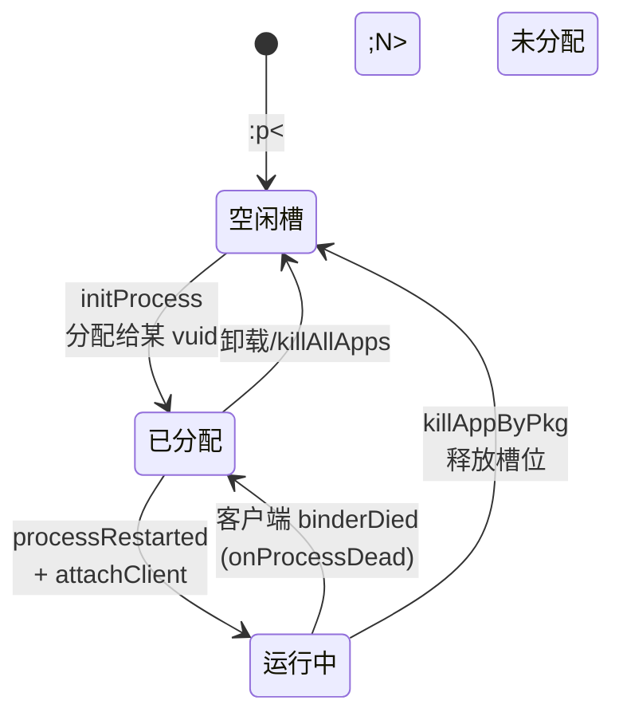

# 活动管理 (AMS)

这一篇讲 server 端的 `VActivityManagerService`（虚拟 AMS）——它如何管理虚拟 App 的进程、Activity 栈、Service、广播，以及它如何和真实 AMS、客户端 `VClientImpl` 协作。

## 职责

真实系统的 `ActivityManagerService` 负责：进程调度、Activity 栈管理、Service 生命周期、广播分发、任务管理、进程优先级等。VirtualXposed 在 server 进程用 `VActivityManagerService`（继承 `IActivityManager.Stub`）重新实现了一套**只针对虚拟 App** 的等价服务。

它和真实 AMS 的关系是：**真实 AMS 负责拉起宿主进程，虚拟 AMS 负责把宿主进程“变成”目标 App 并调度其组件**。

## 核心数据结构

```
VActivityManagerService
├── ActivityStack mMainStack          ← Activity 栈
├── ProcessMap<ProcessRecord> mProcessNames  ← 进程名+vuid → ProcessRecord
├── IntArray mVProcessList            ← 可用虚拟进程槽
├── UidSystem (来自 VAppManagerService) ← 虚拟 UID 分配
└── mPidsSelfLocked                   ← pid → ProcessRecord
```

`ProcessRecord` 记录一个虚拟进程的信息：pid、vuid、包名、进程名、`IVClient`（客户端句柄）、`appThread`（应用线程接口）、绑定的 Activity 列表等。

## 进程调度：`:p<N>` 进程槽

VirtualXposed 给虚拟 App 进程预留了一组进程槽，命名规则是 **`<宿主包名>:p<N>`**，N 是一个整数编号。`parseVPid` 从进程名解析出这个编号：

```java
private int parseVPid(String stubProcessName) {
    String prefix = VirtualCore.get().getHostPkg() + ":p";
    if (stubProcessName != null && stubProcessName.startsWith(prefix)) {
        return Integer.parseInt(stubProcessName.substring(prefix.length()));
    }
    return -1;
}
```

`initProcess(packageName, processName, userId)` 给一个要启动的虚拟 App 分配一个空闲进程槽，`getFreeStubCount()` 返回剩余可用槽位。这个槽位决定了真实系统里宿主的哪个子进程被复用。进程的生命周期：



注意 `processRestarted` 时 server 通过 `getCallingPid()` 拿到的是真实系统 pid，再用 `parseVPid(进程名)` 反推槽位号——把真实进程和虚拟身份绑定。

### processRestarted：把宿主进程绑定到虚拟 App

新进程起来后，客户端会调 `processRestarted` 告诉 server“我是进程 pid=X，我要跑包 pkg 在 userId=Y”：

```java
public void processRestarted(String packageName, String processName, int userId) {
    int callingPid = getCallingPid();
    int appId = VAppManagerService.get().getAppId(packageName);
    int uid = VUserHandle.getUid(userId, appId);
    synchronized (this) {
        ProcessRecord app = findProcessLocked(callingPid);
        if (app == null) {
            ApplicationInfo appInfo = VPackageManagerService.get().getApplicationInfo(packageName, 0, userId);
            String stubProcessName = getProcessName(callingPid);   // 系统里的进程名 (:p<N>)
            int vpid = parseVPid(stubProcessName);
            if (vpid != -1) {
                performStartProcessLocked(uid, vpid, appInfo, processName);
            }
        }
    }
}
```

server 据此把 callingPid 和虚拟身份绑定，建 `ProcessRecord`。

### attachClient：握住客户端句柄

客户端进程起来后，把 `IVClient`（`VClientImpl` 的 Binder 句柄）注册到 server。`attachClient` 把它和 `ProcessRecord` 关联，并注册死亡监听：

```java
private void attachClient(int pid, final IBinder clientBinder) {
    final IVClient client = IVClient.Stub.asInterface(clientBinder);
    IInterface thread = ApplicationThreadCompat.asInterface(client.getAppThread());
    IBinder token = client.getToken();
    if (token instanceof ProcessRecord) {
        app = (ProcessRecord) token;
    }
    clientBinder.linkToDeath(() -> {
        onProcessDead(record);   // 客户端崩了，清理记录
    }, 0);
    app.client = client;
    app.appThread = thread;
    app.pid = pid;
    mProcessNames.put(app.processName, app.vuid, app);
    mPidsSelfLocked.put(app.pid, app);
}
```

server 通过 `appThread`（应用线程接口，对应真实 AMS 里的 `IApplicationThread`）反向驱动客户端：发 `scheduleNewIntent`、`scheduleReceiver` 等。`VClientImpl` 的 `H` Handler 处理这些消息（`NEW_INTENT`、`RECEIVER`）。

## startActivity：和 Stub Activity 配合

```java
public int startActivity(Intent intent, ActivityInfo info, IBinder resultTo,
                         Bundle options, String resultWho, int requestCode, int userId) {
    synchronized (this) {
        return mMainStack.startActivityLocked(userId, intent, info, resultTo, options, resultWho, requestCode);
    }
}
```

`ActivityStack.startActivityLocked` 做的事（结合[Stub Activity 机制](./stub-activity.md)看）：

1. 确定目标进程：如果目标 Activity 所在进程已起，复用；否则 `initProcess` 分配新进程槽，并通过真实 AMS 拉起宿主子进程（用 Stub Activity 作为入口）。
2. 选一个合适的 Stub Activity（按 launchMode/taskAffinity）作为欺骗真实 AMS 的占位。
3. 把真实 Intent 包进 `StubActivityRecord`，塞进 Stub Intent 的 extras。
4. 调真实 `IActivityManager.startActivity` 启动 Stub Intent —— 真实 AMS 看到“宿主自己的 StubActivity”，正常调度。
5. 进程起来后，客户端 `HCallbackStub` 把 Intent 还原成真实的，`onActivityCreated` 通知 server 记录到 ActivityStack。

`onActivityCreated` 由客户端在 `handleLaunchActivity` 里调，把 token、affinity、launchMode 等上报，server 据此维护 Activity 栈：

```java
public void onActivityCreated(ComponentName component, ComponentName caller, IBinder token,
                              Intent intent, String affinity, int taskId, int launchMode, int flags) {
    int pid = Binder.getCallingPid();
    ProcessRecord targetApp = findProcessLocked(pid);
    if (targetApp != null) {
        mMainStack.onActivityCreated(targetApp, component, caller, token, intent, affinity, taskId, launchMode, flags);
    }
}
```

## Activity 栈：ActivityStack / ActivityRecord / TaskRecord

`server/am/` 下有完整的栈模型：

| 类 | 对应真实系统 |
| --- | --- |
| `ActivityStack` | ActivityStack（栈管理） |
| `ActivityRecord` | ActivityRecord（一个 Activity 实例） |
| `TaskRecord` | TaskRecord（任务） |
| `ProcessRecord` | ProcessRecord（进程） |
| `AppBindRecord` | AppBindRecord（进程↔服务绑定） |
| `ServiceRecord` | ServiceRecord（一个 Service 实例） |
| `ConnectionRecord` | ConnectionRecord（一个 bind 连接） |

这套数据结构和 AOSP 的 AMS 几乎同构——VirtualXposed 是把真实 AMS 的核心数据结构在用户态重新实现了一遍。

## Service 调度

`startService` / `bindService` / `stopService` / `unbindService` / `publishService` 全部实现：

```java
public ComponentName startService(IBinder caller, Intent service, String resolvedType, int userId) { ... }
public int bindService(IBinder caller, IBinder token, Intent service, ...) { ... }
public boolean unbindService(IServiceConnection connection, int userId) { ... }
```

和 Activity 类似：server 维护 `ServiceRecord`，按进程归属决定在哪起 Service，通过客户端的 `appThread` 驱动 `scheduleCreateService`/`scheduleServiceArgs` 等生命周期。`ProxyServiceFactory` 处理跨进程的 Service 代理（`VClientImpl.createProxyService`）。

## 广播：BroadcastSystem

`BroadcastSystem`（`server/am/BroadcastSystem.java`）接管虚拟 App 的广播。真实系统的广播是系统级的，VirtualXposed 要让虚拟 App 的广播只在虚拟环境内流转（比如一个虚拟 App 发的 `PACKAGE_ADDED` 不能让真系统收到），所以自己实现广播分发：注册、队列、按 manifest 的 receiver 列表路由。

## 进程查询：getUidByPid / isAppProcess

这两个方法被 native 层和 Hook 层用到：

```java
public int getUidByPid(int pid) { ... }   // pid → 虚拟 UID
public boolean isAppProcess(String processName) { ... }  // 进程名是否是虚拟 App 进程
```

`NativeEngine.onGetCallingUid` 在 native hook 里需要把真实 callingPid 换算成虚拟 UID，就调 `getUidByPid`。`VirtualCore.detectProcessType` 判定 `VAppClient` 进程类型时调 `isAppProcess`。

## getSystemPid / 进程优先级

```java
public int getSystemPid() {
    return VirtualCore.get().myUid();   // 宿主的 UID 当作 "system" pid
}
```

VirtualXposed 里没有真正的系统进程，它把宿主进程当作“系统”的替身。`VirtualCore` 在 VAppClient 进程里 `systemPid = VActivityManager.get().getSystemPid()`，用于在 Hook 时识别“来自 server 的调用”并给 SYSTEM_UID。

## kill / 进程死亡

`killAppByPkg`、`killAllApps`、`killApplicationProcess` 提供杀进程能力。进程自然死亡时，`attachClient` 注册的 `DeathRecipient` 触发 `onProcessDead`，从 `mProcessNames`/`mPidsSelfLocked` 移除记录，释放进程槽。

## 小结

- `VActivityManagerService` 在 server 进程重实现了 AMS 的核心数据结构（ActivityStack/ProcessRecord/TaskRecord/ServiceRecord）。
- 进程调度用 `:p<N>` 进程槽 + 真实 AMS 拉起宿主子进程，再 `processRestarted`/`attachClient` 把它绑定到虚拟 App。
- Activity 启动和 Stub Activity 机制紧密配合（见[Stub Activity](./stub-activity.md)）。
- Service/广播也都有等价的虚拟实现。
- server 通过客户端的 `IVClient.appThread` 反向驱动生命周期。

这块是 VirtualApp 最重的代码之一。接下来看[包管理](./package-manager.md)，了解 APK 是怎么被虚拟安装的。
