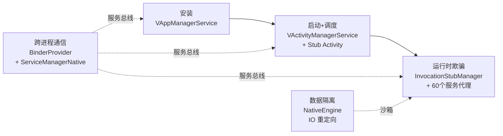
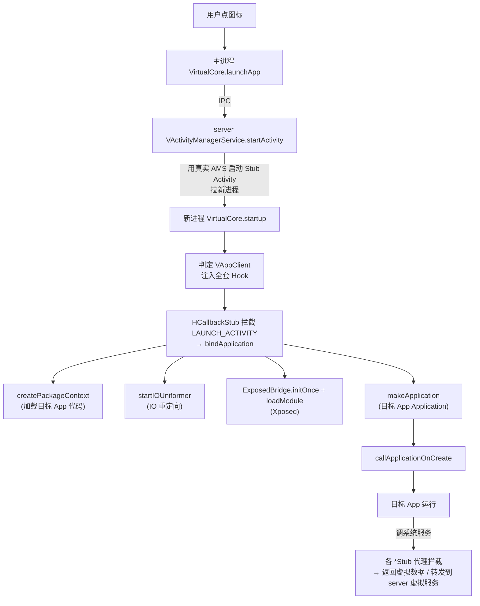

# 应用虚拟化

“应用虚拟化”是 VirtualApp 的核心能力——**让一个没有装进系统的 App，能在 VirtualXposed 的进程里跑起来，并且以为自己在真系统里**。这一篇讲这个目标是怎么达成的，串联起后续各篇。

## 目标分解

要把一个 App“虚拟化”地跑起来，要解决这些问题：

1. **安装**：不调用系统 PMS，自己解析 APK、复制文件、记录包信息。
2. **启动**：不靠系统 PMS 拉起进程，自己调度进程并绑定 Application。
3. **运行时欺骗**：App 调系统服务（定位、电话、账户……）时，返回虚拟数据而非真系统数据。
4. **数据隔离**：App 的 `/data/data/<pkg>` 要独立，不能写到宿主真实数据目录。
5. **组件调度**：App 的 Activity/Service/Receiver 启动要走 VirtualXposed 自己的 AMS，而非系统 AMS。

每一项对应一个机制：

| 问题 | 机制 | 详解篇 |
| --- | --- | --- |
| 安装 | `VAppManagerService` + `VPackageManagerService` | [包管理](./package-manager.md) |
| 启动 + 组件调度 | `VActivityManagerService` + Stub Activity | [活动管理](./activity-manager.md)、[Stub Activity](./stub-activity.md) |
| 运行时欺骗 | `InvocationStubManager` + 各服务代理 | [系统服务 Hook](./service-hook.md) |
| 数据隔离 | `NativeEngine` IO 重定向 | [IO 重定向](./io-redirect.md) |
| 跨进程通信 | `BinderProvider` + `ServiceManagerNative` | [IPC 桥](./ipc-bridge.md) |

这五块的关系：



这一篇只讲总流程，把上面几个机制串起来。

## 安装：把 APK 纳入虚拟管理

用户在 VirtualXposed 里“添加应用”时，`VirtualCore.installPackage(apkPath, flags)` → 跨进程到 server 的 `VAppManagerService.installPackage()`：

1. 解析 APK 的 `AndroidManifest.xml`（`PackageParser`），拿到包名、组件、权限等。
2. 把 APK 复制到 VirtualXposed 私有目录下的虚拟安装区（`VEnvironment` 管理的路径）。
3. 在 `PackageCacheManager` 里登记这个包的 `PackageSetting`。
4. （可选）多用户安装：`installPackageAsUser(userId, pkg)`。

注意：**系统 PMS 完全不知道这个 App 存在**。它只存在于 VirtualXposed 自己的包数据库里。详见[包管理](./package-manager.md)。

## 启动：拉起虚拟进程并绑定 Application

用户点桌面图标，主进程调 `VirtualCore.launchApp()`，最终走到 server 的 `VActivityManagerService.startActivity()`：

1. server 查 `VPackageManager` 找到目标 Activity 信息。
2. server 通过**真实 AMS** 启动一个宿主子进程（用预注册的 Stub Activity 作为进程入口，绕过“App 没装系统”的限制）。
3. 新进程起来，`VirtualCore.startup()` 判定自己是 `VAppClient`，注入全套 Hook。
4. `HCallbackStub` 拦截 `LAUNCH_ACTIVITY`，发现真实 Intent，调 `VClientImpl.bindApplicationForActivity()`。
5. `VClientImpl.bindApplicationNoCheck()` 做核心绑定：
   - 拿目标 App 的 `ApplicationInfo`（从 `VPackageManager`，不是系统 PMS）。
   - `createPackageContext` 构造一个加载了目标 App 代码的 ClassLoader。
   - **IO 重定向**：把 `/data/data/<pkg>` 重定向到虚拟数据目录（`startIOUniformer`）。
   - **加载 Xposed**：`ExposedBridge.initOnce` + 遍历模块 `loadModule`（如果启用）。
   - `LoadedApk.makeApplication` 创建目标 App 的 `Application` 实例。
   - `installContentProviders` 安装目标 App 声明的 ContentProvider。
   - `callApplicationOnCreate` —— 目标 App 的 `Application.onCreate()` 执行。

从此这个进程“就是”目标 App 了，目标 App 的代码在跑，并且（若启用）Xposed 模块的 Hook 已经挂上。详见[活动管理](./activity-manager.md)和[Xposed 集成](../xposed/how-it-works.md)。

## 运行时：拦截每一个系统调用

目标 App 跑起来后会大量调用系统服务：`getDeviceId()`、`getLocation()`、`getAccounts()`…… 这些调用都经过 `InvocationStubManager` 注入的代理：

- 目标 App `getSystemService(LOCATION_SERVICE)` → 拿到的是 `LocationManagerStub` 注入的代理。
- 代理上的 `getLastLocation` 方法被 `MethodProxy` 拦截 → 返回 `VirtualLocationService` 里的伪造坐标。
- 真实系统的定位完全不被触碰。

近 60 个系统服务都被这样代理（见 `InvocationStubManager.injectInternal()` 列表）。每个代理是一个继承 `MethodInvocationProxy` 的 `*Stub` 类，内部用 `@Inject` 注解扫描内部类批量注册 `MethodProxy`。详见[系统服务 Hook](./service-hook.md)。

## 数据隔离：native 层路径重定向

目标 App 写文件时，比如 `openFileOutput("x", MODE_PRIVATE)` 最终落到 `/data/data/<目标pkg>/files/x`。但这个目录在系统里不存在（App 没装系统），必须重定向到 VirtualXposed 私有目录下的虚拟数据区。

Java 层拦不住所有路径（很多 App 直接 native 读写），所以在 native 层 hook libc 的 `open`/`stat`/`readlink` 等，做透明路径替换：

```java
// VClientImpl.startIOUniformer()
NativeEngine.redirectDirectory("/data/data/" + info.packageName, info.dataDir);
NativeEngine.redirectDirectory("/data/user/0/" + info.packageName, info.dataDir);
NativeEngine.redirectDirectory("/sdcard", vsPath);  // 虚拟存储
NativeEngine.enableIORedirect();
```

于是目标 App 看到的 `/data/data/<自己>` 实际是 VirtualXposed 里的隔离目录，多个虚拟 App 互不干扰，和宿主也隔离。详见[IO 重定向](./io-redirect.md)。

## 一张图串联



## 小结

应用虚拟化 = **自管安装 + 自管调度 + 全链路 Hook + native IO 重定向**。VirtualApp 把这四件事都做透了，VirtualXposed 在此基础上加了第五件——在虚拟进程里加载 Xposed。

接下来按机制逐个钻进去，建议顺序：[系统服务 Hook](./service-hook.md) → [Stub Activity](./stub-activity.md) → [IPC 桥](./ipc-bridge.md) → [包管理](./package-manager.md) → [活动管理](./activity-manager.md)。
