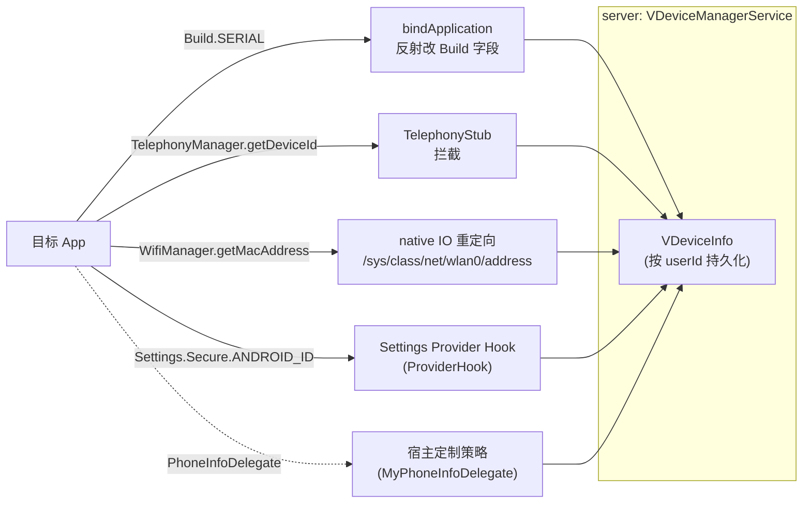

# 设备信息伪造

这一篇讲 VirtualXposed 怎么让每个虚拟 App（或每个虚拟用户）看到不同的设备标识——deviceId、androidId、MAC、serial 等——防追踪、防关联。

## 伪造哪些信息

`VDeviceInfo`（`remote/VDeviceInfo.java`）定义了伪造维度：

```java
public class VDeviceInfo implements Parcelable {
    public String deviceId;      // IMEI / MEID
    public String androidId;     // Settings.Secure.ANDROID_ID
    public String wifiMac;       // WiFi MAC
    public String bluetoothMac;  // 蓝牙 MAC
    public String iccId;         // SIM 卡 ICCID
    public String serial;        // Build.SERIAL
    public String gmsAdId;       // Google 广告 ID
}
```

## server：VDeviceManagerService

`VDeviceManagerService`（`IDeviceInfoManager.Stub`）按 **userId** 管理设备信息：

```java
private final SparseArray<VDeviceInfo> mDeviceInfos = new SparseArray<>();
private final UsedDeviceInfoPool mPool = new UsedDeviceInfoPool();

public VDeviceInfo getDeviceInfo(int userId) {
    VDeviceInfo info = mDeviceInfos.get(userId);
    if (info == null) {
        info = generateDeviceInfo();     // 首次访问自动生成
        mDeviceInfos.put(userId, info);
    }
    return info;
}
```

`generateRandomDeviceInfo` 生成时用 `UsedDeviceInfoPool` 防止 androidId/wifiMac 重复（避免两个用户被关联到同一设备）：

```java
private final class UsedDeviceInfoPool {
    List<String> androidIds = new ArrayList<>();
    List<String> wifiMacs = new ArrayList<>();
}
```

生成的设备信息持久化到磁盘（`DeviceInfoPersistenceLayer`），重启后稳定不变——这点很重要，目标 App 重启看到同一个 IMEI 才不会起疑。

## 客户端：两处注入

设备信息的伪造比定位复杂，因为它来自多个 API：`TelephonyManager.getDeviceId()`、`Settings.Secure.ANDROID_ID`、`WifiManager.getConnectionInfo().getMacAddress()`、`Build.SERIAL`…… 分两处注入：



四路并进才能堵住目标 App 获取真实设备信息的所有路径。

### 1. bindApplication 时直接改 Build 字段

`VClientImpl.bindApplicationNoCheck` 绑定 Application 时，把 `Build.SERIAL` 直接改成伪造值：

```java
VDeviceInfo deviceInfo = getDeviceInfo();
mirror.android.os.Build.SERIAL.set(deviceInfo.serial);
mirror.android.os.Build.DEVICE.set(Build.DEVICE.replace(" ", "_"));
```

`Build.SERIAL` 是个静态字段，直接反射改写（靠 `mirror` 框架 + `free_reflection` 绕过限制）。目标 App 读 `Build.SERIAL` 拿到的就是伪造值。

### 2. TelephonyStub 拦截电话服务

`client/hook/proxies/telephony/TelephonyStub` 拦截 `getDeviceId`/`getSubscriberId`/`getLine1Number` 等，返回 `VDeviceInfo` 里的伪造值。

### 3. PhoneInfoDelegate 扩展点

并非所有设备信息都硬编码走 `VDeviceInfo`。`VirtualCore` 暴露了 `PhoneInfoDelegate` 接口：

```java
public interface PhoneInfoDelegate {
    String getDeviceId(String oldDeviceId, int userId);
    String getBluetoothAddress(String oldAddress, int userId);
    String getMacAddress(String oldAddress, int userId);
}
```

`MethodProxy` 里电话相关代理会调 `getDeviceInfo().xxx` 或 delegate。宿主 `app` 模块在 `BaseVirtualInitializer.onVirtualProcess()` 里注册实现：

```java
virtualCore.setPhoneInfoDelegate(new MyPhoneInfoDelegate());
```

仓库默认的 `MyPhoneInfoDelegate` 直接返回原值（不伪造）——它是个**示例实现**，你想要伪造就改这个类。架构上把“伪造什么值”的决定权留给宿主，引擎只提供机制。

## MAC 伪造：native IO 层

和[虚拟定位](./virtual-location.md)一样，MAC 伪造不能只靠 Java（有的 App native 读 `/sys/class/net/wlan0/address`），所以走 native IO 重定向：

```java
// VClientImpl.startIOUniformer()
String wifiMacAddressFile = deviceInfo.getWifiFile(userId).getPath();
NativeEngine.redirectDirectory("/sys/class/net/wlan0/address", wifiMacAddressFile);
NativeEngine.redirectDirectory("/sys/class/net/eth0/address", wifiMacAddressFile);
NativeEngine.redirectDirectory("/sys/class/net/wifi/address", wifiMacAddressFile);
```

`deviceInfo.getWifiFile(userId)` 是个写好伪造 MAC 的文件，目标 App 读系统 MAC 路径会被重定向到这里。

## androidId 伪造

`Settings.Secure.ANDROID_ID` 走的是 `Settings` ContentProvider。`VClientImpl.fixInstalledProviders()` / `clearSettingProvider()` 清掉系统 Settings Provider 的缓存，并通过 `ProviderHook` 代理 Settings Provider，让 `ANDROID_ID` 的查询返回伪造值。

## 按用户隔离的设备指纹

关键设计：设备信息按 **userId** 隔离，不按包名。这意味着：

- 同一个虚拟用户下，所有 App 看到的设备信息**相同**（模拟“一台设备”）。
- 不同虚拟用户下，设备信息**不同**（模拟“多台设备”）。

这符合真实世界模型：一台设备有唯一 IMEI，设备上所有 App 都能看到它；要“换一台设备”就切用户。VirtualXposed 用多用户模拟“多台设备”。

## 小结

- `VDeviceManagerService` 按 userId 生成并持久化 `VDeviceInfo`（IMEI/MAC/serial/androidId...），用 pool 防重复。
- 客户端两处注入：`bindApplication` 直接改 `Build.SERIAL`，`TelephonyStub` 拦截电话服务方法。
- MAC 伪造走 native IO 重定向，androidId 走 Settings Provider 代理。
- `PhoneInfoDelegate` 是宿主定制伪造策略的扩展点。
- 按 userId 隔离，模拟“多台设备”。

设备信息伪造展示了 VirtualXposed 的多层协作：Java Hook + native IO + Provider 代理 + 反射改字段，四管齐下才能堵住目标 App 获取真实设备信息的所有路径。
