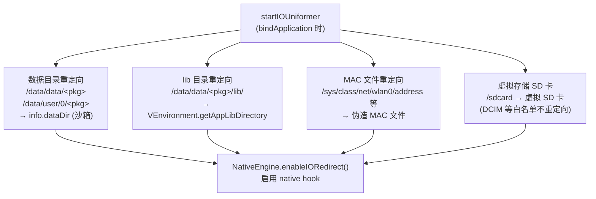

# 虚拟存储与 IO 重定向

这一篇讲 VirtualXposed 怎么实现**数据隔离**——让每个虚拟 App 有自己独立的“数据目录”和“SD 卡”，互不干扰，且和宿主隔离。

## 问题

目标 App 跑在宿主进程里，它写文件时会落到：

- `/data/data/<目标pkg>/` —— 私有数据目录
- `/data/user/0/<目标pkg>/` —— 同上（多用户路径）
- `/sdcard/`、`/storage/emulated/0/` —— 外部存储
- `/sys/class/net/wlan0/address` —— 设备 MAC

但目标 App 没装进系统，`/data/data/<目标pkg>` 根本不存在；`/sdcard` 是真系统的，写了会污染真实存储、和其它虚拟 App 混在一起。

## 思路：native 层路径重定向

Java 层拦不住所有文件访问——很多 App 直接走 native 的 `open`/`stat`/`readlink`，甚至用 NDK 自己读写。所以 VirtualXposed 在 **native 层 hook libc 的文件接口**，做透明路径替换：

```mermaid
flowchart LR
  APP["目标 App"] -->|"open(\"/data/data/com.target/files/x\")"| LIBC["libc open()<br/>已被 inline hook"]
  LIBC --> RULE["查 Path 规则表<br/>origPath → newPath"]
  RULE --> REPLACE["路径替换为<br/>/data/data/io.va.exposed64/<br/>virtual/data/user/0/com.target/files/x"]
  REPLACE --> REAL["真实 libc open()<br/>落到宿主私有目录"]
  REAL --> SANDBOX["沙箱文件"]
  APP -.->|"以为写在自己的目录"| SANDBOX
```

整个替换对目标 App 透明——它看到的路径、返回的 fd 都和真系统一致。

## Java 入口：NativeEngine

`client/NativeEngine.java` 是 native 桥，加载 `libva++.so` 并暴露重定向 API：

```java
public class NativeEngine {
    private static final String LIB_NAME = "va++";
    static { System.loadLibrary(LIB_NAME); }

    public static void redirectDirectory(String origPath, String newPath) {
        nativeIORedirect(origPath, newPath);     // 注册一条重定向规则
    }
    public static void whitelist(String path, boolean directory) {
        nativeIOWhitelist(path);                 // 白名单：不重定向
    }
    public static void forbid(String path) {
        nativeIOForbid(path);                    // 禁止访问
    }
    public static void enableIORedirect() {
        String soPath = ... + "libva++.so";
        redirectDirectory(VESCAPE, "/");         // 转义根
        nativeEnableIORedirect(soPath, SDK_INT, previewApi);  // 启用
    }

    private static native void nativeIORedirect(String origPath, String newPath);
    private static native void nativeIOWhitelist(String path);
    private static native void nativeIOForbid(String path);
    private static native void nativeEnableIORedirect(String soPath, int api, int preview);
}
```

## 应用时机：bindApplication

`VClientImpl.startIOUniformer()`（在 `bindApplicationNoCheck` 里，`VASettings.ENABLE_IO_REDIRECT` 开启时调用）注册一整套规则：

```java
private void startIOUniformer() {
    ApplicationInfo info = mBoundApplication.appInfo;
    int userId = VUserHandle.myUserId();

    // 1. 数据目录重定向
    NativeEngine.redirectDirectory("/data/data/" + info.packageName, info.dataDir);
    NativeEngine.redirectDirectory("/data/user/0/" + info.packageName, info.dataDir);
    if (SDK_INT >= N) {
        NativeEngine.redirectDirectory("/data/user_de/0/" + info.packageName, info.dataDir);
    }

    // 2. lib 目录重定向
    String libPath = VEnvironment.getAppLibDirectory(info.packageName).getAbsolutePath();
    NativeEngine.redirectDirectory("/data/data/" + info.packageName + "/lib/", libPath);
    // ...

    // 3. WiFi MAC 文件重定向（配合设备信息伪造）
    NativeEngine.redirectDirectory("/sys/class/net/wlan0/address", wifiMacAddressFile);
    NativeEngine.redirectDirectory("/sys/class/net/eth0/address", wifiMacAddressFile);
    NativeEngine.redirectDirectory("/sys/class/net/wifi/address", wifiMacAddressFile);

    // 4. 虚拟存储（SD 卡）
    setupVirtualStorage(info, userId);

    // 5. 启用
    NativeEngine.enableIORedirect();
}
```

`info.dataDir` 是 VirtualXposed 给这个虚拟 App 分配的私有目录（在宿主私有目录下），所有对 `/data/data/<目标pkg>` 的访问都重定向到这里。

`startIOUniformer` 注册的规则可归纳为四类：



## 虚拟存储（SD 卡）

`setupVirtualStorage` 处理外部存储隔离：

```java
private void setupVirtualStorage(ApplicationInfo info, int userId) {
    boolean enable = vsManager.isVirtualStorageEnable(info.packageName, userId);
    if (!enable && SDK_INT < 30) return;   // Android 11+ 强制开启

    File vsDir = VEnvironment.getVirtualStorageDir(info.packageName, userId);  // 虚拟 SD 卡
    HashSet<String> storageRoots = getMountPoints();   // /mnt/sdcard /sdcard /storage/self/primary
    storageRoots.add(Environment.getExternalStorageDirectory().getAbsolutePath());

    Set<String> whiteList = ...;  // DCIM Pictures Movies Downloads 等公共目录

    // 白名单目录不重定向（公共相册等）
    for (String root : storageRoots) {
        for (String whiteDir : whiteList) {
            NativeEngine.whitelist(new File(root, whiteDir).getAbsolutePath(), true);
        }
        // Android/data, Android/obb 重定向到私有虚拟存储
        NativeEngine.redirectDirectory(new File(root, "Android/data/").getAbsolutePath(), privatePath);
        NativeEngine.redirectDirectory(new File(root, "Android/obb/").getAbsolutePath(), privatePath);
        // 整个 /sdcard 重定向到虚拟 SD 卡
        NativeEngine.redirectDirectory(root, vsPath);
    }
}
```

效果：

- 目标 App 写 `/sdcard/MyApp/cache.dat` → 实际写到虚拟 SD 卡目录，和真系统隔离。
- 但 `/sdcard/DCIM/`、`/sdcard/Pictures/` 等公共目录**不重定向**（白名单），照片还是存到真系统相册——符合用户预期（不然拍了照找不到）。
- Android 11+ 强制开启虚拟存储（配合 Scoped Storage 限制）。

## native 实现：IOUniformer.cpp

`jni/Foundation/IOUniformer.cpp` 是核心。它做的事：

1. **找 libc 符号**：用 `SymbolFinder` 定位 `open`/`openat`/`stat`/`lstat`/`access`/`readlink`/`fopen`/`mkdir`/`readdir` 等函数地址。
2. **inline hook**：用 `SubstrateHook` / `And64InlineHook` 把这些 libc 函数的入口改写，跳到自己的实现。
3. **路径转换**：自己的实现里，按 `redirectDirectory` 注册的规则把 `origPath` 换成 `newPath`，再调真实 libc 函数。
4. **白名单/禁止**：`whitelist` 的路径跳过重定向，`forbid` 的路径直接返回 `EACCES`。

`Path.cpp` 维护重定向规则表（origPath → newPath 的映射），`SandboxFs.cpp` 实现沙箱文件系统视图。

## 为什么还要 hook openDexFileNative

`NativeEngine.launchEngine()` 还 hook 了几个非 IO 的 native 方法：

```java
static void launchEngine() {
    Method[] methods = {
        NativeMethods.gOpenDexFileNative,        // DexFile.openDexFileNative
        NativeMethods.gCameraNativeSetup,        // Camera.native_setup
        NativeMethods.gAudioRecordNativeCheckPermission  // AudioRecord 权限检查
    };
    nativeLaunchEngine(methods, hostPkg, isArt, SDK_INT, cameraMethodType);
}
```

- `openDexFileNative`：拦截 dex 加载，把 odex 输出路径改到虚拟目录（`onOpenDexFileNative` 回调里改 `params[1]`），让虚拟 App 的 dex 优化产物落到沙箱。
- `Camera.native_setup`：摄像头权限/设备伪装。
- `AudioRecord.native_check_permission`：录音权限伪装。

这些是 native 方法（Java 层 Hook 不到），只能在 native 层用 inline hook 或方法替换。

## VESCAPE：转义根

```java
private static final String VESCAPE = "/6decacfa7aad11e8a718985aebe4663a";
// enableIORedirect 里:
redirectDirectory(VESCAPE, "/");
```

`VESCAPE` 是个不存在的“转义目录”。重定向 `VESCAPE → /` 后，VirtualXposed 内部代码想访问真实根路径时，用 `VESCAPE/...` 前缀就能绕过其它重定向规则访问到真系统——相当于一个“后门通道”。`NativeEngine.getEscapePath(path)` 就是构造这种转义路径的工具。

## 效果与边界

效果：

- 每个虚拟 App 的 `/data/data/<自己>` 独立，卸载即清。
- 虚拟 SD 卡独立，不污染真系统存储。
- MAC 文件、odex 产物都落到沙箱。

边界：

- 重定向只对“经过 libc 的路径”有效。极少数 App 用直接 syscall（绕过 libc）访问文件，native hook 拦不住——但这种情况罕见。
- 某些 SELinux 策略可能阻止访问重定向后的路径，VirtualXposed 靠宿主私有目录的 SELinux 标签通常可访问。

## 小结

- IO 重定向在 native 层 hook libc 文件函数，透明替换路径。
- Java 层 `NativeEngine` 注册规则，`bindApplication` 时按目标 App 配置一套。
- 数据目录、lib、MAC 文件、SD 卡都重定向到宿主私有目录下的沙箱。
- 白名单保留公共目录（DCIM 等）不重定向。
- 另 hook `openDexFileNative`/Camera/AudioRecord 等 native 方法。

这是数据隔离的物理基础。native hook 的更底层原理见 [Native 层](./native-layer.md)，反射工具见 [mirror 反射框架](./mirror-reflection.md)。
