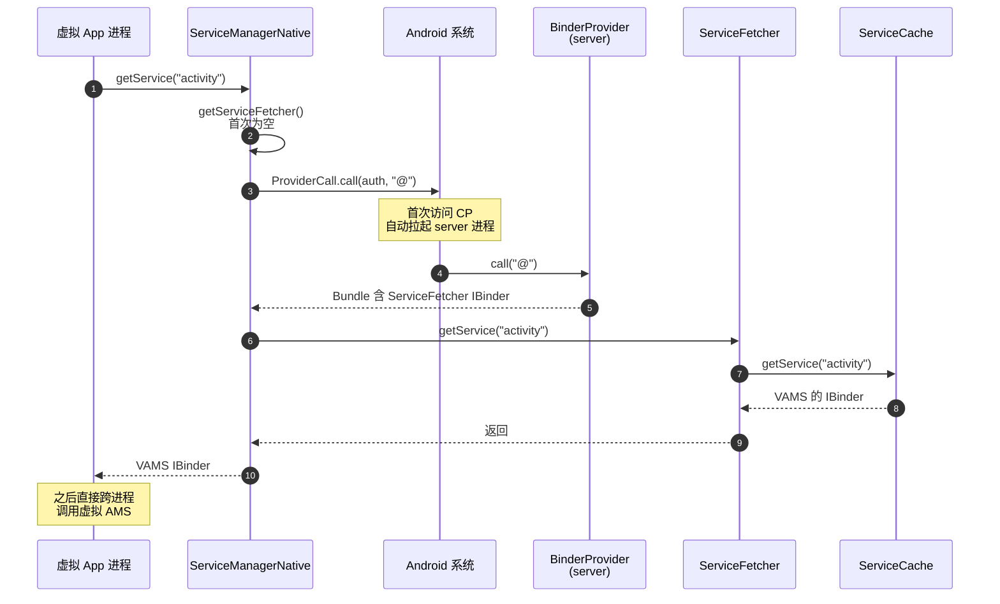

# 跨进程 IPC 桥

VirtualXposed 不依赖任何系统权限，却要在 server 进程里提供一堆虚拟系统服务给所有虚拟 App 进程用。这一篇讲它怎么凭空搭起这条跨进程服务总线。

## 难点

普通 App 要暴露跨进程 Binder 服务，常规手段是 `ServiceManager.addService()`——但这是个隐藏 API，且需要系统权限，普通 App 调不了。

VirtualXposed 的解法是：**用一个 ContentProvider 作为引导入口，把 Binder 句柄通过 Bundle 传出去**。

## BinderProvider：server 的入口

`BinderProvider` 是一个普通的 `ContentProvider`，声明在 `lib` 的 Manifest 里，归属 server 进程：

```java
public final class BinderProvider extends ContentProvider {
    private final ServiceFetcher mServiceFetcher = new ServiceFetcher();

    @Override
    public boolean onCreate() {
        DaemonService.startup(context);
        if (!VirtualCore.get().isStartup()) return true;

        VPackageManagerService.systemReady();
        addService(PACKAGE, VPackageManagerService.get());
        VActivityManagerService.systemReady(context);
        addService(ACTIVITY, VActivityManagerService.get());
        addService(USER, VUserManagerService.get());
        VAppManagerService.systemReady();
        addService(APP, VAppManagerService.get());
        // ... JOB、NOTIFICATION、ACCOUNT、VS、DEVICE、VIRTUAL_LOC ...
        return true;
    }

    private void addService(String name, IBinder service) {
        ServiceCache.addService(name, service);   // 进程内缓存
    }

    @Override
    public Bundle call(String method, String arg, Bundle extras) {
        if ("@".equals(method)) {                 // 约定的取句柄方法
            Bundle bundle = new Bundle();
            BundleCompat.putBinder(bundle, "_VA_|_binder_", mServiceFetcher);
            return bundle;
        }
        return null;
    }

    private class ServiceFetcher extends IServiceFetcher.Stub {
        public IBinder getService(String name) {
            return ServiceCache.getService(name);  // 从进程内缓存取
        }
        // addService / removeService ...
    }
}
```

关键两件事：

1. **`onCreate` 里初始化并注册所有虚拟服务**到进程内的 `ServiceCache`（就是个 `Map`）。
2. **`call("@")` 返回 `ServiceFetcher` 的 IBinder**——这是外界拿服务句柄的唯一入口。

## 客户端：ServiceManagerNative

客户端 `ServiceManagerNative` 负责拿到 `ServiceFetcher` 并查服务：

```java
public class ServiceManagerNative {
    private static IServiceFetcher sFetcher;

    private static IServiceFetcher getServiceFetcher() {
        if (sFetcher == null || !sFetcher.asBinder().isBinderAlive()) {
            synchronized (...) {
                // 通过 ProviderCall 调 BinderProvider.call("@")
                Bundle response = new ProviderCall.Builder(context, SERVICE_CP_AUTH)
                        .methodName("@").call();
                IBinder binder = BundleCompat.getBinder(response, "_VA_|_binder_");
                linkBinderDied(binder);
                sFetcher = IServiceFetcher.Stub.asInterface(binder);
            }
        }
        return sFetcher;
    }

    public static IBinder getService(String name) {
        if (VirtualCore.get().isServerProcess()) {
            return ServiceCache.getService(name);   // server 自己：直接进程内查
        }
        IServiceFetcher fetcher = getServiceFetcher();
        return fetcher.getService(name);            // 客户端：跨进程查
    }
}
```

流程：



## 为什么用 ContentProvider

四个原因：

1. **系统会自动拉起进程**：ContentProvider 首次被访问时，系统保证其所在进程已启动——这给了 VirtualXposed 一个免权限拉起 server 进程的手段（见[进程模型](../architecture/process-model.md)）。
2. **天然跨进程**：ContentProvider 的 `call()` 本就是跨进程的，能传 Bundle。
3. **能传 IBinder**：`BundleCompat.putBinder` 把 IBinder 塞进 Bundle（底层用 `IBinder` 的 parcelable 机制），跨进程传递 Binder 句柄是 Binder 框架原生支持的能力。
4. **无需声明权限**：ContentProvider 的 authority 是宿主包名前缀，只有自己能访问，不涉及权限问题。

## ProviderCall：跨进程调 ContentProvider

`ProviderCall`（`client/ipc/ProviderCall.java`）封装了“不依赖 Context 拿 ContentResolver”的调用方式：

```java
public class ProviderCall {
    public static class Builder {
        public Builder(Context context, String authority) { ... }
        public Builder methodName(String name) { ... }
        public Bundle call() { /* 解析 authority → URI → call() */ }
    }
}
```

它内部用 `ContentResolver.call(uri, method, arg, extras)` 跨进程调 `BinderProvider.call()`。

## StubCP：客户端侧的占位 Provider

对称地，`client/stub/StubCP.java` 是声明在客户端（宿主）进程的占位 ContentProvider，用于让 server 反向调用客户端（比如 server 要通知客户端进程）时有个 authority 可寻址。`VASettings.STUB_CP_AUTHORITY = 包名 + "." + STUB_DEF_AUTHORITY` 保证每个宿主实例 authority 唯一。

## linkToDeath：服务端死了怎么办

```java
private static void linkBinderDied(final IBinder binder) {
    IBinder.DeathRecipient dr = () -> binder.unlinkToDeath(this, 0);
    binder.linkToDeath(dr, 0);
}
```

拿到 `ServiceFetcher` 后注册死亡监听。server 进程崩溃时，`sFetcher` 失效，下次 `getServiceFetcher()` 会重新走 `ProviderCall` 拉起 server 再取一次句柄。

## ServiceCache：进程内的服务表

`server/ServiceCache.java` 极简：

```java
public class ServiceCache {
    private static final Map<String, IBinder> sCache = new ArrayMap<>(5);
    public static void addService(String name, IBinder service) { sCache.put(name, service); }
    public static IBinder getService(String name) { return sCache.get(name); }
}
```

`BinderProvider.onCreate` 里 `addService` 把每个虚拟服务的单例塞进来。server 进程内访问服务直接查这个 map，不走 Binder（`getService` 里 `if (isServerProcess()) return ServiceCache.getService(name)` 就是这个短路）。

## 完整服务清单

`ServiceManagerNative` 定义了所有虚拟服务的名字常量：

```java
public static final String PACKAGE = "package";       // VPackageManagerService
public static final String ACTIVITY = "activity";     // VActivityManagerService
public static final String USER = "user";             // VUserManagerService
public static final String APP = "app";               // VAppManagerService
public static final String ACCOUNT = "account";       // VAccountManagerService
public static final String JOB = "job";               // VJobSchedulerService
public static final String NOTIFICATION = "notification"; // VNotificationManagerService
public static final String VS = "vs";                 // VirtualStorageService
public static final String DEVICE = "device";         // VDeviceManagerService
public static final String VIRTUAL_LOC = "virtual-loc";// VirtualLocationService
```

客户端的 `V*Manager`（`VActivityManager`、`VPackageManager` 等）就是对这些服务的封装，每个都通过 `ServiceManagerNative.getService(name)` 拿到 IBinder 再 `asInterface` 成接口。

## 小结

- `BinderProvider`（ContentProvider）是 server 进程的入口和 Binder 句柄的出口。
- 客户端 `ProviderCall.call("@")` 拿到 `ServiceFetcher`，再 `getService(name)` 取具体服务。
- ContentProvider 既负责拉起 server 进程，又负责传递 Binder 句柄，全程无需系统权限。
- `ServiceCache` 是 server 进程内的服务表，server 自己访问走短路。

这条 IPC 总线是所有虚拟服务能被客户端访问的根基。接下来看 server 端两个最重要的服务怎么实现：[包管理](./package-manager.md) 和 [活动管理](./activity-manager.md)。
