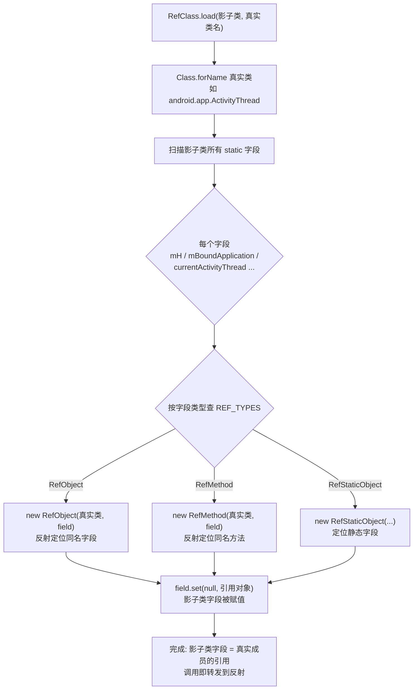

# 反射框架 mirror

VirtualXposed 大量操作 Android 框架的隐藏 API（私有字段、私有方法、`@hide` 类）。直接 `Class.forName` + 反射既啰嗦又容易出错。`mirror` 包提供了一套**类型安全的反射镜像**，把隐藏 API 包装成普通字段/方法调用的样子。

## 问题

举几个 VirtualXposed 必须访问的隐藏 API：

- `ActivityThread.mH`（主线程 Handler，私有字段）
- `ActivityThread.mBoundApplication`（绑定的 App 数据，私有字段）
- `ActivityManagerNative.gDefault`（AMS 单例，静态私有字段）
- `ServiceManager.sCache`（服务缓存，静态私有字段）
- `LoadedApk.makeApplication`（创建 Application，方法）
- `Build.SERIAL`（静态字段，Android 9+ 限制访问）

直接反射写：

```java
Object mainThread = Class.forName("android.app.ActivityThread")
    .getMethod("currentActivityThread").invoke(null);
Field mH = mainThread.getClass().getDeclaredField("mH");
mH.setAccessible(true);
Handler h = (Handler) mH.get(mainThread);
```

啰嗦、无类型检查、异常处理麻烦。`mirror` 让你写成：

```java
Handler h = mirror.android.app.ActivityThread.mH.get(mainThread);
```

## mirror 的设计

`mirror/` 下是一组“影子类”，结构和真实 Android 类对应，但字段类型是 `RefMethod`/`RefObject`/`RefInt` 等“引用对象”：

```java
// mirror/android/app/ActivityThread.java
public class ActivityThread {
    public static Class<?> TYPE = RefClass.load(ActivityThread.class,
            "android.app.ActivityThread");
    public static RefObject<Handler> mH;
    public static RefObject<Object> mBoundApplication;
    public static RefMethod<Object> currentActivityThread;
    public static RefMethod<IBinder> getProcessName;
    // ...
}
```

使用时就像访问静态字段：

```java
Object mainThread = mirror.android.app.ActivityThread.currentActivityThread.call();
Handler h = mirror.android.app.ActivityThread.mH.get(mainThread);
```

## RefClass.load：绑定魔法

`RefClass.load(mappingClass, realClassName)` 是核心：

```java
public static Class load(Class mappingClass, Class<?> realClass) {
    Field[] fields = mappingClass.getDeclaredFields();
    for (Field field : fields) {
        if (Modifier.isStatic(field.getModifiers())) {
            Constructor<?> constructor = REF_TYPES.get(field.getType());
            if (constructor != null) {
                // 把 RefMethod/RefObject/RefInt 等实例化，绑定到 realClass 的对应成员
                field.set(null, constructor.newInstance(realClass, field));
            }
        }
    }
    return realClass;
}
```

它扫描影子类的所有静态字段，按字段类型（`RefMethod`/`RefObject`/`RefInt`...）实例化对应的“引用对象”，构造参数是**真实类 + 字段本身**。引用对象在构造时用反射找到真实类里同名的成员并记住：

- `RefMethod` 记住真实类的同名方法（含签名匹配）
- `RefObject` 记住真实类的同名字段
- `RefStaticMethod`/`RefStaticObject` 记住静态方法/字段

绑定过程：



绑完后，影子类的每个静态字段都持有一个“引用对象”，它内部记住了真实成员的 `Field`/`Method`，调用 `.get()`/`.call()` 就是转发到反射调用——但对外表现为类型安全的普通访问。
`REF_TYPES` 映射表注册了每种 Ref 类型的构造方式：

```java
REF_TYPES.put(RefObject.class, RefObject.class.getConstructor(Class.class, Field.class));
REF_TYPES.put(RefMethod.class, RefMethod.class.getConstructor(Class.class, Field.class));
REF_TYPES.put(RefInt.class, RefInt.class.getConstructor(Class.class, Field.class));
// ... RefLong RefFloat RefDouble RefBoolean RefStaticObject RefStaticInt RefStaticMethod RefConstructor
```

## 引用类型

| 类型 | 用途 | 用法 |
| --- | --- | --- |
| `RefMethod<T>` | 实例方法 | `ref.call(obj, args...)` |
| `RefStaticMethod<T>` | 静态方法 | `ref.call(args...)` |
| `RefObject<T>` | 实例字段 | `ref.get(obj)` / `ref.set(obj, val)` |
| `RefStaticObject<T>` | 静态字段 | `ref.get()` / `ref.set(val)` |
| `RefInt`/`RefLong`/... | 基本类型字段 | `ref.get(obj)` |
| `RefStaticInt` | 静态基本类型字段 | `ref.get()` |
| `RefConstructor<T>` | 构造方法 | `ref.newInstance(args...)` |

`MethodParams`/`MethodReflectParams` 用于指定方法签名（重载区分）。

## mirror.android.* 镜像了什么

`mirror/android/` 下按 Android 包结构镜像了大量框架类：

- `mirror.android.app.ActivityThread` —— 进程主线程
- `mirror.android.app.IActivityManager` —— AMS 接口
- `mirror.android.app.ActivityManagerNative` —— AMS 单例
- `mirror.android.app.LoadedApk` —— APK 加载信息
- `mirror.android.os.ServiceManager` —— 服务管理
- `mirror.android.os.Handler` —— Handler（改 mCallback）
- `mirror.android.content.res.AssetManager` —— 资源管理
- `mirror.android.content.ContentProviderClient` —— CP 客户端
- `mirror.android.providers.Settings` —— Settings Provider 缓存
- `mirror.android.os.Build` —— Build 字段（改 SERIAL）
- ...

`mirror/android/view/`、`mirror/android/media/` 等覆盖了各版本差异的隐藏 API。

## 版本适配

Android 每个版本都在改隐藏 API（字段名变、方法签名变、类挪位置）。`mirror` 用 `TYPE` 字段 + `RefClass.load` 失败容忍来适配：

```java
public static Class<?> TYPE = RefClass.load(ActivityThread.class,
        "android.app.ActivityThread");
```

`load` 找不到类返回 null，对应的 Ref 字段保持 null，调用时镜像类自己判空或抛可控异常。多个版本的字段差异靠 `if (SDK_INT >= N)` 分支选不同 Ref。

这套机制让 VirtualXposed 能在 5.0~10.0 跨版本工作——同一份镜像代码，运行时按版本绑定到不同的真实实现。

## 绕过反射限制：free_reflection

Android 9（API 28）开始限制反射访问隐藏 API（`@hide`）。`VirtualCore.startup()` 第一行就调：

```java
Reflection.unseal(context);
```

`Reflection` 来自 `me.weishu:free_reflection` 库，它通过 JNI 绕过系统的反射检查（修改 `setHiddenApiExemptions` 或更早版本的 `getDeclaredMethod` 检查），让 mirror 能正常访问所有隐藏 API。

## 小结

- `mirror` 是类型安全的反射镜像，把隐藏 API 包装成普通字段/方法调用。
- `RefClass.load` 在运行时把影子类的静态字段绑定到真实 Android 类的成员。
- `RefMethod`/`RefObject`/`RefInt` 等引用类型覆盖方法/字段/基本类型。
- 配合 `free_reflection` 绕过 Android 9+ 反射限制。
- 让跨版本（5.0~10.0）访问隐藏 API 的代码简洁且可控。

mirror 是 VirtualXposed 操作 Android 框架内部的基础设施，几乎所有 Hook、Stub、bindApplication 逻辑都依赖它。和它配套的 native 层见下一篇。
