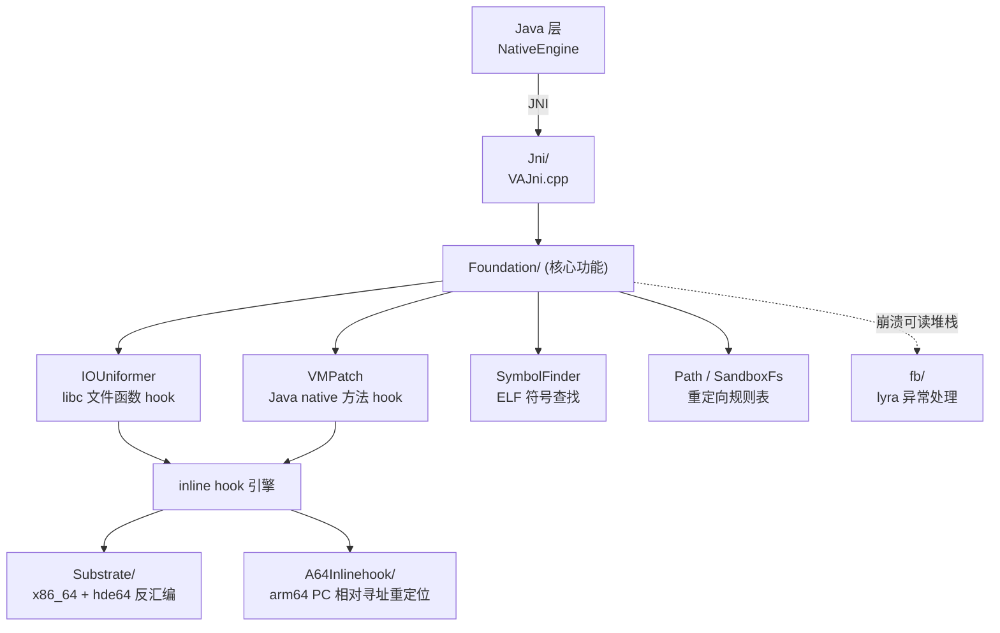

# Native 层 (JNI/Inline Hook)

VirtualXposed 有些事 Java 层做不到——拦截 libc 文件函数、hook native 方法、改 ART 内部结构。这些落在 [src/main/jni/](https://github.com/android-security-engineer/VirtualXposed-skills/tree/vxp/lib/src/main/jni/) 下，编译成 `libva++.so`，由 `NativeEngine` 加载。这一篇梳理 native 层的结构和职责。

## 模块组成

`jni/Android.mk` 定义了 `va++` 共享库，源码分五个目录：

```
jni/
├── Jni/             ← JNI 桥接（NativeEngine 的 native 方法实现）
│   └── VAJni.cpp
├── Foundation/      ← 核心功能
│   ├── IOUniformer.cpp   ← IO 重定向（hook libc 文件函数）
│   ├── VMPatch.cpp       ← ART 方法 hook（Java 方法层面的 native hook）
│   ├── SymbolFinder.cpp  ← 符号查找（找 libc/art 里的函数地址）
│   ├── Path.cpp          ← 重定向路径规则表
│   ├── SandboxFs.cpp     ← 沙箱文件系统视图
│   └── fake_dlfcn.cpp    ← 伪 dlopen/dlsym（绕过符号可见性限制）
├── Substrate/       ← inline hook 库（x86/通用）
│   ├── SubstrateHook.cpp
│   ├── SubstratePosixMemory.cpp
│   ├── hde64.c             ← 64位指令反汇编
│   └── SubstrateDebug.cpp
├── A64Inlinehook/   ← arm64 专用 inline hook
│   └── And64InlineHook.cpp
└── fb/              ← Facebook 的 JNI 异常处理库（lyra）
    ├── jni/...、lyra/...
    ├── assert.cpp / log.cpp / onload.cpp
    └── Android.mk
```

这五部分从上到下是“Java 桥接 → 核心功能 → 底层 hook 引擎”的分层：



上层 `Jni` 把 Java 调用翻译成 Foundation 的操作，Foundation 依赖底层 inline hook 引擎去改写真实函数指令。

## JNI 桥接：VAJni.cpp

`Jni/VAJni.cpp` 实现了 `NativeEngine` 声明的所有 `native` 方法，把 Java 调用转发到 Foundation 层：

| NativeEngine 方法 | VAJni 实现 |
| --- | --- |
| `nativeIORedirect(orig, new)` | 注册到 `Path` 规则表 |
| `nativeIOWhitelist(path)` | 加白名单 |
| `nativeIOForbid(path)` | 加禁止 |
| `nativeEnableIORedirect(soPath, api, preview)` | 调 `IOUniformer` 启动 hook |
| `nativeGetRedirectedPath(orig)` / `nativeReverseRedirectedPath` | 查规则做路径转换 |
| `nativeLaunchEngine(methods, hostPkg, isArt, api, cameraType)` | 调 `VMPatch` hook 指定 native 方法 |
| `disableJit(api)` | 关闭 JIT |

`onLoad` 里 `fb/onload.cpp` 注册 lyra 的异常处理，让 native 崩溃时能生成可读堆栈。

## IOUniformer：IO 重定向核心

[IO 重定向](./io-redirect.md) 已详述，这里补 native 视角。`IOUniformer.cpp` 的套路：

1. 用 `SymbolFinder` 在 `/system/lib(64)/libc.so` 里找到 `open`/`openat`/`stat`/`lstat`/`access`/`faccessat`/`readlink`/`readlinkat`/`fopen`/`mkdir`/`rmdir`/`readdir`/`rename`/`symlink`/`unlink`/`chmod`/`chown` 等函数的真实地址。
2. 用 inline hook（Substrate 或 And64InlineHook）把函数入口指令改写，跳到自己的 wrapper。
3. wrapper 里调 `Path` 查规则：路径命中 `redirectDirectory` 规则就替换，命中 `whitelist` 就跳过，命中 `forbid` 就返回 `EACCES`。
4. 处理后的路径调真实 libc 函数。

`SandboxFs.cpp` 提供更高层的沙箱视图（目录枚举过滤等），`Path.cpp` 维护 `origPath → newPath` 的映射和匹配（按最长前缀）。

## SymbolFinder 与 fake_dlfcn：找符号

hook 一个函数前要先拿到它的地址。正常 `dlsym` 只能找导出符号，且 Android 对系统库的符号可见性有限制。VirtualXposed 用两种手段：

- **SymbolFinder**：直接解析 ELF 文件（`.dynsym`/`.symtab` 表）找符号地址，不依赖 `dlsym`，能找到未导出的内部符号。
- **fake_dlfcn**：实现一套“伪 dlopen/dlsym”，绕过系统的命名空间和可见性限制，可以像操作普通库一样查找 `libc.so`/`libart.so` 里的符号。

这让 VirtualXposed 能 hook 到 libc 的内部函数和 ART 的内部方法。

## VMPatch：ART 方法 hook

`nativeLaunchEngine` 传入的 `methods` 是几个 Java native 方法（`openDexFileNative`、`Camera.native_setup`、`AudioRecord.native_check_permission`）。`VMPatch.cpp` 对这些方法做 hook：

- 把 Java native 方法的实现替换成自己的回调。
- 回调里能改参数（如 `onOpenDexFileNative` 改 odex 输出路径）、改返回值、加权限检查。

这和 epic 的 ART 方法 hook 不同——epic hook 的是任意 Java 方法（包括非 native 的），`VMPatch` 主要针对 native 方法。两者互补：epic 管 Xposed 模块的方法 hook，VMPatch 管引擎自己需要的 native 方法 hook。

## inline hook 库

| 库 | 用途 |
| --- | --- |
| `SubstrateHook` | 通用 inline hook，基于指令重写 + 跳转。`SubstratePosixMemory` 处理内存权限（`mprotect`）。`hde64` 反汇编 64 位指令确定要复制的指令长度。 |
| `And64InlineHook` | arm64 专用的 inline hook 实现，处理 ARM64 指令集的 PC 相对寻址重定位。 |

为什么用两个？因为 inline hook 要把目标函数开头的几条指令替换成跳转指令，而 ARM64 和 x86_64 指令长度/寻址方式不同，需要各自专用的实现。当前构建只产出 `arm64-v8a` 和 `x86_64` 两个 ABI（见 `lib/build.gradle` 的 `abiFilters`）。

## 64 位定位

`app/build.gradle` 里 `applicationId "io.va.exposed64"`，`abiFilters "arm64-v8a", "x86_64"`——这是个 64 位包。原因：

- Android 5.0+ 支持 64 位 ART，64 位能 hook 到 64 位进程里的方法。
- `exposed64` 的命名暗示这是为 64 位优化的版本。
- 不含 32 位 ABI，所以 32 位设备/纯 32 位 App 不适用。

## native hook vs Java hook 的分工

| 场景 | 用哪个 |
| --- | --- |
| 拦截系统服务方法（AMS/PMS/Location...） | Java 层 `MethodProxy` 动态代理 |
| 拦截 libc 文件函数 | native `IOUniformer` |
| 拦截 Java native 方法（openDexFile/Camera/Audio） | native `VMPatch` |
| 拦截任意 Java 方法（Xposed 模块用的） | epic（ART inline hook） |
| 改私有字段（mH、gDefault、Build.SERIAL） | `mirror` 反射 + `free_reflection` |

四层各管一段，共同覆盖目标 App 的所有可拦截路径。

## 风控提示

native hook 会在进程里留下可检测的痕迹（被改写的指令、额外的 .so）。反作弊引擎能扫到 `libva++.so`、检测到 inline hook 的特征。这也是为什么游戏/支付类 App 在 VirtualXposed 里容易被识别。

## 小结

- `libva++.so` 由 `Jni`/`Foundation`/`Substrate`/`A64Inlinehook`/`fb` 五部分组成。
- `IOUniformer` 在 native 层 hook libc 文件函数实现路径重定向。
- `SymbolFinder`/`fake_dlfcn` 绕过符号可见性限制找地址。
- `VMPatch` hook 特定 Java native 方法（openDex/Camera/Audio）。
- inline hook 用 Substrate（x86_64）和 And64InlineHook（arm64）两套。
- 与 Java 层 `MethodProxy`、`mirror`、epic 分工互补。

native 层是 VirtualXposed 能“骗过到底层”的根基。接下来进入 [Xposed 集成](../xposed/how-it-works.md)，看 epic 怎么在这个虚拟进程里实现免 Root 的方法 Hook。
