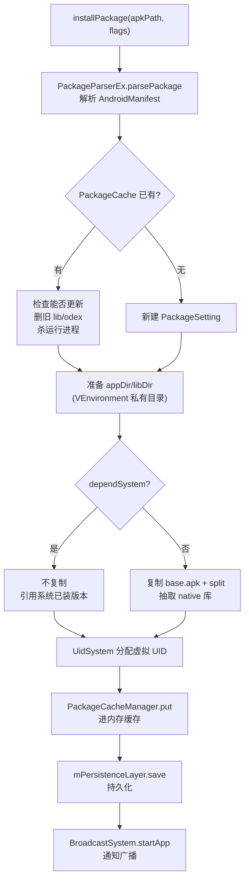
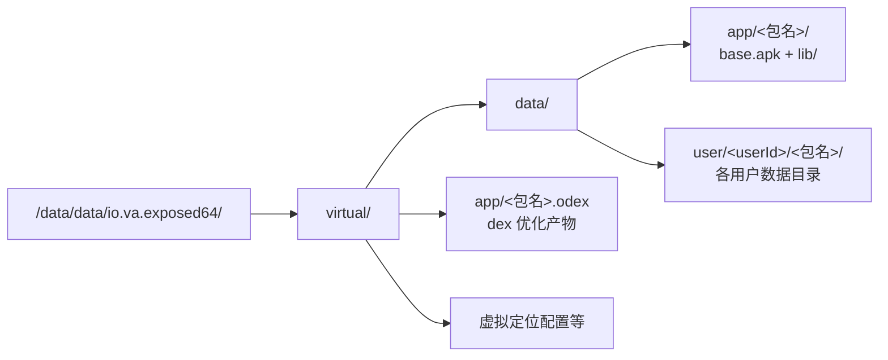

# 包管理 (PMS)

这一篇讲 VirtualXposed 怎么“安装”一个 App——**不调系统 PMS，自己解析 APK、复制文件、分配 UID、记录包信息**，让这个 App 只存在于虚拟环境里。

## 两个服务的分工

| 服务 | 职责 |
| --- | --- |
| `VAppManagerService`（`IAppManager.Stub`） | 安装/卸载/多用户管理、持久化、UID 分配、对外可见性 |
| `VPackageManagerService`（`IPackageManager.Stub`） | 查询：包信息、Activity/Service/Receiver/Provider 信息、Intent 查询、权限检查 |

简单说：`VAppManagerService` 管“装/卸”，`VPackageManagerService` 管“查”。两者都跑在 server 进程，通过 `BinderProvider` 注册到 `ServiceCache`（名字分别是 `app` 和 `package`）。

## 安装流程：installPackage

入口是 `VirtualCore.installPackage(apkPath, flags)` → 跨进程到 `VAppManagerService.installPackage`：

```java
public synchronized InstallResult installPackage(String path, int flags, boolean notify) {
    // 1. 解析 APK
    VPackage pkg = PackageParserEx.parsePackage(packageFile);
    if (pkg == null) return InstallResult.makeFailure("Unable to parse the package.");

    // 2. 检查是否已安装 / 能否更新
    VPackage existOne = PackageCacheManager.get(pkg.packageName);
    if (existOne != null) {
        if (!canUpdate(existOne, pkg, flags)) return failure("Can not update ...");
        res.isUpdate = true;
    }

    // 3. 准备目录
    File appDir = VEnvironment.getDataAppPackageDirectory(pkg.packageName);
    File libDir = new File(appDir, "lib");
    if (res.isUpdate) {
        FileUtils.deleteDir(libDir);              // 删旧 lib
        VEnvironment.getOdexFile(pkg.packageName).delete();  // 删旧 odex
        killAppByPkg(pkg.packageName, USER_ALL);  // 杀运行中的进程
    }

    // 4. 决定是否复用系统已装的版本
    boolean dependSystem = (flags & DEPEND_SYSTEM_IF_EXIST) != 0
            && VirtualCore.get().isOutsideInstalled(pkg.packageName);

    // 5. 复制 APK 和 native 库
    if (!dependSystem) {
        FileUtils.copyFile(baseApkFile, new File(appDir, "base.apk"));
        NativeLibraryHelperCompat.copyNativeBinaries(baseApkFile, libDir);
        // split apk 也复制
    }

    // 6. 登记包设置
    PackageSetting ps = new PackageSetting();
    ps.dependSystem = dependSystem;
    ps.apkPath = packageFile.getPath();
    ps.libPath = libDir.getPath();
    ps.appId = VUserHandle.getAppId(mUidSystem.getOrCreateUid(pkg));  // 分配虚拟 UID
    // 多用户：默认只在 userId=0 安装
    for (int userId : VUserManagerService.get().getUserIds()) {
        ps.setUserState(userId, false, false, userId == 0);
    }
    PackageCacheManager.put(pkg, ps);     // 进内存缓存
    mPersistenceLayer.save();             // 持久化
    BroadcastSystem.get().startApp(pkg);  // 通知广播
    notifyAppInstalled(ps, -1);
    return res;
}
```

关键步骤拆解：



### 解析 APK：PackageParserEx

`PackageParserEx`（`server/pm/parser/`）复用 Android 自带的 `PackageParser`，把 APK 的 `AndroidManifest.xml` 解析成 `VPackage`——包含包名、版本、所有组件（Activity/Service/Receiver/Provider）、权限、签名等。`VPackage` 是 `Package` 的等价物，结构和系统 `PackageParser.Package` 一致。

### 复制到私有目录：VEnvironment

不调系统 PMS，APK 被复制到 VirtualXposed 自己的私有目录：

```
/data/data/io.va.exposed64/virtual/data/app/<包名>/
├── base.apk        ← 复制过来的主 APK
├── <split>.apk     ← split APK（如有）
└── lib/            ← 抽取的 native 库（.so）
```

`VEnvironment` 集中管理所有虚拟路径（数据目录、odex 目录、用户目录等）。目录布局：



系统 PMS 对此一无所知——这些路径在系统层面属于宿主 `io.va.exposed64` 的私有目录。

### dependSystem：复用系统已装版本

有个优化：如果 `DEPEND_SYSTEM_IF_EXIST` flag 开启且系统里已经装了同名 App，VirtualXposed **不复制 APK**，直接引用系统的那份（`isOutsideInstalled` 检查）。这样省空间，但要求系统版本和虚拟版本一致。`existSetting.dependSystem` 会记住这个选择。

### 分配虚拟 UID：UidSystem

真实 Android 每个 App 有独立 UID。VirtualApp 也得给每个虚拟 App 分配 UID（不然权限隔离无从谈起），但用的是**自己维护的虚拟 UID 空间**（`UidSystem.getOrCreateUid`），不向系统申请。

`VUserHandle.getUid(userId, appId)` 把 userId 和 appId 组合成虚拟 UID，和真实 Android 的 UID 编码方式一致（userId << 24 | appId）。这样 Hook 层替换 UID 时，目标 App 看到的“自己的 UID”是虚拟的，和真实系统 UID 不冲突。

### 持久化：PackagePersistenceLayer

`mPersistenceLayer.save()` 把 `PackageSetting` 列表序列化到磁盘（`VEnvironment` 下的一个文件）。server 进程重启后 `scanApps()` → `mPersistenceLayer.read()` 恢复，虚拟 App 列表不丢。

### 多用户安装

```java
public synchronized boolean installPackageAsUser(int userId, String packageName) { ... }
```

VirtualXposed 支持多用户（`VUserManagerService`），同一个包可以在不同虚拟用户下安装/卸载，状态独立（`PackageUserState`）。`getPackageInstalledUsers` 查询一个包装在哪些用户下。

## 卸载

```java
public synchronized boolean uninstallPackage(String packageName) {
    PackageSetting ps = ...;
    uninstallPackageFully(ps);   // 删文件 + 清缓存 + 广播
}
private void uninstallPackageFully(PackageSetting ps) {
    // kill 进程、删 appDir、删 odex、删用户数据、从 PackageCache 移除、持久化
}
```

`clearPackage` / `clearPackageAsUser` 只清用户数据不删包。

## 查询：VPackageManagerService

`VPackageManagerService`（`IPackageManager.Stub`）实现了一整套和系统 `PackageManager` 对等的查询接口：

| 方法 | 作用 |
| --- | --- |
| `getPackageInfo` | 包信息（版本、签名、权限） |
| `getApplicationInfo` | ApplicationInfo |
| `getActivityInfo` / `getReceiverInfo` / `getServiceInfo` / `getProviderInfo` | 组件信息 |
| `resolveIntent` / `queryIntentActivities` / `queryIntentServices` / `queryIntentReceivers` | Intent 路由 |
| `queryContentProviders` | ContentProvider 查询 |
| `getInstalledPackages` / `getInstalledApplications` | 已装列表 |
| `checkPermission` | 权限检查 |

这些是 `VirtualCore.resolveActivityInfo`、`VClientImpl.bindApplication`（查 providers）、`getLaunchIntent` 等的基础——所有“这个 App 有哪些 Activity”“启动 Intent 指向哪个 Activity”的查询都走虚拟 PMS，而非系统 PMS。

`PackageCacheManager` 在内存里缓存所有 `VPackage`，`queryIntentActivities` 用 `IntentResolver`（`server/pm/IntentResolver.java`）做 Intent 匹配——和 AOSP 的 `<intent-filter>` 匹配逻辑一致。

## 客户端如何用

客户端 `VPackageManager`（`client/ipc/VPackageManager.java`）是 `VPackageManagerService` 的远程代理：

```java
public static VPackageManager get() {
    if (sInstance == null) {
        IBinder binder = ServiceManagerNative.getService(ServiceManagerNative.PACKAGE);
        sInstance = IPackageManager.Stub.asInterface(binder);
    }
    return sInstance;
}
```

虚拟 App 进程里 `VirtualCore.getLaunchIntent(pkg, userId)` → `VPackageManager.get().queryIntentActivities(...)` 拿到启动 Activity——全程不碰系统 PMS。

## 与系统 PMS 的隔离

关键点：**系统 PMS 完全不知道虚拟 App 的存在**。

- 系统里 `pm list packages` 看不到虚拟 App。
- 虚拟 App 的数据目录在宿主私有目录下，系统层面属于宿主。
- 虚拟 App 的 UID 是 VirtualApp 自己编的，系统以为是宿主的子进程。

这种隔离是双向的：虚拟 App 也“看不到”系统里其它 App（除非显式 `addVisibleOutsidePackage` 声明，如 server 进程里声明的 QQ/微信等，用于跨进程通信场景）。

## 小结

- `VAppManagerService` 负责装/卸：解析 APK → 复制到私有目录 → 抽 native 库 → 分配虚拟 UID → 持久化。
- `VPackageManagerService` 负责查询：组件信息、Intent 路由，接口和系统 PMS 对等。
- UID 是虚拟空间自己分配的，和系统 UID 不冲突。
- 系统完全不知道虚拟 App 的存在，隔离双向。

接下来看一个具体的服务虚拟化例子：[虚拟定位](./virtual-location.md)。
