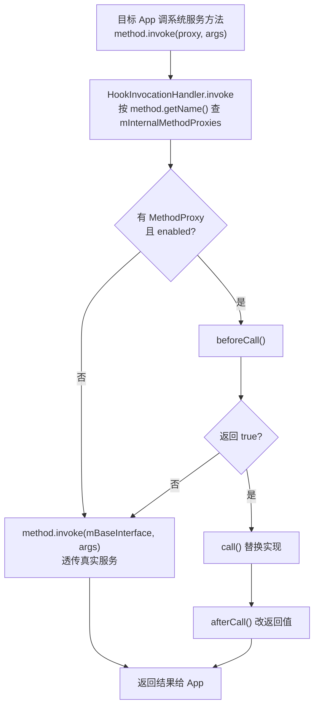
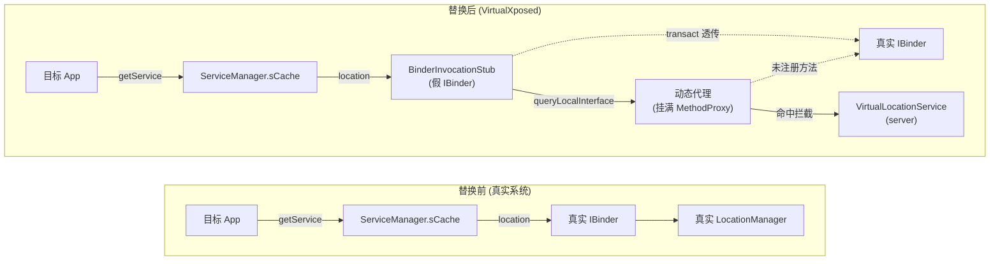

# 系统服务 Hook

这一篇是 VirtualXposed 最核心的机制：**怎么把 Android 的系统服务换成自己的代理，让目标 App 调到的每一个系统方法都被拦截**。

## 目标

目标 App 跑在虚拟进程里，它调 `TelephonyManager.getDeviceId()`、`LocationManager.getLastKnownLocation()`、`AccountManager.getAccounts()` 时，我们要：

1. 不让调用到真系统服务（避免泄露真实设备信息、避免触发系统校验）。
2. 返回我们伪造的数据（假 IMEI、假定位、空账户）。
3. 对部分调用转发到 server 进程的虚拟服务（虚拟账户、虚拟定位）。

## 基础设施：四个基类

整个 Hook 体系建立在 `client/hook/base/` 下的四个基类上。

### MethodInvocationStub —— 动态代理容器

```java
public class MethodInvocationStub<T> {
    private Map<String, MethodProxy> mInternalMethodProxies;
    private T mBaseInterface;      // 真实系统服务接口
    private T mProxyInterface;     // 包了一层代理的接口

    public MethodInvocationStub(T baseInterface, Class<?>... proxyInterfaces) {
        this.mBaseInterface = baseInterface;
        mProxyInterface = (T) Proxy.newProxyInstance(
            ..., proxyInterfaces, new HookInvocationHandler());
    }
}
```

它用 `Proxy.newProxyInstance` 给真实服务接口套一个 `InvocationHandler`。核心是这个 handler：

```java
class HookInvocationHandler implements InvocationHandler {
    public Object invoke(Object proxy, Method method, Object[] args) {
        MethodProxy methodProxy = getMethodProxy(method.getName());  // 按方法名查代理
        if (methodProxy != null && methodProxy.isEnable()
                && methodProxy.beforeCall(...)) {
            res = methodProxy.call(...);          // 走代理
            res = methodProxy.afterCall(...);
        } else {
            res = method.invoke(mBaseInterface, args); // 不拦就放行真服务
        }
    }
}
```

**按方法名（`method.getName()`）查表分发**：注册了代理就拦，没注册就透传给真实服务。这是整个拦截模型的核心。



### MethodProxy —— 单个方法的拦截器

```java
public abstract class MethodProxy {
    public abstract String getMethodName();          // 拦截哪个方法
    public boolean beforeCall(...) { return true; }  // 前置
    public Object call(...) { return method.invoke(who, args); } // 替换
    public Object afterCall(...) { return result; }  // 后置改结果
}
```

`beforeCall` 返回 true 表示“我来处理”，`call` 是替换实现，`afterCall` 改返回值。子类只重写需要的部分。

仓库还提供了一批现成的 `MethodProxy` 子类，覆盖常见拦截模式：

| 子类 | 作用 |
| --- | --- |
| `ReplaceCallingPkgMethodProxy` | 把调用方包名改成宿主包 |
| `ReplaceLastPkgMethodProxy` | 替换参数里的包名 |
| `ReplaceUidMethodProxy` / `ReplaceLastUidMethodProxy` | 替换 UID 为虚拟 UID |
| `ResultStaticMethodProxy` | 直接返回固定值 |
| `StaticMethodProxy` | 透传但可加副作用 |

### BinderInvocationStub —— 把代理伪装成 IBinder

有些系统服务是 IBinder（通过 `ServiceManager.getService` 拿）。`BinderInvocationStub` 在 `MethodInvocationStub` 基础上实现 `IBinder`，关键在 `queryLocalInterface`：

```java
public IInterface queryLocalInterface(String descriptor) {
    return getProxyInterface();   // 返回动态代理，而非真实 IInterface
}
```

并能在 `replaceService(name)` 里把自己塞进 `ServiceManager.sCache`：

```java
public void replaceService(String name) {
    if (mBaseBinder != null) {
        ServiceManager.sCache.get().put(name, this);  // ← 关键：替换系统缓存
    }
}
```

### BinderInvocationProxy —— 注入器

```java
public abstract class BinderInvocationProxy extends MethodInvocationProxy<BinderInvocationStub> {
    public void inject() {
        getInvocationStub().replaceService(mServiceName);  // 替换 sCache
    }
}
```

它把上面的 stub 安装到 `ServiceManager.sCache`。注入后，所有 `ServiceManager.getService(name)` 拿到的就是假 binder。

## 注入流程

`InvocationStubManager`（单例）在 `VirtualCore.startup()` 时被初始化：

```java
// VirtualCore.startup()
InvocationStubManager mgr = InvocationStubManager.getInstance();
mgr.init();          // injectInternal()：按进程类型 new 一堆 *Stub
mgr.injectAll();     // 遍历所有 injector 调 inject()
```

`injectInternal()` 按进程类型加载（详见[进程模型](../architecture/process-model.md)）。在虚拟 App 进程里加载近 60 个 `*Stub`，涵盖：

`ActivityManager`、`PackageManager`、`LocationManager`、`TelephonyManager`、`WifiManager`、`BluetoothManager`、`AccountManager`、`NotificationManager`、`JobScheduler`、`ClipboardManager`、`AudioManager`、`UserManager`、`FingerprintManager`、`PackageManager`、`WindowManager`、`PowerManager`、`MountService`、`ContentService`、`ConnectivityManager`、`Vibrator`、`AlarmManager`、`AppOpsManager`、`InputMethodManager`、`UsageStatsManager`、`ShortcutService`、`DevicePolicyManager`、`AutoFillManager`、`ActivityTaskManager`（Android 10+）…… 完整列表在 `InvocationStubManager.injectInternal()` 源码里。

## @Inject 注解：批量注册 MethodProxy

每个 `*Stub` 用 `@Inject` 注解指向一个装满内部类的“方法代理类”，框架自动扫描这些内部类实例化注册：

```java
@Inject(MethodProxies.class)
public class ActivityManagerStub extends MethodInvocationProxy<...> { ... }
```

```java
// MethodProxies.java —— 里面是一堆 static 内部类
public static class getIntentSender extends MethodProxy {
    public String getMethodName() { return "getIntentSender"; }
    public Object call(Object who, Method method, Object... args) { return null; }
}
public static class getDevicesForStorageManager extends MethodProxy { ... }
// ...
```

`MethodInvocationProxy.onBindMethods()` 反射读 `@Inject` 指向类的所有非抽象内部类，只要继承 `MethodProxy` 且没标 `@SkipInject`，就反射 new 出来塞进 stub：

```java
Class<?>[] innerClasses = proxiesClass.getDeclaredClasses();
for (Class<?> innerClass : innerClasses) {
    if (!Modifier.isAbstract(...) && MethodProxy.class.isAssignableFrom(innerClass)
            && innerClass.getAnnotation(SkipInject.class) == null) {
        addMethodProxy(innerClass);  // 反射实例化
    }
}
```

这种“一个内部类 = 一个方法代理”的约定，让加新代理极低成本——写个内部类就行。`MethodProxies.java` 有 65KB 之大，就是因为塞了几百个方法代理。

## 两个具体例子

### ActivityManager 的注入

`ActivityManagerStub` 不走 `BinderInvocationProxy`，因为它要替换的是 `ActivityManagerNative.gDefault`（一个静态字段）而非 `ServiceManager.sCache`：

```java
public void inject() {
    if (BuildCompat.isOreo()) {
        // 8.0+：IActivityManagerSingleton.mInstance = 代理
        Object singleton = ActivityManagerOreo.IActivityManagerSingleton.get();
        Singleton.mInstance.set(singleton, getProxyInterface());
    } else {
        // 8.0-：gDefault = 代理
        ActivityManagerNative.gDefault.set(getProxyInterface());
    }
    // 同时把 ServiceManager.sCache 里的 activity binder 也换掉
    BinderInvocationStub hookAMBinder = new BinderInvocationStub(getBaseInterface());
    hookAMBinder.copyMethodProxies(getInvocationStub());
    ServiceManager.sCache.get().put(Context.ACTIVITY_SERVICE, hookAMBinder);
}
```

为何要替换两处？因为拿 AMS 接口有两条路：`ActivityManagerNative.getDefault()`（走 gDefault 字段）和 `ServiceManager.getService("activity")`（走 sCache）。两条路都得堵上。

它还在 `onBindMethods()` 里手动加了几个代理，比如 `getRecentTasks`/`getRunningTasks` 把返回的任务信息改成虚拟 App 的真实 Activity（不然最近任务栏会显示宿主信息）。

### LocationManager 的注入

定位代理（`LocationManagerStub`）走标准 `BinderInvocationProxy` 路线：`inject()` 把假 binder 塞进 `ServiceManager.sCache["location"]`。之后目标 App 调定位，命中对应 `MethodProxy`，转发到 server 的 `VirtualLocationService` 拿伪造坐标。详见[虚拟定位](./virtual-location.md)。

## 为何能替换：ServiceManager.sCache 是个可写 Map

Android 的 `ServiceManager` 用一个静态 `Map<String, IBinder> sCache` 缓存所有系统服务 binder。正常情况下这个 cache 由系统填，但它是 Java 层的普通 `Map`，**用反射就能 put**（配合 `free_reflection` 库绕过 Android 9+ 的反射限制）。

VirtualXposed 就是把每个服务的 binder 换成自己的 `BinderInvocationStub`——它实现 `IBinder`，`transact` 透传给真 binder（保持基本可用），`queryLocalInterface` 返回挂满 `MethodProxy` 的动态代理。于是目标 App 拿到的“系统服务”其实是个套了壳的代理。

替换前后对比：



## 小结

- `MethodInvocationStub` 用 Java 动态代理套住真实服务接口，按方法名查 `MethodProxy` 分发。
- `BinderInvocationStub` 把代理伪装成 IBinder，塞进 `ServiceManager.sCache` 替换真 binder。
- `@Inject` 注解 + 内部类约定，让数百个方法代理可批量注册。
- 近 60 个系统服务各有一个 `*Stub`，在虚拟 App 进程启动时统一注入。

这套机制让目标 App 的**每一个系统调用都经过我们的手**，是“运行时欺骗”的根基。接下来看它怎么和 Stub Activity 配合，把 Activity 启动也接管了——见 [Stub Activity 机制](./stub-activity.md)。
