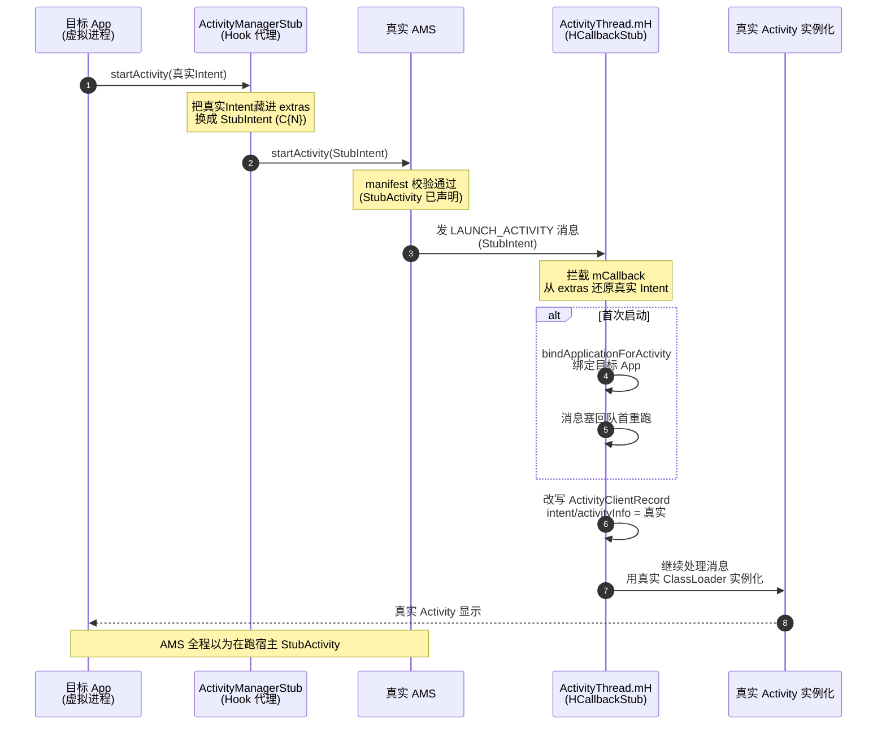

# Stub Activity 机制

这一篇讲 VirtualXposed 怎么绕过 Android 的限制，**启动一个没有装进系统的 App 的 Activity**。这是整个虚拟化里最绕、也最精巧的部分。

## 问题

Android 规定：`startActivity` 启动的 Activity 必须在当前应用（或同一 UID 的应用）的 `AndroidManifest.xml` 里声明，否则 AMS 会拒绝（`ActivityNotFoundException` / 安全校验）。

虚拟 App 的 Activity 没有声明在宿主 Manifest 里（它们是运行时装进来的），所以直接 `startActivity(虚拟Activity)` 会被真实 AMS 挡掉。

## 思路：偷梁换柱

VirtualXposed 的办法是**两段式**：

1. **出发时**：把真实 Intent 偷偷换成指向“宿主自己预声明的占位 Activity”的 Stub Intent。真实 AMS 看到的是宿主自己的 Activity，正常放行。
2. **到达时**：Activity 实例化之前，在主线程 Handler（`ActivityThread.mH`）这一层把 Stub Intent 还原成真实 Intent，并换成目标 App 的 ClassLoader 去实例化真实 Activity。

于是 AMS 全程以为在跑宿主的 Activity，实际跑的是虚拟 App 的 Activity。完整时序：



## 占位 Activity：100 个 C0~C99

`StubActivity` 是个抽象 Activity，它有 100 个空子类：

```java
public abstract class StubActivity extends Activity {
    @Override
    protected void onCreate(Bundle savedInstanceState) {
        super.onCreate(null);
        finish();
        Intent stubIntent = getIntent();
        StubActivityRecord r = new StubActivityRecord(stubIntent);
        if (r.intent != null) {
            if (同一进程) {
                startActivity(r.intent);   // 还原后启动真实 Activity
            } else {
                VActivityManager.get().startActivity(r.intent, r.userId);
            }
        }
    }
    public static class C0 extends StubActivity {}
    public static class C1 extends StubActivity {}
    // ... 共 100 个 C0 ~ C99
}
```

为什么要 100 个？因为 **launchMode 和 taskAffinity**。Android 的 Activity 栈管理依赖 launchMode（standard/singleTop/singleTask/singleInstance）和 taskAffinity。一个占位 Activity 同时只能扮演一种 launchMode 的行为，所以要预备多个、各配不同 launchMode 和 taskAffinity，按目标 Activity 的 launchMode 选一个合适的 Stub 去承载。

这些 Stub Activity 声明在 `lib` 的 `AndroidManifest.xml` 里（merge 进 APK），各带不同的 `launchMode`/`taskAffinity`/`process` 配置，由系统正常管理。

## 出发时：改写 Intent

`ActivityManagerStub` 拦截了 `startActivity` 系列。`MethodProxies` 里的 `startActivity` 代理把真实 Intent 包装进一个 `StubActivityRecord`，再塞进指向某个 Stub Activity 的 Intent：

```
真实 Intent: { pkg=com.target, cls=com.target.MainActivity }
        │ 包装成 StubActivityRecord，塞进 extras
        ▼
Stub Intent: { cls=io.va.exposed64.StubActivity$C{N} (按 launchMode 选) ,
               extras=_VA_|_intent_=真实Intent }
        │
        ▼ 调用真实 AMS（被 ActivityManagerStub 代理放行）
真实 AMS 看到的是宿主自己的 StubActivity，正常启动
```

真实 Intent 被藏在 Stub Intent 的 extras 里，跟着 Stub Activity 一起被系统调度。

## 到达时：在 mH 这一层还原

Stub Activity 起来后，`ActivityThread` 会在主线程发一条 `LAUNCH_ACTIVITY` 消息给 `mH`（主线程 Handler）。VirtualXposed 在这里拦一手——`HCallbackStub`：

```java
public class HCallbackStub implements Handler.Callback, IInjector {
    public boolean handleMessage(Message msg) {
        if (LAUNCH_ACTIVITY == msg.what) {
            if (!handleLaunchActivity(msg)) return true;
        } else if (CREATE_SERVICE == msg.what) { ... }
        // ...
    }

    private boolean handleLaunchActivity(Message msg) {
        Object r = msg.obj;   // ActivityClientRecord
        Intent stubIntent = ActivityThread.ActivityClientRecord.intent.get(r);
        StubActivityRecord saveInstance = new StubActivityRecord(stubIntent);  // 还原
        if (saveInstance.intent == null) return true;
        Intent intent = saveInstance.intent;       // 真实 Intent
        ActivityInfo info = saveInstance.info;     // 真实 ActivityInfo

        // 首次启动：绑定 Application
        if (!VClientImpl.get().isBound()) {
            VClientImpl.get().bindApplicationForActivity(info.packageName, ...);
            getH().sendMessageAtFrontOfQueue(Message.obtain(msg));  // 重排队
            return false;
        }

        // 通知 server 记录这个 Activity
        VActivityManager.get().onActivityCreate(...);

        // 把 ActivityClientRecord 里的 intent / activityInfo 换成真实的
        intent.setExtrasClassLoader(appClassLoader);
        ActivityThread.ActivityClientRecord.intent.set(r, intent);
        ActivityThread.ActivityClientRecord.activityInfo.set(r, info);
        return true;
    }

    public void inject() {
        otherCallback = getHCallback();
        mirror.android.os.Handler.mCallback.set(getH(), this);  // 替换 mCallback
    }
}
```

关键点：

1. **注入位置**：`Handler.mCallback`。Android 的 `Handler` 处理消息时优先调 `mCallback`，返回 true 就拦截。VirtualXposed 把 `ActivityThread.mH` 的 `mCallback` 换成 `HCallbackStub`，于是在 `LAUNCH_ACTIVITY` 真正处理前先截到。
2. **还原**：从 Stub Intent 的 extras 里解出真实 Intent 和 ActivityInfo，**改写 `ActivityClientRecord` 的字段**。之后系统继续处理这条消息，实例化的就是真实 Activity（用真实 ClassLoader）。
3. **首次绑定**：如果这个进程还没绑定目标 App 的 Application，先 `bindApplicationForActivity`，然后把消息塞回队首重跑——等 Application 绑好再处理 LAUNCH_ACTIVITY。

`StubActivity.onCreate` 里的 `startActivity(r.intent)` 是同一进程的简单情况：Stub 起来后立刻 `finish` 自己并启动真实 Activity，真实 Activity 再走一次上面的 mH 流程。

## 为什么要两层（Stub + mH）

有人会问：既然 mH 能还原，为啥还要 Stub Activity？

因为 **AMS 校验发生在 mH 之前**。AMS 要先认可这个 Activity 合法（在 manifest 声明过），才会调度它、才会发 `LAUNCH_ACTIVITY`。如果直接 `startActivity(虚拟Activity)`，AMS 这关就过不了，根本到不了 mH。

所以两层各管一段：

- **Stub Activity**：骗过 AMS 的 manifest 校验，让进程能起来、`LAUNCH_ACTIVITY` 能发出。
- **mH 还原**：在进程内把 Intent 换回真实的，让实际实例化的是目标 Activity。

## Stub 不止 Activity

`client/stub/` 下还有一堆配套 Stub，作用类似但场景不同：

| Stub | 场景 |
| --- | --- |
| `StubPendingActivity` / `StubPendingReceiver` / `StubPendingService` | `PendingIntent` 场景 |
| `StubDialog` | 对话框 Activity |
| `StubExcludeFromRecentActivity` | 不出现在最近任务的 Activity |
| `StubJob` / `DaemonJobService` | JobScheduler |
| `ResolverActivity` / `ChooserActivity` / `ChooseTypeAndAccount...` | 选择器场景 |
| `StubCP` | 占位 ContentProvider（IPC 桥用） |
| `DaemonService` | 常驻服务 |

这些都是“宿主预声明的占位组件”，用来骗过系统对“组件必须在 manifest 声明”的要求。

## 小结

- Stub Activity 是预声明的占位 Activity（C0~C99，对应不同 launchMode/taskAffinity）。
- 出发时把真实 Intent 藏进 Stub Intent 的 extras，骗过 AMS 的 manifest 校验。
- 到达时在 `ActivityThread.mH` 的 `mCallback`（`HCallbackStub`）把 Intent 还原，实例化真实 Activity。
- 首次启动顺带触发 `bindApplication`，把进程绑定到目标 App。

这套机制让“没装进系统的 App 的 Activity”能正常启动，是应用虚拟化的调度核心。接下来看 server 端怎么和客户端协作调度 Activity——[活动管理](./activity-manager.md)。
