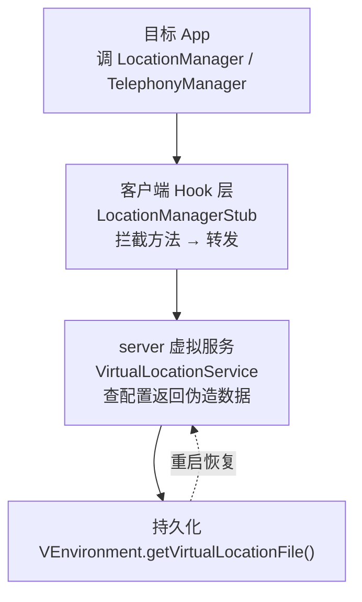
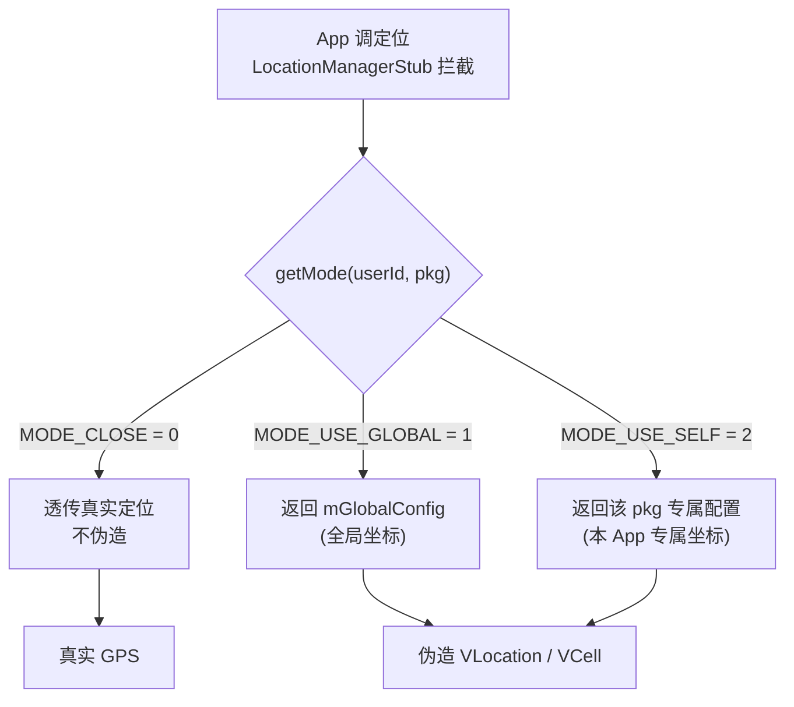

# 虚拟定位

这一篇讲 VirtualXposed 怎么给虚拟 App 伪造 GPS 位置和基站信息——一个典型的“服务虚拟化”案例，能帮你看懂其它服务（账户、通知等）是怎么做的。

## 目标

目标 App 调 `LocationManager.getLastKnownLocation()`、`LocationManager.requestLocationUpdates()`、`TelephonyManager.getCellLocation()` 时，拿到的是我们配置的伪造坐标和基站，而非真实位置。

## 架构：三层



和所有虚拟服务一样：**客户端 Hook 拦截 → 跨进程到 server → server 返回伪造数据**。

## server：VirtualLocationService

`VirtualLocationService`（`IVirtualLocationManager.Stub`）按 **userId × 包名** 维度管理定位配置，外加一个全局配置。三种模式：

```java
private static final int MODE_CLOSE = 0;        // 关闭伪造，用真实定位
private static final int MODE_USE_GLOBAL = 1;   // 用全局配置
private static final int MODE_USE_SELF = 2;     // 用本 App 专属配置
```

```java
private final SparseArray<Map<String, VLocConfig>> mLocConfigs = new SparseArray<>();
private final VLocConfig mGlobalConfig = new VLocConfig();
```

`VLocConfig` 持有一组伪造数据：

```java
private static class VLocConfig implements Parcelable {
    int mode;
    VCell cell;                 // 主基站
    List<VCell> allCell;        // 所有基站
    List<VCell> neighboringCell;// 邻区基站
    VLocation location;         // 经纬度
}
```

`getOrCreateConfig(userId, pkg)` 取配置（没有则创建并默认 `MODE_CLOSE`）。配置选择逻辑：



每个 setter（`setCell`/`setLocation`/...）改完都 `mPersistenceLayer.save()`，配置持久化到 `VEnvironment.getVirtualLocationFile()`，重启不丢。

`setGlobalCell`/`setGlobalLocation` 等方法操作全局配置，给 `MODE_USE_GLOBAL` 的 App 用。

## 客户端：LocationManagerStub

`client/hook/proxies/location/LocationManagerStub` 继承 `BinderInvocationProxy`，注入时把 `ServiceManager.sCache["location"]` 换成自己的代理 binder。它注册一批 `MethodProxy`，把定位请求转发到 `VirtualLocationService`：

- `getLastKnownLocation` → 返回配置的 `VLocation`
- `requestLocationUpdates` → 注入一个会按配置坐标回调的 listener
- `getCellLocation` / `getAllCellInfo` / `getNeighboringCellInfo` → 返回配置的 `VCell`

`MethodProxy` 里有 `isFakeLocationEnable()` 判断当前 App 是否开了伪造：

```java
// MethodProxy 基类
protected static boolean isFakeLocationEnable() {
    return VirtualLocationManager.get().getMode(VUserHandle.myUserId(),
            VClientImpl.get().getCurrentPackage()) != 0;  // != MODE_CLOSE
}
```

`MODE_CLOSE` 时透传真实定位，否则返回伪造数据。`VirtualLocationManager`（`client/ipc/`）是 `VirtualLocationService` 的远程代理。

## 进程归属

- 配置写入（用户在设置里设“这个 App 定位在哪”）：主进程或 server 进程调 `VirtualLocationService.setMode/setCell/setLocation`。
- 配置读取（目标 App 跑起来查定位）：虚拟 App 进程的 `LocationManagerStub` 通过 `VirtualLocationManager` 跨进程查 `VirtualLocationService`。

## 一个细节：IO 层的 MAC 伪造

定位还涉及 WiFi MAC（部分老定位用扫描到的 AP MAC 反查位置）。`VClientImpl.startIOUniformer` 把 WiFi MAC 文件路径也重定向了：

```java
String wifiMacAddressFile = deviceInfo.getWifiFile(userId).getPath();
NativeEngine.redirectDirectory("/sys/class/net/wlan0/address", wifiMacAddressFile);
NativeEngine.redirectDirectory("/sys/class/net/eth0/address", wifiMacAddressFile);
NativeEngine.redirectDirectory("/sys/class/net/wifi/address", wifiMacAddressFile);
```

目标 App 读 `/sys/class/net/wlan0/address`（真实 MAC）会被 native 层重定向到伪造的 MAC 文件。这把 Java Hook 和 native IO 重定向结合起来了。

## 为何要这么分层

为什么不直接在客户端 Hook 里写死坐标？

1. **配置要持久化**：用户设的坐标要存盘，放 server 进程统一管。
2. **配置要跨进程共享**：UI（主进程）设坐标，目标 App（虚拟进程）读，必须有个共享的 server。
3. **多用户/多包独立**：`userId × pkg` 维度的配置需要统一存储，不能散在各虚拟进程。

这套“server 持久化 + 客户端 Hook 转发”的模式，是 VirtualXposed 所有可配置虚拟服务（定位、设备信息、账户）的通用架构。

## 小结

- `VirtualLocationService`（server）按 `userId × pkg` 管理伪造定位/基站配置，三种模式（关闭/全局/专属），持久化。
- `LocationManagerStub`（客户端）拦截定位方法，转发到 server。
- `MODE_CLOSE` 透传真实定位，否则返回伪造数据。
- 配合 native IO 重定向伪造 WiFi MAC。

理解了这个模式，[设备信息伪造](./device-spoofing.md) 和后面的账户/通知服务就是同构的。
