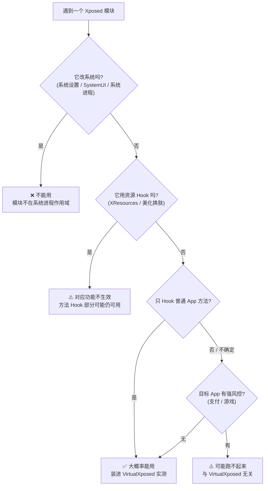

# 能力边界与限制

VirtualXposed 不是“完整的 Xposed”，它在能力和兼容性上都有明确边界。这一篇把这些边界讲清楚，帮你判断某个模块能不能用、为什么不能用。

## 两条硬限制

### 1. 不能修改系统

VirtualXposed 自身是一个普通 App，运行在用户态进程里，没有任何系统权限。所有“改系统”的模块都不可用：

- 改系统设置（如重力工具箱改 DPI、状态栏）
- 改系统 UI
- 注入系统进程（SystemUI、Phone 等）

**根因**：模块的 Hook 只对跑在 VirtualXposed 虚拟进程里的 App 生效。系统进程不在这个虚拟进程里，根本不在 Hook 的作用域内。

### 2. 不支持资源 Hook

Xposed 的 Hook 分两类：

- **方法 Hook**：改某个方法的执行逻辑（前/后插入、替换返回值等）。
- **资源 Hook**：改 `Resources` 加载的资源值（替换字符串、换图片、改布局等），实现主题美化、UI 改造。

VirtualXposed 基于 epic，**只做了方法层面的 ART Hook，没有在资源加载链路上介入**。所以：

- 用 `XResources` 做资源替换的模块，对应功能不生效。
- 典型受害者：MDWechat 这类把微信整成 Material Design 的美化模块。

## 兼容性边界

### Android 版本

- 官方支持 **Android 5.0 ~ 10.0**。
- 更高版本（Android 11+）系统 API 变动大，VirtualApp 虚拟化的系统服务接口对不上，常有兼容问题。仓库近期 commit 有针对 Android 12 的修复（`Android 12: make component lazy load` 等），但仍属追赶状态。

### 架构

- 当前构建只产出 **arm64-v8a** 和 **x86_64** 两个 ABI（见 `app/build.gradle` 的 `abiFilters`）。
- applicationId 为 `io.va.exposed64`，是个 64 位包。32 位设备不适用。

### 模块兼容

大部分不依赖系统、不依赖资源 Hook 的模块可用。但有额外限制：

- **依赖 Xposed Installer 特定行为**的模块可能有问题（VirtualXposed 内置的 Xposed Installer 是简化版）。
- **依赖修改系统数据库/Settings**的模块无效。
- **依赖资源 Hook**的模块对应功能无效。

## 风控与检测

很多 App 会主动检测自己是否运行在虚拟环境里。VirtualXposed 虽然做了不少伪装（设备信息伪造、进程名伪装等），但仍可能被识别：

- **支付类 App**（银行、支付宝）通常有较强虚拟环境检测，可能拒绝运行或触发安全提醒。
- **游戏**有反作弊检测，可能封号。
- 部分 App 通过检测进程名、包名、文件路径、Binder 调用来源等手段识别 VirtualApp 特征。

## 性能损耗

目标 App 实际运行在宿主进程内，相比原生多出：

- 系统 Service 调用要跨进程到 VirtualXposed 的 server 进程再返回（多一跳 IPC）。
- 大量系统 API 被动态代理拦截（反射开销）。
- 文件 IO 被 native 层重定向（路径转换开销）。

日常使用感知不强，但 CPU/IO 密集场景会有可测量的损耗。

## 商用限制

VirtualApp 引擎**禁止商用**。仓库内的 VirtualApp 版本已过时，商业需求请联系原作者 Lody 获取商业授权。VirtualXposed 本身开源，可用于学习研究。

## 小结：能不能用，怎么判断

遇到一个 Xposed 模块，按这个顺序判断：

剩下的就是实测。VirtualXposed 的能力上限基本就是“方法级 Hook + 不碰系统”。

