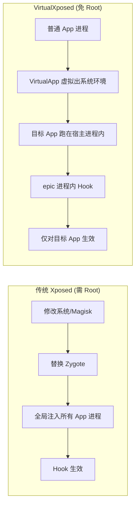

# 它解决了什么问题

要理解 VirtualXposed 解决的问题，先看“想用 Xposed 模块”这件事在它出现之前有多麻烦，以及 VirtualXposed 用什么思路绕开了麻烦，又付出了什么代价。

## 痛点：Xposed 的使用门槛太高

Xposed 是 Android 上最知名的方法 Hook 框架。一个 Xposed 模块能在任意 App 的任意方法前后插入自定义逻辑——读微信消息改写、屏蔽广告、伪造设备信息，都靠它。

但 Xposed 的运行机制决定了它的门槛：

- 模块要在 **Zygote** 进程里生效。Zygote 是所有 App 进程的父进程，Xposed 通过替换 Zygote 把自己注入进去。
- 要改 Zygote，必须**修改系统**——要么刷入带 Xposed 的系统镜像，要么用 Magisk 之类的工具在系统层挂载。
- 这意味着：**解锁 Bootloader → 刷机/刷入框架 → 每次开机校验 → 影响全局所有 App**。

对绝大多数只想用某个模块（比如微信防撤回）的普通用户，这条路太重了：失去保修、有变砖风险、影响支付类 App 的安全检测、全局生效带来副作用。

VirtualXposed 要解决的就是：**能不能不碰系统、不解锁、不刷机，照样跑 Xposed 模块？**

## 思路：把“注入 Zygote”换成“在沙箱里重放”

Xposed 的本质是“在一个进程里 Hook 它的方法”。传统做法是注入 Zygote 实现“一个钩子影响所有进程”。VirtualXposed 把目标缩小了——**我不需要全局生效，我只需要对“我想 Hook 的那个 App”生效**。

于是思路变成：

1. 我自己是一个普通 App，我有自己的进程。
2. 我在这个进程里**虚拟出一个系统环境**，把目标 App 装进来跑——目标 App 以为自己在真系统里，实际跑在我的进程里。
3. 目标 App 跑在我的进程里，那我在这个进程里 Hook 它的方法，就不需要碰 Zygote、不需要 Root。

第 2 步就是 **VirtualApp** 干的事（应用虚拟化），第 3 步就是 **epic** 干的事（ART 方法 Hook）。VirtualXposed 把两者接上。

## 注入路径对比

传统路径要在系统层动手，影响全局；VirtualXposed 把战场缩到单进程，目标 App 以为自己在真系统，实际跑在宿主沙箱里，Hook 自然不需要碰系统。

## 它解决得如何

### 解决得好的部分

- **真的免 Root**。整个流程不需要任何系统权限，普通安装即用，对手机零风险。
- **模块生态复用**。通过 `exposed-xposedapi` 还原了标准 Xposed API，绝大多数不依赖系统的 Xposed 模块可以**零改动**直接装进来用。
- **隔离性好**。模块只对 VirtualXposed 内部运行的目标 App 生效，系统里直接安装的同名 App 不受影响——你可以“系统装一份微信正常用，VirtualXposed 里装一份微信挂防撤回”，两份互不干扰。
- **重启即生效**。改了模块不需要重启手机，VirtualXposed 内部“重启”一下就行，几秒钟。

### 解决得不够的部分

- **兼容性靠手适配**。VirtualApp 虚拟化的是特定 Android 版本的系统服务，每个版本（尤其大版本）的系统 API 都在变，引擎需要持续追赶。仓库当前支持 5.0~10.0，更新的 Android 上常有兼容问题。
- **资源 Hook 缺位**。只做了方法 Hook，没做资源 Hook，依赖资源 Hook 的模块（主要是主题美化类）功能缺失。
- **系统级模块无解**。因为根本没有系统权限，改系统设置的模块天然不可用。
- **性能损耗**。目标 App 实际跑在宿主进程里，多了 IPC 和反射开销，比原生运行略慢。
- **被风控识别**。很多 App（尤其支付、游戏）能检测到自己运行在虚拟环境里，会拒绝运行或触发风控。

## 一张表对比

| 维度 | 传统 Xposed | VirtualXposed |
| --- | --- | --- |
| 是否需要 Root | 需要（刷机/Magisk） | **不需要** |
| 生效范围 | 全局所有 App | 仅 VirtualXposed 内的 App |
| 影响系统 | 是 | 否 |
| 资源 Hook | 支持 | **不支持** |
| 系统级模块 | 支持 | **不支持** |
| 模块改动 | 无需改动 | 基本无需改动 |
| 重启生效 | 重启手机 | 重启 VirtualXposed |
| 风险 | 变砖/失去保修 | 几乎无风险 |

## 小结

VirtualXposed 用“应用沙箱 + 进程内 Hook”的组合，把 Xposed 的使用门槛从“折腾系统”降到了“装个 App”。代价是牺牲了全局生效、资源 Hook 和系统级能力，换来了零风险和易用性。

这是一个典型的**工程权衡**：不追求 Xposed 的完整能力，而是用 80% 的能力覆盖 95% 的常见需求，把门槛打到最低。后面的章节我们会逐层看它是怎么把这个权衡落地成代码的。
