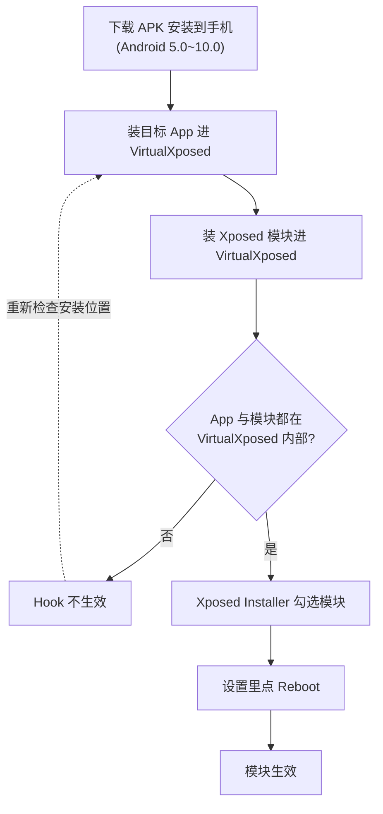

# 快速使用

这一篇面向“我只是想用起来”的读者，覆盖安装、装 App、装模块、激活、重启的完整流程。原理部分请移步[架构总览](../architecture/overview.md)。

## 使用流程总览

::: warning 商用警告
本项目使用的 VirtualApp **不允许用于商业用途**，且仓库内 VirtualApp 版本已过时。商业需求请向原作者 Lody 申请商业授权。本站内容仅供学习研究。
:::

## 准备

1. 在 [release 页面](https://github.com/android-hacker/VirtualXposed/releases) 下载最新的 APK，安装到手机。
2. 确认系统版本在 **Android 5.0 ~ 10.0** 之间（更高版本可能不兼容）。

如果你要用 GameGuardian（GG 修改器），需要下载带 `For_GameGuardian` 后缀的**专版**，普通版不行。

## 装 App 与装模块

打开 VirtualXposed，点首页底部的抽屉按钮（或长按屏幕），进入“添加应用”。

有三种安装方式：

1. **克隆已装 App**：第一页列出系统里已安装的 App，直接复制一份进来。
2. **从 APK 文件安装**：第二页扫描 sdcard 上的 APK 文件。
3. **外部文件选择器安装**：用浮动按钮选任意 APK。

::: danger 关键规则
**目标 App 和 Xposed 模块都必须装在 VirtualXposed 内部。**

以下三种组合**都不会生效**：
- 目标 App 装系统里 + 模块装 VirtualXposed 里
- 目标 App 装 VirtualXposed 里 + 模块装系统里
- 两者都装系统里

原因见[架构总览](../architecture/overview.md)：模块的 Hook 只对和它跑在同一个虚拟进程里的 App 有效。
:::

Xposed 模块除了用上面三种方式装，也可以通过 VirtualXposed 内置的 Xposed Installer 安装管理，用法和普通 Xposed Installer 一样。

## 激活模块

在 VirtualXposed 里打开 Xposed Installer → 进入模块页 → 勾选你要用的模块。

## 重启

激活后**不需要重启手机**。在 VirtualXposed 首页 → 设置 → 点 `Reboot`，VirtualXposed 会快速重启，模块即生效。

## 常见问题

- **模块没生效？** 99% 是因为目标 App 或模块没装在 VirtualXposed 内部，重新检查安装位置。
- **App 闪退？** 可能是 VirtualXposed 版本与系统不兼容，或目标 App 有虚拟环境检测。
- **杀毒软件报警？** VirtualXposed 确实具备操作其它应用的能力，部分引擎会误报。代码开源可自查；仍不放心可使用 0.8.7 版本（该版本未被报毒）。

## 亲测可用的模块（节选）

完整清单见仓库 [CHINESE.md](https://github.com/android-security-engineer/VirtualXposed-skills/blob/main/CHINESE.md)，这里列几类典型：

- **隐私/去广告**：XPrivacyLua、Minminguard、YouTube AdAway、大圣净化
- **微信增强**：微X模块、微信增强插件、微信巫师、MDWechat（资源 Hook 部分 limited）
- **QQ 增强**：QX模块、QQ精简模块、QQ斗图神器
- **设备/位置**：应用变量（机型伪装）、模拟位置（虚拟定位）、步数修改器
- **其它**：音量增强器、微信学英语、情迁抢包、指纹支付

真正能用的远不止这些，可以自行测试。
