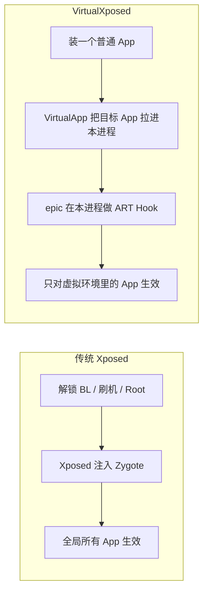

# 这是什么

**VirtualXposed** 是一个 Android 应用，它让你**在免 Root、不解锁 Bootloader、不刷机**的前提下，运行 Xposed 模块来 Hook（改写）其它应用的方法调用。

它支持 Android 5.0 ~ 10.0，当前仓库版本为 `0.22.0`。

## 一句话定位

> 把 Xposed 框架的能力，从“需要 Root + 刷入系统”降级到“装一个普通 App 就能用”。

传统 Xposed 的工作方式是：你解锁 Bootloader → 刷入带 Xposed 框架的系统镜像 → 重启 → 模块在 Zygote 进程里全局生效，影响所有 App。

VirtualXposed 换了一条路：它自己就是一个普通 App，内部用一套**应用虚拟化引擎**把目标 App 装进自己的进程里跑，再在虚拟进程里用 **ART 方法 Hook** 加载 Xposed 模块。模块只对“装进 VirtualXposed 里运行的那个 App”生效，对系统里直接安装的 App 无影响。

两条路殊途：传统 Xposed 改系统以换取全局生效，VirtualXposed 不碰系统、只换进程内生效。

## 它由两个核心拼成

VirtualXposed 不是一个从零写的框架，它站在两个项目的肩膀上：

| 项目 | 作用 | 仓库 |
| --- | --- | --- |
| **VirtualApp** | 应用虚拟化引擎：在 App 进程内用 Java 重新实现 AMS/PMS 等系统服务，让任意 App 能“安装”进沙箱运行 | [asLody/VirtualApp](https://github.com/asLody/VirtualApp) |
| **epic** | 非 Root 下的 ART 方法 Hook 引擎，基于 inline hook 改写 ART 方法入口 | [tiann/epic](https://github.com/tiann/epic) |

VirtualXposed 的贡献在于把两者缝合：让 epic 跑在 VirtualApp 虚拟出来的进程里，并把 Xposed 的标准 API（`XposedBridge`、`XC_LoadPackage` 等）暴露出来，这样**现成的 Xposed 模块可以零改动接入**。

## 它能做什么

站在使用者视角，VirtualXposed 能让你在不 Root 的手机上：

- 安装一个目标 App（比如微信、QQ、Instagram）到 VirtualXposed 内部
- 安装一个 Xposed 模块到 VirtualXposed 内部
- 在 Xposed Installer 里勾选启用模块
- 重启 VirtualXposed（不是重启手机），模块即生效

典型用途：防撤回、去广告、应用变量（机型伪装）、虚拟定位、微信/QQ 增强等。仓库的 [CHINESE.md](https://github.com/android-security-engineer/VirtualXposed-skills/blob/main/CHINESE.md) 列了一份实测可用的模块清单。

## 它不能做什么

有两道硬限制，根因都在“它本质上还是个普通 App”：

1. **不能修改系统本身**。它运行在用户态 App 进程里，没有系统权限，所以重力工具箱这类要改系统设置/系统 UI 的模块无效。
2. **不支持资源 Hook**。资源 Hook 需要在资源加载阶段介入，当前实现只在 ART 方法层面 Hook，资源钩子不会起作用。用资源 Hook 的主题美化模块（如 MDWechat）相应功能不生效。

详细边界见[能力边界与限制](./limitations.md)。

## 这个文档站讲什么

本站不是使用手册（使用说明在 README/CHINESE.md 已经写清楚了），而是一份**逐层拆解实现原理的教学文档**。读完它，你会清楚：

- VirtualApp 是怎么在 App 进程里“假装自己是系统”的
- 系统 Service 为什么能被替换、被拦截
- 一个虚拟 App 的 Activity 是怎么骗过真实 AMS 启动起来的
- 数据隔离（每个虚拟 App 独立数据目录）是怎么做到的
- epic 怎么在不 Root 的情况下 Hook ART 方法
- Xposed 模块是怎么被加载进虚拟进程并生效的

如果你只是想用它，看[快速使用](./quick-start.md)就够了；想搞懂它怎么做到的，从[架构总览](../architecture/overview.md)开始往下读。
