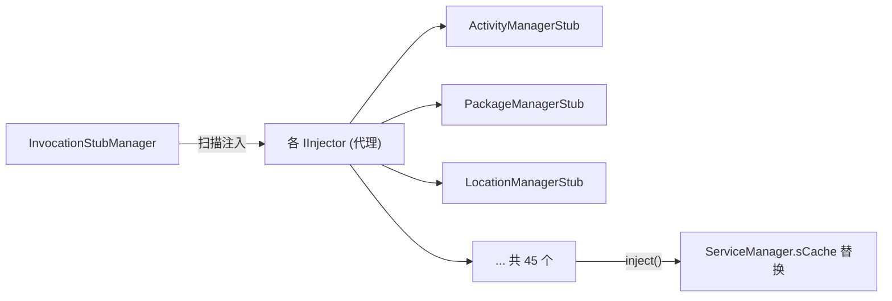

# client/core · 引擎核心

::: tip 源码路径
[`src/main/java/com/lody/virtual/client/core/`](https://github.com/android-security-engineer/VirtualXposed-skills/tree/vxp/VirtualApp/lib/src/main/java/com/lody/virtual/client/core)
:::

引擎单例和代理注册器。共 4 个文件。

## 文件组成

| 文件 | 职责 |
| --- | --- |
| `VirtualCore.java` | 引擎单例：`startup`/`installPackage`/`launchApp`/`isXposedEnabled`/`detectProcessType`/`setPhoneInfoDelegate` 等 |
| `InvocationStubManager.java` | 代理注册器：扫描所有 `IInjector` 实现并批量 `inject`，是 45 代理的调度中枢 |
| `InstallStrategy.java` | 安装策略接口 |
| `CrashHandler.java` | 客户端崩溃处理 |

## VirtualCore 关键职责

`VirtualCore.get()` 是全局单例，承担：

- **进程类型判定**：`detectProcessType()` 按进程名区分 Main/Server/VAppClient/Child
- **启动**：`startup()` 调 `Reflection.unseal()` 解封隐藏 API，初始化 `InvocationStubManager`
- **App 管理**：`installPackage`/`uninstallPackage`/`launchApp`/`getInstalledApps`
- **Xposed 开关**：`isXposedEnabled()` 检查 `.disable_xposed`
- **扩展点**：`setPhoneInfoDelegate`/`setLocationDelegate` 等宿主定制钩子

## InvocationStubManager

它把所有代理 `inject()` 到 `ServiceManager.sCache`，完成系统服务劫持。

## 子文档详解

| 文档 | 内容 |
| --- | --- |
| [`InvocationStubManager`](./invocation-stub-manager) | 代理注册器：~40 个 Stub 的注入清单、API、调用时序 |
