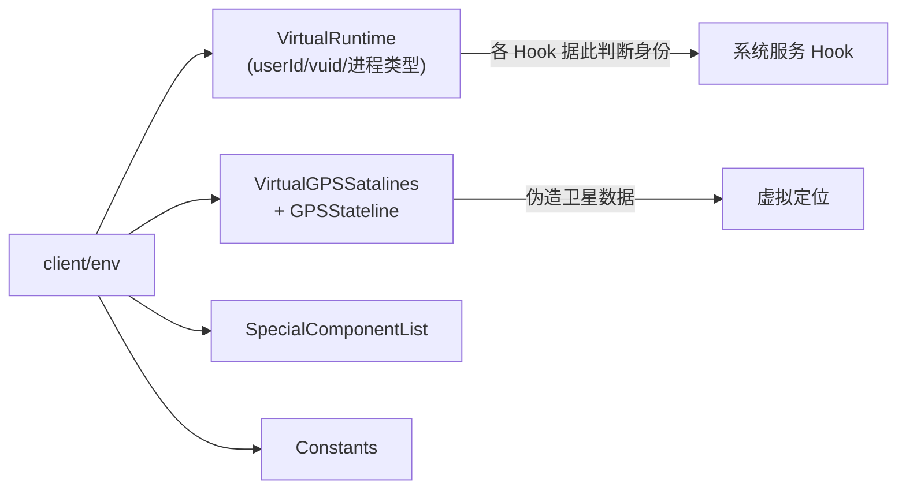

# client/env · 运行环境

::: tip 源码路径
[`src/main/java/com/lody/virtual/client/env/`](https://github.com/android-security-engineer/VirtualXposed-skills/tree/vxp/VirtualApp/lib/src/main/java/com/lody/virtual/client/env)
:::

客户端运行环境支撑，共 6 个文件。包含常量、特殊组件清单、GPS 模拟数据等。

## 文件组成

| 文件 | 职责 |
| --- | --- |
| `Constants.java` | 运行环境常量 |
| `VirtualRuntime.java` | 虚拟运行时信息（当前 userId/vuid/进程类型） |
| `SpecialComponentList.java` | 特殊组件清单（需特殊处理的组件） |
| `DeadServerException.java` | server 死亡异常 |
| `VirtualGPSSatalines.java` | 虚拟 GPS 卫星数据 |
| `GPSStateline.java` | GPS 状态行 |

## 核心机制

`VirtualRuntime` 记录当前进程的运行时身份（`getUserId`/`getProcessType`），供各 Hook 判断"我现在在哪个虚拟用户/哪种进程"。

`VirtualGPSSatalines` 配合 [虚拟定位](../../features/virtual-location) 的 GPS 状态监听，伪造卫星数据让 `GpsStatus` listener 也收到伪造信息。

## 运行环境组成

