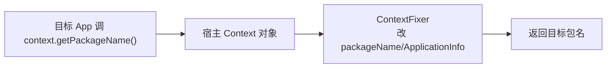

# client/fixer · 修复器

::: tip 源码路径
[`src/main/java/com/lody/virtual/client/fixer/`](https://github.com/android-security-engineer/VirtualXposed-skills/tree/vxp/VirtualApp/lib/src/main/java/com/lody/virtual/client/fixer)
:::

修复目标 App 对 Android 框架内部状态的误判，共 3 个文件。目标 App 跑在虚拟进程里，很多框架对象（Context/ApplicationInfo/Activity）是宿主的，字段值不对，需要修复器校正。

## 文件组成

| 文件 | 职责 |
| --- | --- |
| `ContextFixer.java` | 修复 Context 的包名/资源/ClassLoader/AttributionSource |
| `ActivityFixer.java` | 修复 Activity 的 ApplicationInfo/资源 |
| `ComponentFixer.java` | 修复组件（Service/Provider）的类名与信息 |

## 修复方法清单

从源码提取的静态修复入口：

| 类 | 方法 | 修复内容 |
| --- | --- | --- |
| `ContextFixer` | `fixContext(Context)` | 改 Context 的 `mPackageInfo`/`applicationInfo.packageName`/资源/ClassLoader 为目标 App |
| `ContextFixer` | `fixAttributionSource(attr, pkg, uid)` | 修正 AttributionSource 链上的包名与 uid（Android 10+） |
| `ActivityFixer` | `fixActivity(Activity)` | 改 Activity 的 ApplicationInfo/资源指向目标 App |
| `ComponentFixer` | `fixComponentClassName(pkgName, className)` | 修正组件类名的包名前缀 |
| `ComponentFixer` | `fixComponentInfo(PackageSetting, ComponentInfo, userId)` | 按用户修正 ComponentInfo 的 `name`/`packageName` |

## 核心机制

`bindApplication` 后，目标 App 拿到的 `Context` 实际是宿主的——`ContextFixer` 把 `mBase`/`mPackageInfo`/`applicationInfo.packageName` 等字段改成目标 App 的值，让目标 App 以为 Context 是自己的。

