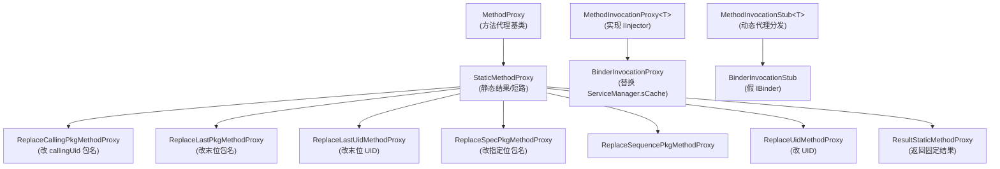
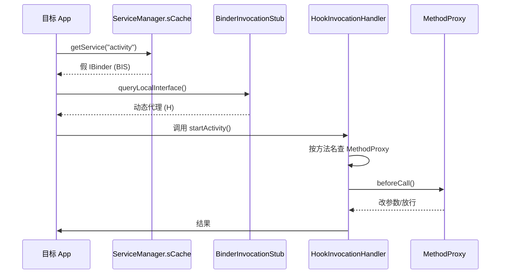

# client/hook/base · Hook 框架基类

::: tip 源码路径
[`src/main/java/com/lody/virtual/client/hook/base/`](https://github.com/android-security-engineer/VirtualXposed-skills/tree/vxp/VirtualApp/lib/src/main/java/com/lody/virtual/client/hook/base)
:::

VirtualXposed Hook 框架的基类体系，共 **17 个文件**。所有 [服务代理](../proxies/) 都建立在这套基类上。详见 [系统服务 Hook](../../features/service-hook)。

## 类继承体系

## 关键类

| 类 | 职责 |
| --- | --- |
| `MethodProxy` | 所有方法代理的基类，定义 `beforeCall`/`call`/`afterCall`/`isEnable` |
| `BinderInvocationProxy` | 替换 `ServiceManager.sCache[service]` 为假 IBinder，48 代理的基类 |
| `BinderInvocationStub` | 假 IBinder 实现，`queryLocalInterface` 返回带 MethodProxy 的动态代理 |
| `MethodInvocationStub` | `Proxy.newProxyInstance` + `HookInvocationHandler`（按方法名分发） |
| `MethodInvocationProxy` | `IInjector` 实现，组合 stub + 注入逻辑 |
| `Inject` / `SkipInject` | 注解：`@Inject` 标记内部类批量注册 MethodProxy |
| `Replace*MethodProxy` | 一族现成的方法代理，改写调用参数里的 UID/包名（最常用） |
| `StaticMethodProxy` / `ResultStaticMethodProxy` | 返回固定结果/短路 |
| `MethodBox` / `LogInvocation` | 工具：方法签名封装、调用日志 |

## 工作流

## 子文档详解

每个核心类/功能点都有独立文档：

| 文档 | 主题 |
| --- | --- |
| [`MethodProxy`](./method-proxy) | 方法代理基类，`beforeCall`/`call`/`afterCall` 抽象 + 便捷静态方法 |
| [`MethodInvocationStub`](./method-invocation-stub) | 动态代理分发器，`HookInvocationHandler` 按名路由 |
| [`BinderInvocationStub`](./binder-invocation-stub) | 假 IBinder，`replaceService` 替换 ServiceManager 缓存 |
| [`MethodInvocationProxy`](./method-invocation-proxy) | `IInjector` 实现，组合 stub + 注入逻辑 |
| [`BinderInvocationProxy`](./method-invocation-proxy-binder) | 48 服务代理的实际基类，触发 binder 替换 |
| [`Replace*MethodProxy` 族](./method-proxy-replace) | 改写参数包名/UID 的现成代理 |
| [`StaticMethodProxy`](./method-proxy-static) | 静态代理基类（不改语义） |
| [`ResultStaticMethodProxy`](./result-static-method-proxy) | 固定返回/短路代理 |
| [`@Inject` / `@SkipInject`](./inject-annotation) | 批量注册注解 |
| [`LogInvocation`](./log-invocation) | 调用日志注解 |
| [`MethodBox`](./method-box) | 方法调用三件套封装 |
