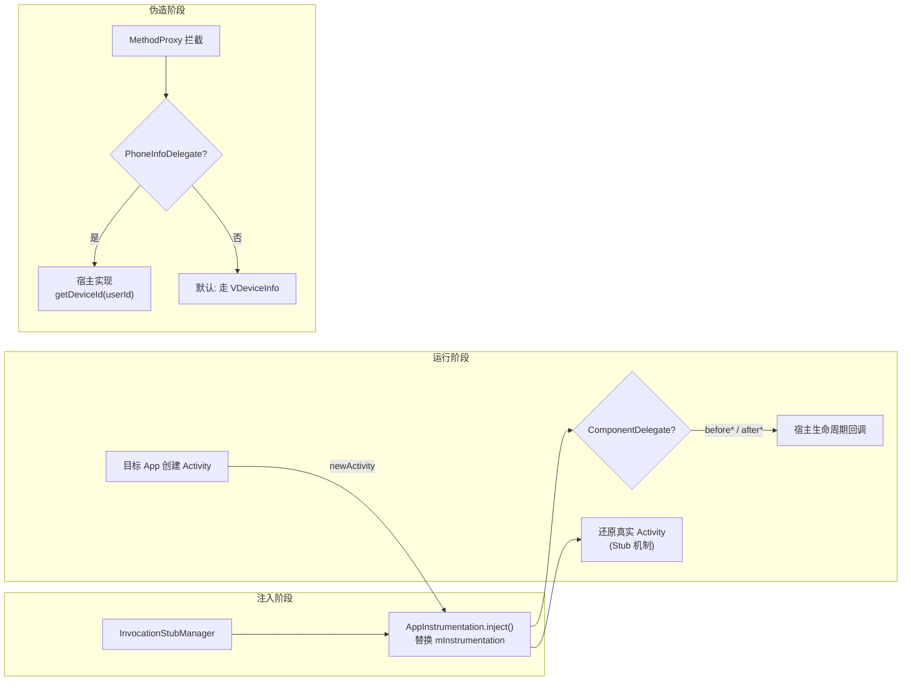
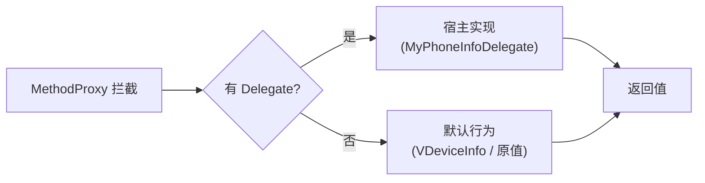

# client/hook/delegate · Hook 委托扩展点

::: tip 源码路径
[`src/main/java/com/lody/virtual/client/hook/delegate/`](https://github.com/android-security-engineer/VirtualXposed-skills/tree/vxp/VirtualApp/lib/src/main/java/com/lody/virtual/client/hook/delegate)
:::

把"伪造什么值 / 怎么处理生命周期"的决定权留给宿主 App 的扩展点目录，共 **5 个文件**。引擎只提供**机制**（拦截 + 转发），策略由宿主实现——这是 VirtualXposed 区别于"硬编码伪造"的关键设计。

## 文件组成

| 文件 | 类型 | 作用 |
| --- | --- | --- |
| [`AppInstrumentation`](https://github.com/android-security-engineer/VirtualXposed-skills/blob/vxp/VirtualApp/lib/src/main/java/com/lody/virtual/client/hook/delegate/AppInstrumentation.java) | 具体类 `extends InstrumentationDelegate implements IInjector` | 替换宿主 `Instrumentation`，接管 Activity 实例化与生命周期回调（`newActivity`/`callActivityOnCreate`），是 Stub Activity 还原的入口 |
| [`InstrumentationDelegate`](https://github.com/android-security-engineer/VirtualXposed-skills/blob/vxp/VirtualApp/lib/src/main/java/com/lody/virtual/client/hook/delegate/InstrumentationDelegate.java) | 基类 `extends Instrumentation` | 包装原始 `Instrumentation`，转发未拦截方法；`AppInstrumentation` 继承它 |
| [`ComponentDelegate`](https://github.com/android-security-engineer/VirtualXposed-skills/blob/vxp/VirtualApp/lib/src/main/java/com/lody/virtual/client/hook/delegate/ComponentDelegate.java) | 接口 | Activity 生命周期钩子：`beforeActivityCreate/Resume/Pause/Destroy` + `after*` 对应 |
| [`PhoneInfoDelegate`](https://github.com/android-security-engineer/VirtualXposed-skills/blob/vxp/VirtualApp/lib/src/main/java/com/lody/virtual/client/hook/delegate/PhoneInfoDelegate.java) | 接口 | 设备信息伪造策略：`getDeviceId`/`getBluetoothAddress`/`getMacAddress` 按 userId 返回伪造值 |
| [`TaskDescriptionDelegate`](https://github.com/android-security-engineer/VirtualXposed-skills/blob/vxp/VirtualApp/lib/src/main/java/com/lody/virtual/client/hook/delegate/TaskDescriptionDelegate.java) | 接口 | 任务描述定制：`getTaskDescription(old)` 改 Recents 里任务的标题/图标 |

## 三类委托的协作



## PhoneInfoDelegate 详解

设备信息伪造的策略接口，三个方法都接收"原值 + userId"，返回伪造值：

```java
public interface PhoneInfoDelegate {
    String getDeviceId(String oldDeviceId, int userId);
    String getBluetoothAddress(String oldBluetoothAddress, int userId);
    String getMacAddress(String oldMacAddress, int userId);
}
```

宿主 `app` 模块在 `BaseVirtualInitializer.onVirtualProcess()` 里注册：

```java
VirtualCore.get().setPhoneInfoDelegate(new MyPhoneInfoDelegate());
```

仓库默认的 `MyPhoneInfoDelegate` 直接返回原值（不伪造）——它是个**示例实现**，想要伪造就改这个类。与 [`VDeviceInfo`](../remote/vdevice-info) 的关系：`VDeviceInfo` 是引擎自动生成并持久化的伪造池（按 userId 隔离），`PhoneInfoDelegate` 是宿主介入的口子——宿主实现后可覆盖引擎默认行为。

## 设计意图：机制与策略分离



引擎只提供**机制**（拦截 + 转发），策略由宿主实现。例如 [设备信息伪造](../../features/device-spoofing) 里，`VirtualCore.setPhoneInfoDelegate(...)` 注册宿主实现——默认实现不伪造，想伪造就改这个类。同样的模式见 `ComponentDelegate`（生命周期策略）与 `TaskDescriptionDelegate`（任务外观策略）。

## 关联

- [`IInjector`](./interfaces)：`AppInstrumentation` 实现的注入器契约。
- [`InvocationStubManager`](./core)：注册并驱动 `AppInstrumentation`。
- [`MethodProxy`](./method-proxy)：调用 `PhoneInfoDelegate` 的代理基类。
- [设备信息伪造](../../features/device-spoofing)：`PhoneInfoDelegate` 的使用场景。
- [Stub Activity](../../features/stub-activity)：`AppInstrumentation` 还原真实 Activity 的机制。
