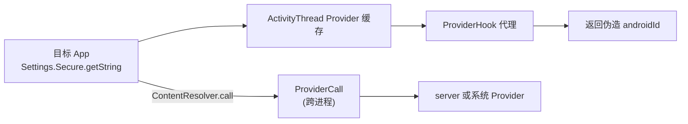

# client/hook/providers · ContentProvider Hook

::: tip 源码路径
[`src/main/java/com/lody/virtual/client/hook/providers/`](https://github.com/android-security-engineer/VirtualXposed-skills/tree/vxp/VirtualApp/lib/src/main/java/com/lody/virtual/client/hook/providers)
:::

ContentProvider（CP）的 Hook 体系，共 7 个文件。CP 比系统服务复杂——它既涉及 `ContentResolver`，又涉及 `ActivityThread` 内部的 Provider 缓存。

## 关键类

从源码提取的真实类清单：

| 类 | 职责 |
| --- | --- |
| `ProviderHook` | CP Hook 基类，`implements InvocationHandler`，按 authority 静态分发到子类 |
| `SettingsProviderHook` | 代理 Settings Provider，`Settings.Secure.ANDROID_ID` 返回伪造值 |
| `DownloadProviderHook` | 代理 Downloads Provider |
| `MediaProviderHook` | 代理 Media Provider |
| `InternalProviderHook` | 内部（虚拟环境内）Provider 代理 |
| `ExternalProviderHook` | 外部（系统）Provider 代理 |
| `QueryRedirectCursor` | 包装 `Cursor`，重定向查询结果（IO 重定向在 CP 层的延伸） |

`ProviderHook` 的 `PROVIDER_MAP` 按 authority（`settings`/`downloads`/`media`）注册 `HookFetcher`，命中时构造对应子类代理。`external` 标志区分该 Provider 是走虚拟环境内还是真实系统。

## 核心机制

详见 [IPC 桥](../../features/ipc-bridge) 的 `StubCP` 部分。要点：

- `VClientImpl.fixInstalledProviders` 修复 `ActivityThread` 的 Provider 缓存
- `clearSettingProvider` 清掉系统 Settings Provider 缓存
- `ProviderHook` 代理 Settings Provider，让 `Settings.Secure.ANDROID_ID` 返回伪造值（见 [设备信息伪造](../../features/device-spoofing)）
- 跨进程 CP 调用通过 `ProviderCall`（无需 Context）

