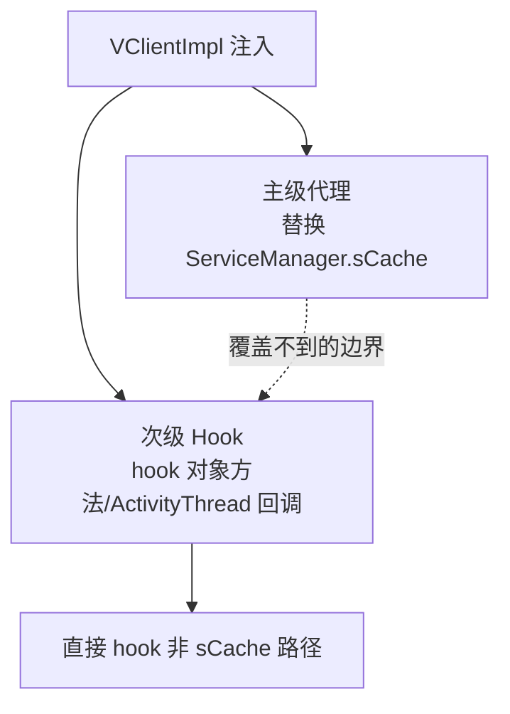

# client/hook/secondary · 次级 Hook

::: tip 源码路径
[`src/main/java/com/lody/virtual/client/hook/secondary/`](https://github.com/android-security-engineer/VirtualXposed-skills/tree/vxp/VirtualApp/lib/src/main/java/com/lody/virtual/client/hook/secondary)
:::

次级 Hook——处理跨组件、需要更深介入的 Hook 场景。共 4 个文件。

## 文件组成

| 文件 | 职责 |
| --- | --- |
| `ServiceConnectionDelegate.java` | `extends IServiceConnection.Stub`，代理虚拟 App 的 `ServiceConnection`——把真实系统回调的 Service 连接转发到虚拟 App 的目标组件 |
| `StubBinder.java` | 抽象 `IBinder` 实现，`queryLocalInterface` 返回动态代理；为次级 hook 提供假 binder 基类 |
| `ProxyServiceFactory.java` | 按 ClassLoader 创建服务代理 binder 的工厂，内部用 `StubBinder` 生成带 `InvocationHandler` 的代理 |
| `HackAppUtils.java` | 针对特定 App 的兼容修复（如 `enableQQLogOutput` 反射开启 QQ 日志） |

## 核心机制

不同于主级代理（替换 `ServiceManager.sCache`），次级 Hook 处理那些不走 sCache 的路径，例如直接 hook 对象方法、`ActivityThread` 内部回调等。常用于补全主代理覆盖不到的边界。

具体类随版本变化，作为主级代理的补充层。

## 主级 vs 次级 Hook

