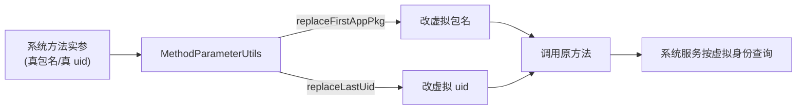

# client/hook/utils · Hook 工具

::: tip 源码路径
[`src/main/java/com/lody/virtual/client/hook/utils/`](https://github.com/android-security-engineer/VirtualXposed-skills/tree/vxp/VirtualApp/lib/src/main/java/com/lody/virtual/client/hook/utils)
:::

Hook 框架的通用工具目录，目前含 `MethodParameterUtils` 一个类。它把各 `MethodProxy` 里反复出现的「在参数数组里找某类型参数、替换包名/Uid」操作收敛成静态方法，是 hook 代理方法最常见的助手。

## MethodParameterUtils

| 方法 | 作用 |
| --- | --- |
| `getFirstParam(args, tClass)` | 取实参数组里第一个指定类型的参数 |
| `replaceFirstAppPkg(args)` | 把第一个 `String` 包名参数替换成当前虚拟 App 包名，返回原值 |
| `replaceLastAppPkg(args)` | 把最后一个 `String` 包名参数替换成虚拟包名 |
| `replaceSequenceAppPkg(args, sequence)` | 替换第 N 个 `String` 包名参数 |
| `replaceLastUid(args)` | 把最后一个 `int` uid 参数替换成虚拟 uid |
| `getAllInterface(Class)` / `getAllInterfaces(Class, set)` | 反射收集某类实现的所有接口 |

## 为什么需要它

大量系统服务方法（`startActivity`、`getPackageInfo`、`queryIntentActivities` …）的参数里带「调用方包名 / uid」。在虚拟环境里，App 传上来的真实包名要被改成虚拟包名、真实 uid 要改成虚拟 uid，否则系统服务按真包名查不到虚拟安装的 App。这些替换逻辑高度同质，抽到这里避免每个 `MethodProxy` 各写一遍。

## 参数替换流程



```java
@Override
public Object invoke(Object who, Method method, Object[] args) {
    MethodParameterUtils.replaceFirstAppPkg(args);
    return method.invoke(who, args);
}
```

## 关联

- [系统服务 Hook](/features/service-hook)：`MethodProxy` 机制。
- 与 [`ArrayUtils`](../helper/utils/array-utils) 互补：前者按类型定位参数，后者做替换。
