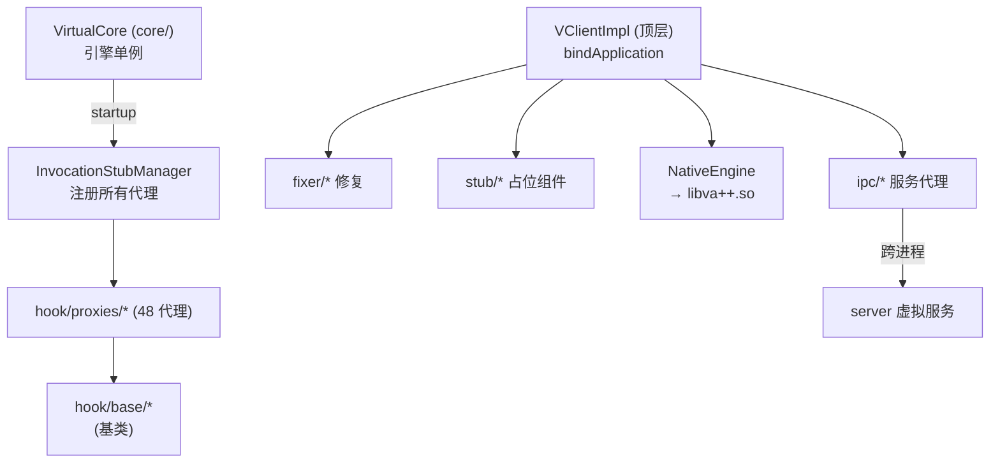
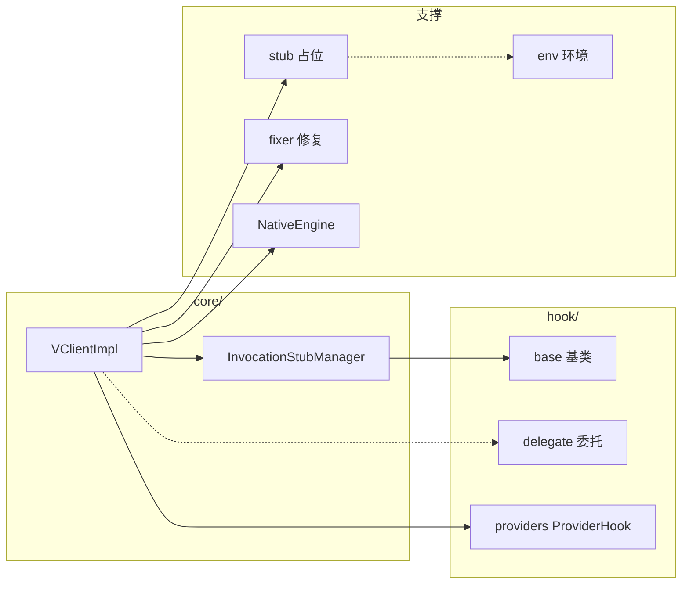

# 客户端基建 client

::: tip 源码路径
[`src/main/java/com/lody/virtual/client/`](https://github.com/android-security-engineer/VirtualXposed-skills/tree/vxp/VirtualApp/lib/src/main/java/com/lody/virtual/client)
:::

客户端（虚拟 App 进程 + 主进程）的基础设施——Hook 框架基类、IPC 客户端代理、Stub 组件、修复器、运行环境。这是支撑 45 个 [服务代理](../proxies/) 运转的骨架。

## 模块总览

| 模块 | 文件数 | 职责 | 文档 |
| --- | --- | --- | --- |
| 顶层 | 2 | `VClientImpl`（客户端核心）+ `NativeEngine`（native 桥） | [客户端核心](./vclient) · [Native 桥](./native-engine) |
| `core/` | 4 | `VirtualCore`（引擎单例）+ `InvocationStubManager`（代理注册器） | [引擎核心](./core) |
| `hook/base/` | 17 | Hook 框架基类：`MethodProxy`/`BinderInvocationProxy` 等 | [Hook 基类](./hook-base) |
| `hook/delegate/` | 5 | Hook 委托扩展点（如 `PhoneInfoDelegate`） | [Hook 委托](./hook-delegate) |
| `hook/providers/` | 7 | ContentProvider Hook（`ProviderHook` 等） | [Provider Hook](./hook-providers) |
| `hook/secondary/` | 4 | 次级 Hook（跨组件） | [次级 Hook](./hook-secondary) |
| `hook/utils/` | 1 | Hook 工具 | [Hook 工具](./hook-utils) |
| `ipc/` | 12 | server 服务的客户端 IPC 代理 + `ServiceManagerNative` | [IPC 代理](./ipc) |
| `stub/` | 17 | Stub 组件（Activity/CP/Service/Receiver 占位） | [Stub 组件](./stub) |
| `fixer/` | 3 | 修复器（Activity/组件/Context 字段修复） | [修复器](./fixer) |
| `env/` | 6 | 运行环境常量、特殊组件列表、GPS 模拟 | [运行环境](./env) |
| `natives/` | 1 | `NativeMethods`（native 方法符号缓存） | [Native 方法表](./natives) |
| `interfaces/` | 1 | 客户端接口定义 | [接口](./interfaces) |
| `badger/` | 4 | 角标（Badge）支持 | [角标](./badger) |

## 启动关系

## bindApplication 数据流

`VClientImpl.bindApplicationNoCheck` 是把宿主进程变成目标 App 的总入口，串联 client 各子模块：

## 阅读顺序

| 步骤 | 文档 | 了解什么 |
| --- | --- | --- |
| 1 | [`VClientImpl`](./vclient) | 客户端核心，`bindApplication` 全流程 |
| 2 | [`core`](./core) | 引擎单例 `VirtualCore` 与代理注册器 |
| 3 | [`InvocationStubManager`](./invocation-stub-manager) | 48 代理如何被批量注入 |
| 4 | [`hook/base`](./hook-base) | Hook 框架基类（`MethodProxy` 等） |
| 5 | [`stub`](./stub) | Stub Activity/CP/Service 占位还原 |
| 6 | [45 个服务代理](../proxies/) | 各系统服务如何被劫持 |
