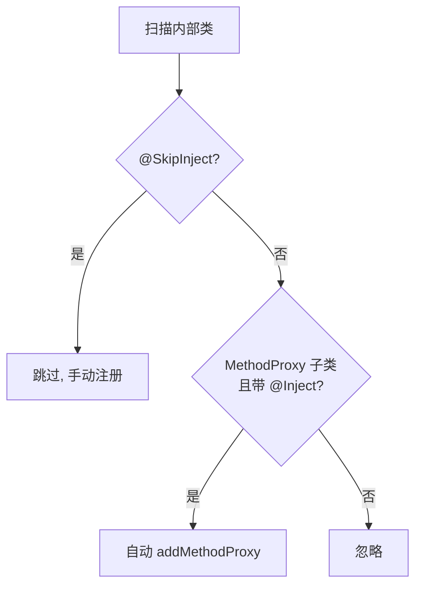

# @Inject / @SkipInject · 注册注解

::: tip 源码路径
[`src/main/java/com/lody/virtual/client/hook/base/Inject.java`](https://github.com/android-security-engineer/VirtualXposed-skills/blob/vxp/VirtualApp/lib/src/main/java/com/lody/virtual/client/hook/base/Inject.java) + `SkipInject.java`
:::

`@Inject` 和 `@SkipInject` 是一对运行时注解，控制 [`MethodInvocationProxy`](./method-invocation-proxy) 是否自动把一个内部类注册为 `MethodProxy`。它们让服务代理类不必逐条手写 `addMethodProxy`。

## @Inject

```java
@Target(ElementType.TYPE)
@Retention(RetentionPolicy.RUNTIME)
public @interface Inject { }
```

标在 `MethodProxy` 子类（通常是服务代理类的内部类）上。`MethodInvocationProxy.addMethodProxy(Class)` 反射扫描带此注解的内部类，自动实例化并注册。

```java
public class ActivityManagerStub extends BinderInvocationProxy {
    @Inject
    class startActivity extends MethodProxy { ... }  // 自动注册
    @Inject
    class getRunningTasks extends MethodProxy { ... }
}
```

## @SkipInject

```java
@Target(ElementType.TYPE)
@Retention(RetentionPolicy.RUNTIME)
public @SkipInject { }
```

标在「虽然是 `MethodProxy` 子类但不该自动注册」的内部类上——比如需要带参构造、或按版本条件注册的代理。扫描时跳过，由代码手动 `addMethodProxy`。

## 配合使用

扫描逻辑（伪码）：

```
for 每个内部类:
    if 带 @SkipInject: 跳过
    else if 是 MethodProxy 子类 且 带 @Inject: 自动注册
```

::: tip 设计意图
注解驱动注册把「一个服务代理 = 一组内部类 hook」的对应关系声明化，新增一个拦截点只要加个带 `@Inject` 的内部类，不动注册代码。
:::

## 注册扫描决策



## 关联

- [`MethodInvocationProxy`](./method-invocation-proxy)：扫描方。
- [`MethodProxy`](./method-proxy)：被注册的元素。
- [系统服务 Hook](../../features/service-hook)。
