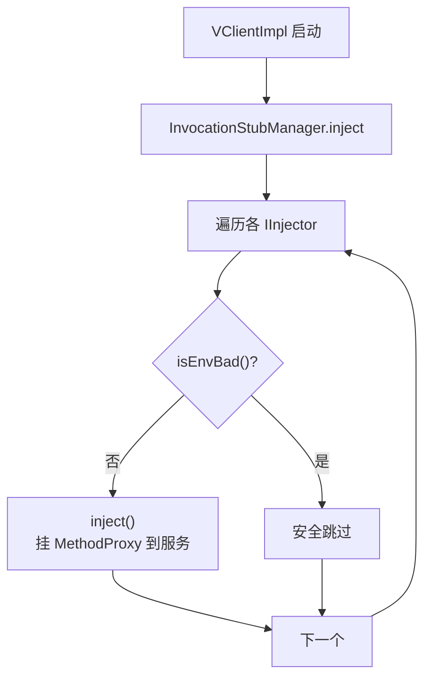

# client/interfaces · 客户端接口

::: tip 源码路径
[`src/main/java/com/lody/virtual/client/interfaces/`](https://github.com/android-security-engineer/VirtualXposed-skills/tree/vxp/VirtualApp/lib/src/main/java/com/lody/virtual/client/interfaces)
:::

客户端对外暴露的契约接口目录，目前定义 `IInjector`——所有「注入器」的统一抽象，是 hook 注入流程的入口契约。

## IInjector

```java
public interface IInjector {
    void inject() throws Throwable;
    boolean isEnvBad();
}
```

| 方法 | 作用 |
| --- | --- |
| `inject()` | 执行注入：把对应的 `MethodProxy` 集合挂到目标系统服务的 `IInterface` 上 |
| `isEnvBad()` | 检查运行环境是否就绪/已损坏，决定是否跳过注入 |

## 谁实现它

- `InvocationStubManager` —— 总注入器，按服务逐个注入。
- 各服务的 `*Hook`（如 `IActivityManagerHook`）—— 单服务注入器，内部持有一组 `MethodProxy`，`inject()` 时把它们 patch 到代理对象上。

## 注入时机

client 进程启动时由 [`VClientImpl`](./vclient) 调用 `InvocationStubManager.inject()`，遍历各 `IInjector` 逐个注入。`isEnvBad()` 让某些在当前版本不适用的注入器安全跳过。

## IInjector 注入流程



## 关联

- [`VClientImpl`](./vclient)：注入流程驱动方。
- [`hook/delegate`](./hook-delegate)：`InvocationStubManager` 实现。
- [系统服务 Hook](/features/service-hook)。
