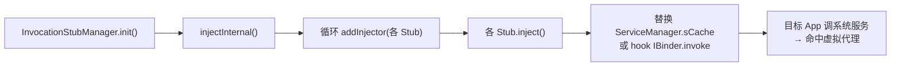
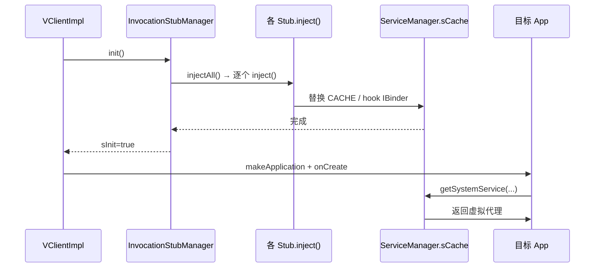

# InvocationStubManager · 代理注册器

::: tip 源码路径
[`src/main/java/com/lody/virtual/client/core/InvocationStubManager.java`](https://github.com/android-security-engineer/VirtualXposed-skills/blob/vxp/VirtualApp/lib/src/main/java/com/lody/virtual/client/core/InvocationStubManager.java)
:::

`InvocationStubManager` 是 48 个系统服务代理的**调度中枢**——单例，扫描所有 `IInjector` 实现并批量 `inject()`，把虚拟 Binder 替换进 `ServiceManager.sCache`，完成系统服务劫持。它是 `bindApplication` 流程的关键一环。

## 单例与状态

```java
public final class InvocationStubManager {
    private static InvocationStubManager sInstance = new InvocationStubManager();
    private static boolean sInit;
    private Map<Class<?>, IInjector> mInjectors = new HashMap<>(13);

    public static InvocationStubManager getInstance();
    public boolean isInit();
    public void init() throws Throwable;   // 入口：injectAll + sInit=true
}
```

`mInjectors` 按 `IInjector` 的 Class 索引注入器实例，供后续 `findInjector`/`getInvocationStub` 取回。

## API

| 方法 | 作用 |
| --- | --- |
| `getInstance()` | 取单例 |
| `init()` | 初始化入口，调 `injectAll()` 注入全部代理 |
| `injectAll()` | 调 `injectInternal()`（受 `sInit` 保护，只注入一次） |
| `injectInternal()` | 实例化并 `addInjector` 全部 ~40 个 Stub |
| `addInjector(IInjector)` | 注册单个注入器到 `mInjectors` |
| `findInjector(clazz)` | 按类型取注入器实例 |
| `checkEnv(clazz)` | 校验某注入器环境是否就绪 |
| `getInvocationStub(injectorClass)` | 取注入器对应的 `MethodInvocationStub`（即替换后的 Binder 代理） |

## 注入器清单（节选）

`injectInternal()` 顺序注册约 40 个 Stub，覆盖几乎所有系统服务。按类别：

| 类别 | 注入器 |
| --- | --- |
| **核心** | `ActivityManagerStub`、`PackageManagerStub`、`LibCoreStub`、`HCallbackStub`、`TransactionHandlerStub` |
| **通信** | `ClipBoardStub`、`ContentServiceStub`、`ISmsStub`、`ISubStub`、`PhoneSubInfoStub` |
| **设备/状态** | `TelephonyStub`、`TelephonyRegistryStub`、`LocationManagerStub`、`PowerManagerStub`、`VibratorStub`、`DisplayStub`、`WindowManagerStub` |
| **网络** | `ConnectivityStub`、`WifiManagerStub`、`BluetoothStub`、`ContextHubServiceStub` |
| **媒体/输入** | `AudioManagerStub`、`InputMethodManagerStub`、`AppWidgetManagerStub`、`MmsStub` |
| **账户/搜索** | `AccountManagerStub`、`SearchManagerStub`、`UserManagerStub` |
| **调度/策略** | `AlarmManagerStub`、`JobServiceStub`、`AppOpsManagerStub`、`RestrictionStub`、`SessionManagerStub` |
| **其他** | `NotificationManagerStub`、`DropBoxManagerStub`、`MountServiceStub`、`BackupManagerStub`、`PersistentDataBlockServiceStub` |

各注入器对应一个 [服务代理](../proxies/) 的详细文档。

## 注入机制

每个注入器实现 [`IInjector`](./interfaces)，`inject()` 时通常走 [`BinderInvocationStub`](./binder-invocation-stub) 或 [`MethodInvocationProxy`](./method-invocation-proxy)：



## 调用时机

`init()` 由 [`VClientImpl.bindApplicationNoCheck`](./vclient) 在加载目标 App ClassLoader 之后、`makeApplication` 之前调用——确保目标 App 任何系统服务调用都已先被劫持：



## 关联

- [`VirtualCore`](./core)：在 `startup()` 时初始化本管理器。
- [`VClientImpl`](./vclient)：`bindApplication` 时调用 `init()`。
- [`IInjector`](./interfaces)：所有注入器实现的契约。
- [`MethodInvocationStub`](./method-invocation-stub) / [`BinderInvocationStub`](./binder-invocation-stub)：注入器的两种实现基类。
- [系统服务 Hook](../../features/service-hook)：整体机制总览。
- [48 个服务代理](../proxies/)：各注入器的详细文档。
