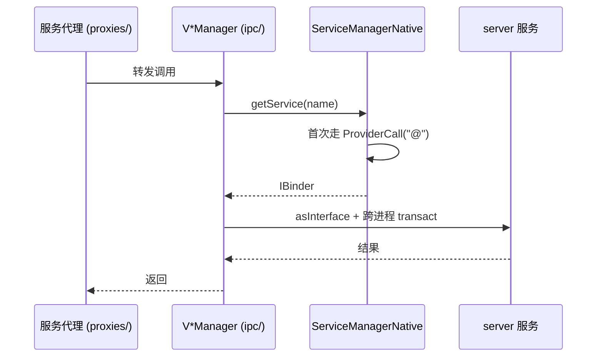

# client/ipc · server 服务客户端代理

::: tip 源码路径
[`src/main/java/com/lody/virtual/client/ipc/`](https://github.com/android-security-engineer/VirtualXposed-skills/tree/vxp/VirtualApp/lib/src/main/java/com/lody/virtual/client/ipc)
:::

server 虚拟服务的客户端 IPC 代理，共 **12 个文件**。每个 `V*Manager` 是对应 server 服务的远程代理，通过 `ServiceManagerNative.getService(name)` 拿 IBinder 再 `asInterface`。

## 文件组成

| 文件 | 代理的 server 服务 |
| --- | --- |
| `ServiceManagerNative.java` | 取服务句柄的总入口（`ProviderCall("@")` → `ServiceFetcher`） |
| `ProviderCall.java` | 跨进程调 ContentProvider 的封装 |
| `LocalProxyUtils.java` | 本地代理工具 |
| `ActivityClientRecord.java` | Activity 客户端记录 |
| `VActivityManager.java` | `VActivityManagerService` |
| `VPackageManager.java` | `VPackageManagerService` |
| `VAccountManager.java` | `VAccountManagerService` |
| `VJobScheduler.java` | `VJobSchedulerService` |
| `VirtualLocationManager.java` | `VirtualLocationService` |
| `VNotificationManager.java` | `VNotificationManagerService` |
| `VDeviceManager.java` | `VDeviceManagerService` |
| `VirtualStorageManager.java` | `VirtualStorageService` |

## 调用链

详见 [IPC 桥](../../features/ipc-bridge)。
