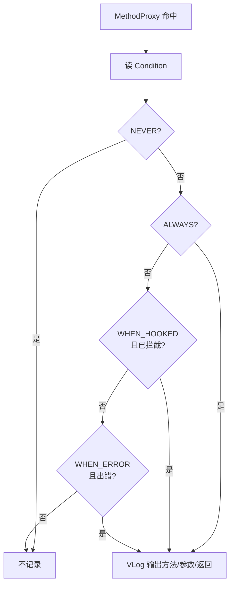

# LogInvocation · 调用日志注解

::: tip 源码路径
[`src/main/java/com/lody/virtual/client/hook/base/LogInvocation.java`](https://github.com/android-security-engineer/VirtualXposed-skills/blob/vxp/VirtualApp/lib/src/main/java/com/lody/virtual/client/hook/base/LogInvocation.java)
:::

`LogInvocation` 是运行时注解，控制某个 [`MethodProxy`](./method-proxy) 被命中时是否记录日志。排错时定位「某个系统方法到底有没有被 hook、参数是什么」全靠它。

## 用法

```java
@LogInvocation(LogInvocation.Condition.ALWAYS)
class startActivity extends MethodProxy { ... }
```

## Condition 枚举

| 值 | 何时记录 |
| --- | --- |
| `NEVER` | 从不记录（默认） |
| `ALWAYS` | 每次命中都记录 |
| `WHEN_HOOKED` | 命中且被实际拦截时记录 |
| `WHEN_ERROR` | 仅调用出错时记录 |

## 机制

`MethodProxy` 构造函数读这个注解，存到 `mInvocationLoggingCondition`。`HookInvocationHandler` 分发调用时按此策略决定是否通过 [`VLog`](../helper/utils/vlog) 输出方法名、参数、返回值。`getLogLevel(isHooked, isError)` 按「是否命中 / 是否出错」算出对应的 log 级别。

## 与 MethodInvocationStub 的关系

`MethodInvocationStub` 也有 `setInvocationLoggingCondition`，可对整个 stub 设全局策略，未单独标注的 `MethodProxy` 继承之。

## 日志策略决策



## 关联

- [`MethodProxy`](./method-proxy)：标注目标。
- [`MethodInvocationStub`](./method-invocation-stub)：全局策略继承。
- [`VLog`](../helper/utils/vlog)：日志输出。
