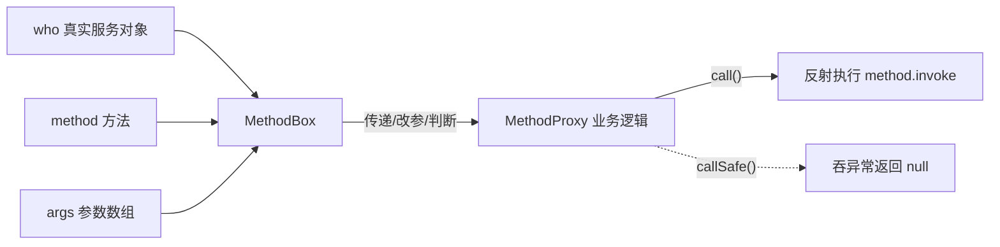

# MethodBox · 方法调用封装

::: tip 源码路径
[`src/main/java/com/lody/virtual/client/hook/base/MethodBox.java`](https://github.com/android-security-engineer/VirtualXposed-skills/blob/vxp/VirtualApp/lib/src/main/java/com/lody/virtual/client/hook/base/MethodBox.java)
:::

`MethodBox` 是一个轻量值对象，把「方法 + 调用者 + 参数」三件套打包，方便在 [`MethodProxy`](./method-proxy) 内部传递和延迟调用。

## 字段

| 字段 | 类型 | 含义 |
| --- | --- | --- |
| `method` | `Method` | 要调用的方法 |
| `who` | `Object` | 调用目标（真实服务对象） |
| `args` | `Object[]` | 参数数组 |

## 方法

| 方法 | 作用 |
| --- | --- |
| `call()` | 反射执行 `method.invoke(who, args)`，抛 `InvocationTargetException` |
| `callSafe()` | 同上但吞掉异常，返回 `null` |

## 用途

`MethodProxy.call(who, method, args)` 收到这三件套后，有时不想立刻调用原方法（要先改参数、做条件判断、或转发到别处）。`MethodBox` 把它们封装起来，可以在逻辑里传来传去，最后再 `call()`。

## 调用封装与延迟执行



```java
@Override
public Object call(Object who, Method method, Object... args) {
    MethodBox box = new MethodBox(method, who, args);
    // 改参数、做判断...
    return box.call();  // 最终放行原方法
}
```

## 关联

- [`MethodProxy`](./method-proxy)：使用方。
- [系统服务 Hook](../../features/service-hook)。
