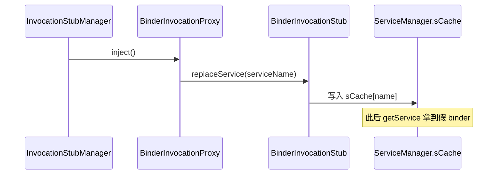

# BinderInvocationProxy · Binder 注入器

::: tip 源码路径
[`src/main/java/com/lody/virtual/client/hook/base/BinderInvocationProxy.java`](https://github.com/android-security-engineer/VirtualXposed-skills/blob/vxp/VirtualApp/lib/src/main/java/com/lody/virtual/client/hook/base/BinderInvocationProxy.java)
:::

`BinderInvocationProxy` 继承 [`MethodInvocationProxy<BinderInvocationStub>`](./method-invocation-proxy)，是 48 个服务代理注入器的**实际基类**。它专门负责「替换 `ServiceManager` 缓存里的真 binder」这一步。

## 构造

四种构造方式，按拿到原接口的途径选：

| 构造 | 入参 | 场景 |
| --- | --- | --- |
| `(IInterface stub, String serviceName)` | 已有接口 | 直接包装 |
| `(RefStaticMethod asInterfaceMethod, String serviceName)` | mirror 反射的 asInterface | 跨版本取接口 |
| `(Class<?> stubClass, String serviceName)` | Stub 类 | 反射 asInterface |
| `(BinderInvocationStub hookDelegate, String serviceName)` | 已构造的 stub | 复用 stub |

`serviceName` 决定要替换 `ServiceManager.sCache` 的哪个槽位（如 `"activity"`、`"package"`）。

## inject()

```java
public void inject() throws Throwable {
    // 把 BinderInvocationStub 写进 ServiceManager.sCache[serviceName]
    getInvocationStub().replaceService(serviceName);
}
```

`inject()` 是 [`IInjector`](./interfaces) 的实现，触发 [`BinderInvocationStub.replaceService`](./binder-invocation-stub) 完成替换。此后系统服务的 binder 句柄就是假的。

## binder 注入与替换



## isEnvBad()

```java
public boolean isEnvBad();
```

检查运行环境是否就绪（原 binder 是否能取到）。若环境异常，[`InvocationStubManager`](./hook-delegate) 会跳过本注入器，避免崩溃。

## 关联

- [`MethodInvocationProxy`](./method-invocation-proxy)：父类。
- [`BinderInvocationStub`](./binder-invocation-stub)：持有并触发替换。
- [系统服务 Hook](../../features/service-hook)。
- [IPC 桥](../../features/ipc-bridge)。
