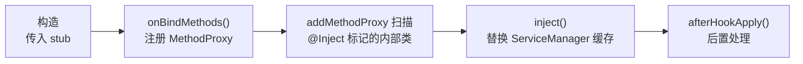

# MethodInvocationProxy · 注入器基类

::: tip 源码路径
[`src/main/java/com/lody/virtual/client/hook/base/MethodInvocationProxy.java`](https://github.com/android-security-engineer/VirtualXposed-skills/blob/vxp/VirtualApp/lib/src/main/java/com/lody/virtual/client/hook/base/MethodInvocationProxy.java)
:::

`MethodInvocationProxy<T extends MethodInvocationStub>` 实现 [`IInjector`](./interfaces) 接口，是所有服务代理注入器的抽象基类。它把「持有 stub + 注册 MethodProxy + 执行注入」三件事组合起来，45 个服务代理都继承它。

## 核心结构

```java
public abstract class MethodInvocationProxy<T extends MethodInvocationStub>
        implements IInjector {
    protected T invocationStub;
    protected void onBindMethods() { }       // 子类注册 MethodProxy
    private void addMethodProxy(Class<?> hookType);  // 反射扫描 @Inject 内部类
    public abstract void inject() throws Throwable;  // IInjector：执行注入
    protected void afterHookApply(T delegate) { }
}
```

## 生命周期



## @Inject 批量注册

`addMethodProxy(Class)` 反射扫描带 `@Inject` 注解的内部类，自动实例化并注册——这样服务代理类只要把每个 hook 写成带 `@Inject` 的内部类，不必手动 `addMethodProxy` 逐条注册。带 `@SkipInject` 的则跳过。

## 与 stub 的关系

`MethodInvocationProxy` 是**控制器**（何时注入、注入哪些代理），`MethodInvocationStub` 是**被控对象**（怎么分发）。子类 `BinderInvocationProxy` 进一步把 stub 落到 binder 替换上。

## 关联

- [`IInjector`](./interfaces)：实现的接口。
- [`MethodInvocationStub`](./method-invocation-stub)：持有的分发器。
- [`BinderInvocationProxy`](./method-invocation-proxy-binder)：binder 专用子类。
- [`Inject` / `SkipInject`](./inject-annotation)：批量注册注解。
- [系统服务 Hook](../../features/service-hook)。
