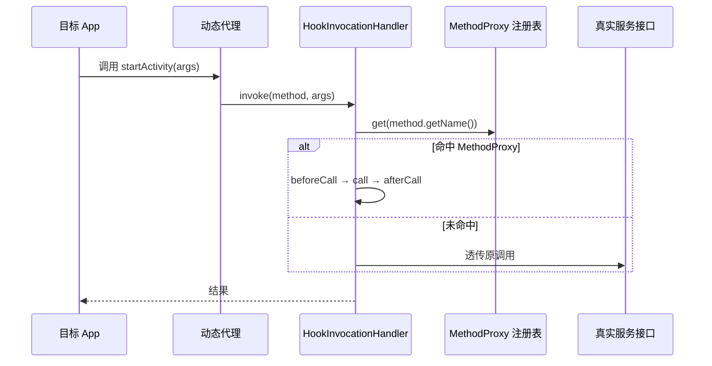

# MethodInvocationStub · 动态代理分发器

::: tip 源码路径
[`src/main/java/com/lody/virtual/client/hook/base/MethodInvocationStub.java`](https://github.com/android-security-engineer/VirtualXposed-skills/blob/vxp/VirtualApp/lib/src/main/java/com/lody/virtual/client/hook/base/MethodInvocationStub.java)
:::

`MethodInvocationStub<T>` 是 Hook 框架的**分发器**。它用 JDK 动态代理（`Proxy.newProxyInstance`）包住一个真实的服务接口，内部用 `HookInvocationHandler` 按**方法名**把调用路由到注册的 [`MethodProxy`](./method-proxy)。所有 48 个服务代理的分发都靠它。

## 核心 API

| 方法 | 作用 |
| --- | --- |
| `MethodInvocationStub(T baseInterface, Class<?>... proxyInterfaces)` | 包装真实接口，生成代理 |
| `addMethodProxy(MethodProxy)` | 注册一个方法代理（按 `getMethodName()` 索引） |
| `removeMethodProxy(String name)` / `removeMethodProxy(MethodProxy)` | 移除 |
| `getMethodProxy(String name)` | 按名取代理 |
| `getAllHooks()` | 取全部代理的 Map |
| `getProxyInterface()` | 取生成的代理对象（注入回 ServiceManager 的就是这个） |
| `copyMethodProxies(MethodInvocationStub from)` | 从另一个 stub 复制全部代理（版本切换时用） |
| `setInvocationLoggingCondition(…)` | 设置调用日志策略 |

## HookInvocationHandler

内部类 `HookInvocationHandler implements InvocationHandler` 是真正的拦截核心：

## 注册表结构

内部用 `Map<String, MethodProxy>` 按方法名索引。一个服务接口可能有几十个方法，每个被 hook 的方法注册一条；未注册的方法自动透传给真实接口，不影响。

## 关联

- [`MethodProxy`](./method-proxy)：注册表里的元素。
- [`BinderInvocationStub`](./binder-invocation-stub)：它的子类，专做 binder 层替换。
- [`MethodInvocationProxy`](./method-invocation-proxy)：持有 stub 的注入器。
- [系统服务 Hook](../../features/service-hook)。
