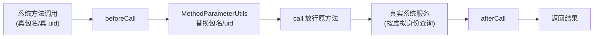

# Replace*MethodProxy · 参数改写代理族

::: tip 源码路径
[`src/main/java/com/lody/virtual/client/hook/base/`](https://github.com/android-security-engineer/VirtualXposed-skills/tree/vxp/VirtualApp/lib/src/main/java/com/lody/virtual/client/hook/base)（`ReplaceCallingPkgMethodProxy`/`ReplaceLastPkgMethodProxy`/`ReplaceSequencePkgMethodProxy`/`ReplaceSpecPkgMethodProxy`/`ReplaceLastUidMethodProxy`/`ReplaceUidMethodProxy` 等多个文件）
:::

`Replace*MethodProxy` 是一族现成的 [`MethodProxy`](./method-proxy) 子类，专门做一件事：**把系统服务方法参数里的包名 / UID 改成虚拟环境的值**。它们继承自 [`StaticMethodProxy`](./method-proxy-static)，是 45 个服务代理里复用率最高的一族。

## 为什么需要改参数

虚拟 App 调用 `getPackageInfo("com.target")`、`startService(intent)` 时，参数里带的包名 / UID 是虚拟 App 自己的。但系统服务按真实包名查不到虚拟安装的副本。所以 hook 要在调用前把参数替换：

- 包名 → 虚拟 App 在虚拟 PMS 注册的包名（或宿主包名，视场景）。
- UID → 虚拟 uid（`VUid`）。

## 族成员

| 类 | 改什么 | 典型场景 |
| --- | --- | --- |
| `ReplaceCallingPkgMethodProxy` | 改 `callingPkg`（调用方包名） | App 申明「我是谁」的方法 |
| `ReplaceLastPkgMethodProxy` | 改**末位** `String` 包名参数 | 参数末尾带包名的方法 |
| `ReplaceSequencePkgMethodProxy` | 改**第 N 位**包名参数 | 多包名参数按序定位 |
| `ReplaceSpecPkgMethodProxy` | 改**指定**包名参数 | 按方法签名精确定位 |
| `ReplaceLastUidMethodProxy` | 改**末位** `int` uid 参数 | 带 uid 的查询 |
| `ReplaceUidMethodProxy` | 改 uid 参数 | 通用 uid 替换 |

## 用法

子类只要给方法名，不用写 `call` 逻辑：

```java
addMethodProxy(new ReplaceLastPkgMethodProxy("getPackageInfo"));
```

注入时由基类在 `beforeCall` 阶段完成替换，原方法继续执行——这样既改了参数又不改变方法语义。
## 参数改写族调用流




## 关联

- [`MethodProxy`](./method-proxy)：基类。
- [`MethodParameterUtils`](./hook-utils)：底层参数替换工具。
- [`StaticMethodProxy`](./method-proxy-static)：父类。
- [系统服务 Hook](../../features/service-hook)。
