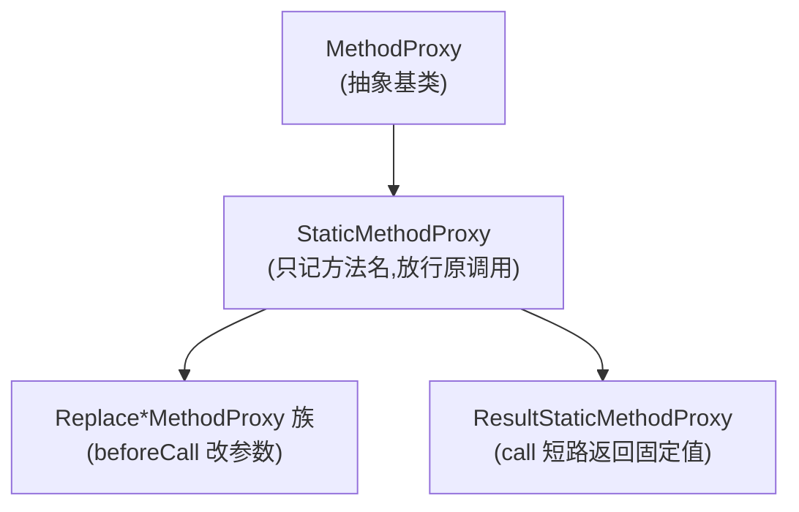

# StaticMethodProxy · 静态代理

::: tip 源码路径
[`src/main/java/com/lody/virtual/client/hook/base/StaticMethodProxy.java`](https://github.com/android-security-engineer/VirtualXposed-skills/blob/vxp/VirtualApp/lib/src/main/java/com/lody/virtual/client/hook/base/StaticMethodProxy.java)
:::

`StaticMethodProxy` 是 [`MethodProxy`](./method-proxy) 的直接子类，代表「不改方法语义、只挂个名」的代理。它本身不做任何拦截动作，存在意义是作为「参数改写族」和「固定返回族」的公共父类。

## 实现

```java
public class StaticMethodProxy extends MethodProxy {
    private String mName;
    public StaticMethodProxy(String name) { this.mName = name; }
    @Override public String getMethodName() { return mName; }
}
```

只记录方法名，`beforeCall`/`call`/`afterCall` 全用基类默认（放行原调用）。

## 子族

- **参数改写族** [`Replace*MethodProxy`](./method-proxy-replace)：在 `beforeCall` 改包名/UID，原方法继续跑。
- **固定返回族** [`ResultStaticMethodProxy`](./result-static-method-proxy)：`call` 直接返回预设结果，短路原方法。

`StaticMethodProxy` 自己很少直接用，多数场景用它的子类。
## 子族分支




## 关联

- [`MethodProxy`](./method-proxy)：基类。
- [`Replace*MethodProxy` 族](./method-proxy-replace)。
- [`ResultStaticMethodProxy`](./result-static-method-proxy)。
