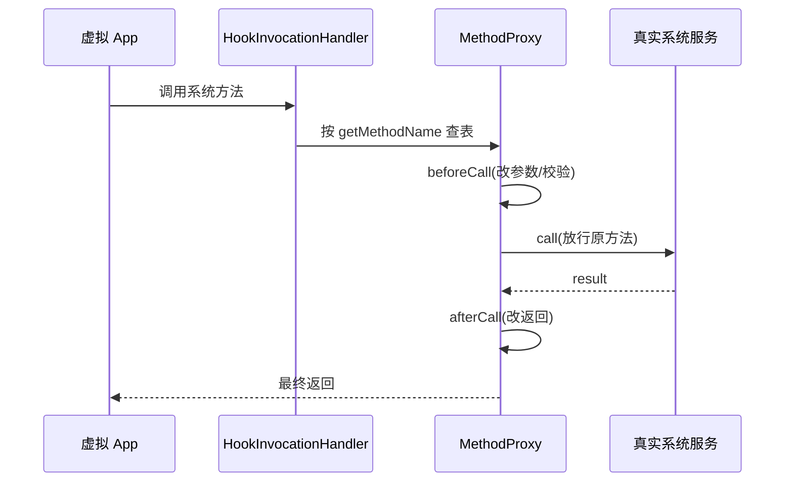

# MethodProxy · 方法代理基类

::: tip 源码路径
[`src/main/java/com/lody/virtual/client/hook/base/MethodProxy.java`](https://github.com/android-security-engineer/VirtualXposed-skills/blob/vxp/VirtualApp/lib/src/main/java/com/lody/virtual/client/hook/base/MethodProxy.java)
:::

`MethodProxy` 是 VirtualXposed 所有方法代理的抽象基类。每一个需要拦截的系统服务方法，都对应一个 `MethodProxy` 子类——它定义「方法名」「调用前改什么参数」「调用时返回什么」。48 个服务代理里的成百上千个拦截点，本质都是 `MethodProxy` 实例。

## 核心抽象

```java
public abstract class MethodProxy {
    public abstract String getMethodName();        // 拦截哪个方法（按名匹配）
    public boolean beforeCall(Object who, Method method, Object... args);  // 调用前
    public Object call(Object who, Method method, Object... args);         // 调用时
    public Object afterCall(Object who, Method method, Object[] args, Object result);  // 调用后
    public boolean isEnable();                     // 是否启用
}
```

`HookInvocationHandler` 收到一次方法调用后，按 `getMethodName()` 在注册表里查 `MethodProxy`，依次走 `beforeCall` → `call` → `afterCall`。
## 调用分发三段式




## 提供给子类的便捷静态方法

这些方法让子类不用每次都去取全局上下文：

| 方法 | 返回 |
| --- | --- |
| `getHostPkg()` / `getAppPkg()` | 宿主包名 / 当前虚拟 App 包名 |
| `getHostContext()` | 宿主 `Context` |
| `isAppProcess()` / `isServerProcess()` / `isMainProcess()` | 当前进程身份判定 |
| `getVUid()` / `getBaseVUid()` / `getRealUid()` | 虚拟 uid / 基础 uid / 真实 uid |
| `getAppUserId()` | 当前虚拟用户 id |
| `getDeviceInfo()` | 伪造设备信息（[`VDeviceInfo`](../remote/vdevice-info)） |
| `isFakeLocationEnable()` | 虚拟定位是否开启 |
| `isVisiblePackage(ApplicationInfo)` | 该包对当前 App 是否可见 |

## 子类族

`MethodProxy` 直接子类分两支：

- **`StaticMethodProxy`** —— 不改参数、只返回固定结果或短路。其下又派生一族 `Replace*MethodProxy`（[见下](./method-proxy-replace)）和 [`ResultStaticMethodProxy`](./method-proxy-static)。
- 各服务代理自写的内部类 —— 在 `@Inject` 注解标记下批量注册，[服务代理总览](../proxies/) 逐一介绍。

## 调用日志

`MethodProxy` 构造时读 `@LogInvocation` 注解决定是否记录本次调用的日志（`NEVER`/`ALWAYS`/`WHEN_HOOKED`/`WHEN_ERROR`）。详见 [`LogInvocation`](./log-invocation)。

## 关联

- [`MethodInvocationStub`](./method-invocation-stub)：分发器，按名查 `MethodProxy`。
- [系统服务 Hook](../../features/service-hook)：机制总览。
- [`Replace*MethodProxy` 族](./method-proxy-replace)：最常用的现成代理。
