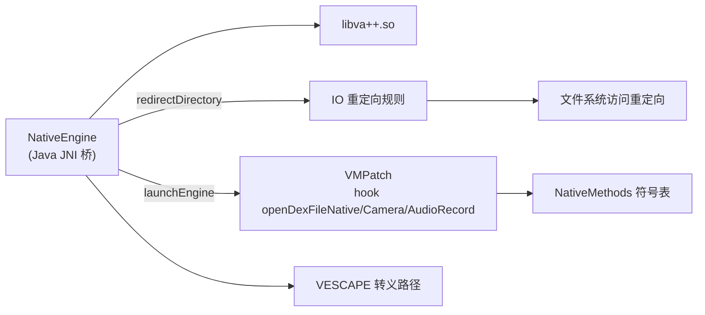

# client/NativeEngine · Native 桥

::: tip 源码路径
[`src/main/java/com/lody/virtual/client/NativeEngine.java`](https://github.com/android-security-engineer/VirtualXposed-skills/blob/vxp/VirtualApp/lib/src/main/java/com/lody/virtual/client/NativeEngine.java)
:::

`NativeEngine` 是 Java 层与 `libva++.so` 的 JNI 桥，加载 native 库并暴露 IO 重定向 / ART 方法 hook API。详见 [Native 层](../../features/native-layer)。

## 关键 API

| 方法 | 作用 |
| --- | --- |
| `redirectDirectory(orig, newPath)` | 注册路径重定向规则 |
| `whitelist(path)` | 白名单（不重定向） |
| `forbid(path)` | 禁止访问 |
| `enableIORedirect()` | 启动 IO hook |
| `launchEngine()` | hook `openDexFileNative`/Camera/AudioRecord |
| `getEscapePath(path)` | 构造 VESCAPE 转义路径 |

native 实现见 `jni/`（[native 参考文档](../native/)）。
## NativeEngine 与 native 层协作

