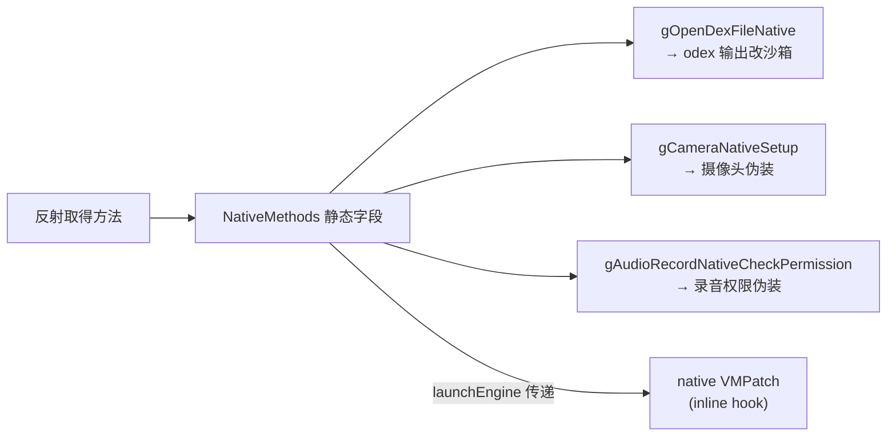

# client/natives · Native 方法表

::: tip 源码路径
[`src/main/java/com/lody/virtual/client/natives/NativeMethods.java`](https://github.com/android-security-engineer/VirtualXposed-skills/blob/vxp/VirtualApp/lib/src/main/java/com/lody/virtual/client/natives/NativeMethods.java)
:::

缓存需要 hook 的 Java native 方法符号。`NativeEngine.launchEngine` 把这些方法传给 native 层 `VMPatch` 做 inline hook。

## 关键字段

`NativeMethods` 静态持有以下方法引用（通过反射取得）：

| 字段 | 对应方法 | hook 目的 |
| --- | --- | --- |
| `gOpenDexFileNative` | `DexFile.openDexFileNative` | 改 odex 输出路径到沙箱 |
| `gCameraNativeSetup` | `Camera.native_setup` | 摄像头权限/设备伪装 |
| `gAudioRecordNativeCheckPermission` | `AudioRecord.native_check_permission` | 录音权限伪装 |

详见 [Native 层](../../features/native-layer) 的 `VMPatch` 部分。
## Native 方法符号与 hook 目标

