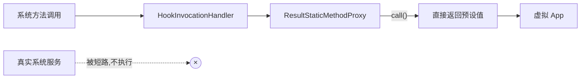

# ResultStaticMethodProxy · 固定返回代理

::: tip 源码路径
[`src/main/java/com/lody/virtual/client/hook/base/ResultStaticMethodProxy.java`](https://github.com/android-security-engineer/VirtualXposed-skills/blob/vxp/VirtualApp/lib/src/main/java/com/lody/virtual/client/hook/base/ResultStaticMethodProxy.java)
:::

`ResultStaticMethodProxy` 继承 [`StaticMethodProxy`](./method-proxy-static)，用于「直接返回固定结果、短路原方法」的拦截点。当某系统方法在虚拟环境下不该真正执行（或应返回伪造值）时用它。

## 用法

```java
addMethodProxy(new ResultStaticMethodProxy("isApplicationRestricted", false));
// 所有 isApplicationRestricted 调用直接返回 false，不再走真实服务
```

构造参数除了方法名，还带一个返回值对象，`call` 阶段直接返回它。
## 短路返回流程




## 与 Replace 族的区别

| 代理 | 行为 |
| --- | --- |
| `Replace*MethodProxy` | 改参数，**放行**原方法 |
| `ResultStaticMethodProxy` | **短路**原方法，返回固定值 |

## 典型场景

- 权限/限制类查询：`isRestricted`、`hasPermission` 之类，虚拟环境里直接放行返回。
- 不该触达真系统的调用：某些会暴露宿主身份的探测方法，返回空/默认值。

## 关联

- [`StaticMethodProxy`](./method-proxy-static)：父类。
- [`MethodProxy`](./method-proxy)：根基类。
